# AQUA V. – Aerospace & Quantum United Advanced Venture

<p align="center">
  
  
  
</p>

<p align="center">
  <span style="font-size:1.5em;"><strong>AQUA V. – Aerospace & Quantum United Advanced Venture</strong></span><br/>
  <i>Flying Fluidity • Agua que Vuela</i><br/>
  <strong>Transform. Innovate. Transcend.</strong>
</p>

---
# AQUA V. Framework
## Unified Master Documentation
### Aerospace and Quantum United Aspirational Venture

---

# **EXECUTIVE BRIEFING**

## Vision Statement
**"Transforming aerospace through quantum-enhanced intelligence, creating a convergent platform where quantum computing, artificial intelligence, and cyber-physical systems unite to redefine the boundaries of flight and space exploration."**

## Mission
By 2050, establish AQUA V. as the global leader in quantum-enhanced aerospace technology, delivering €144 billion in annual revenue through revolutionary products and services that fundamentally transform how humanity interacts with air and space.

## Strategic Objectives
- **2025-2027**: Establish quantum computing foundation and core infrastructure
- **2028-2032**: Deploy first quantum-enhanced products and validate market
- **2033-2040**: Scale to full production and achieve technology leadership
- **2041-2050**: Consolidate global market leadership position

---

# **PART I: SYSTEM ARCHITECTURE**

## 1.1 Conceptual Framework

### Core Definition
AQUA V. (Aerospace and Quantum United Aspirational Venture) is a next-generation digital-industrial and business intelligence framework, architected as a quantum-enhanced, virtual infrastructure serving as a convergence platform for the most advanced technological domains.

### Architectural Philosophy
```
Physical Systems + Quantum Computing + Artificial Intelligence + Cyber-Physical Integration 
= Transformative Aerospace Capabilities
```

## 1.2 Six-Layer Architecture Model

### Layer 1: Quantum Enhancement Layer
**Purpose**: Foundational quantum computing capabilities

**Components**:
- Quantum Processing Units (QPUs)
- Quantum Algorithms Library
- Quantum Sensors Network
- Quantum Communication Systems
- Quantum Error Correction Modules

**Key Capabilities**:
- Hybrid quantum-classical processing
- Quantum advantage for optimization problems
- Quantum-secured communications
- Quantum sensing for navigation

### Layer 2: Aerospace Integration Layer
**Purpose**: Interface with physical aerospace systems

**Components**:
- Flight Control Systems
- Space Platform Integration
- Avionics Interfaces
- Ground Control Networks
- Satellite Communication Links

**Key Capabilities**:
- Real-time telemetry processing
- Autonomous flight operations
- Predictive maintenance
- Mission planning optimization

### Layer 3: AI/ML Cognitive Layer
**Purpose**: Intelligence and decision-making

**Components**:
- Machine Learning Pipelines
- Neural Network Architectures
- Decision Intelligence Systems
- Training Infrastructure
- Inference Engines

**Key Capabilities**:
- Distributed learning across assets
- Real-time inference
- Adaptive algorithms
- Explainable AI for critical decisions

### Layer 4: Cyber-Physical Integration Layer
**Purpose**: Bridge between digital and physical worlds

**Components**:
- IoT Device Networks
- Sensor Arrays
- Edge Computing Nodes
- Actuator Systems
- Communication Protocols

**Key Capabilities**:
- Real-time data acquisition
- Edge processing
- Digital twin synchronization
- Remote operation control

### Layer 5: Digital-Industrial Layer
**Purpose**: Manufacturing and operations

**Components**:
- Manufacturing Execution Systems
- Supply Chain Management
- Logistics Optimization
- Maintenance Systems
- Quality Control

**Key Capabilities**:
- Quantum-optimized production
- Predictive maintenance
- Supply chain visibility
- Automated quality assurance

### Layer 6: Business Intelligence Layer
**Purpose**: Strategic decision support

**Components**:
- Analytics Engines
- Visualization Dashboards
- Reporting Systems
- Decision Support Tools
- Performance Monitoring

**Key Capabilities**:
- Real-time business metrics
- Predictive analytics
- Scenario planning
- ROI optimization

## 1.3 System Boundaries and Interfaces

### External Interfaces
| Interface Type | Stakeholders | Protocol | Security Level |
|---|---|---|---|
| Regulatory | Government Agencies | Standardized APIs | Quantum-Secured |
| Commercial | Industry Partners | RESTful/GraphQL | Encrypted |
| Research | Academic Institutions | Open Standards | Authenticated |
| Operational | End Users | Multi-Modal | Role-Based |

### Internal Interfaces
| Interface | Function | Technology | Performance |
|---|---|---|---|
| Quantum-Classical | Hybrid Processing | OpenQASM 3.0 | <100ms latency |
| Layer-to-Layer | Data Exchange | gRPC/Protocol Buffers | >10Gbps |
| Service Mesh | Microservices | Istio/Envoy | 99.999% uptime |
| Event Bus | Async Communication | Apache Kafka | 1M msgs/sec |

---

# **PART II: CONCEPT OF OPERATIONS (CONOPS)**

## 2.1 System Overview

### Operational Vision
AQUA V. operates as an integrated ecosystem where quantum-enhanced capabilities augment every aspect of aerospace operations, from design and manufacturing to flight operations and maintenance.

### Key Operational Principles
1. **Quantum-First Design**: Leverage quantum advantages wherever applicable
2. **Hybrid Processing**: Seamless integration of quantum and classical computing
3. **Autonomous Operations**: AI-driven decision-making with human oversight
4. **Continuous Optimization**: Real-time system improvement through machine learning
5. **Secure by Design**: Quantum-secured communications and data protection

## 2.2 Operational Scenarios

### Nominal Operations

#### Scenario DRM-0100: Quantum-Enhanced Satellite Constellation Optimization
**Objective**: Optimize constellation geometry for 1,000+ satellites

**Process Flow**:
1. Collect current orbital parameters from all satellites
2. Input mission requirements and constraints
3. Execute quantum optimization algorithm for configuration
4. Validate results through classical simulation
5. Generate command sequences for orbit adjustments
6. Monitor execution and refine as needed

**Quantum Advantage**: 10,000x speedup over classical methods

#### Scenario DRM-0200: AI-Driven Aircraft Maintenance Prediction
**Objective**: Predict component failures before occurrence

**Process Flow**:
1. Continuous sensor data collection from aircraft systems
2. Quantum-enhanced pattern recognition for anomaly detection
3. AI model prediction of failure probability
4. Maintenance scheduling optimization
5. Parts inventory management
6. Technician assignment and routing

**Value Delivery**: 40% reduction in unscheduled maintenance

#### Scenario DRM-0300: Real-Time Supply Chain Optimization
**Objective**: Optimize global supply chain in real-time

**Process Flow**:
1. Monitor global inventory levels
2. Track transportation assets
3. Predict demand using quantum ML
4. Optimize routing and scheduling
5. Execute procurement decisions
6. Update all stakeholders

**Efficiency Gain**: 25% reduction in inventory costs

### Off-Nominal Operations

#### Scenario DRM-0400: Quantum System Failure Recovery
**Trigger**: Quantum processor decoherence or hardware failure

**Response Protocol**:
1. Automatic detection of quantum system anomaly
2. Immediate failover to backup quantum system
3. Reroute critical calculations to classical systems
4. Diagnostic assessment of failed system
5. Repair or replacement execution
6. System restoration and validation

**Recovery Time**: <5 minutes for critical operations

#### Scenario DRM-0500: Cyber-Attack Response
**Trigger**: Detection of cybersecurity breach attempt

**Response Protocol**:
1. Quantum sensor detection of anomalous network behavior
2. Automatic isolation of affected systems
3. Quantum-secured communication channel activation
4. Forensic analysis using quantum computing
5. System restoration from secure backups
6. Post-incident analysis and hardening

**Defense Capability**: Quantum encryption unbreakable by classical computers

## 2.3 Operational Modes

### Development Mode
- System design and integration
- Algorithm development and testing
- Simulation and validation
- Performance optimization

### Testing Mode
- Component verification
- System integration testing
- User acceptance testing
- Certification preparation

### Operational Mode
- Full production deployment
- Real-time operations
- Continuous monitoring
- Performance optimization

### Maintenance Mode
- Scheduled maintenance windows
- System updates and patches
- Technology insertion
- Performance tuning

---

# **PART III: SYSTEM REQUIREMENTS**

## 3.1 Functional Requirements

### Quantum Processing Requirements
| ID | Requirement | Priority | Verification |
|---|---|---|---|
| QR-001 | Support hybrid quantum-classical computations | Critical | Test Suite |
| QR-002 | Provide quantum error correction (QEC) with 99.9% fidelity | Critical | Benchmarking |
| QR-003 | Interface with multiple quantum hardware vendors | High | Integration Test |
| QR-004 | Execute quantum algorithms for aerospace optimization | Critical | Performance Test |
| QR-005 | Support quantum machine learning frameworks | High | Validation Suite |

### Aerospace Integration Requirements
| ID | Requirement | Priority | Verification |
|---|---|---|---|
| AR-001 | Process satellite telemetry in real-time (<100ms) | Critical | Performance Test |
| AR-002 | Monitor aircraft health across 10,000+ parameters | Critical | System Test |
| AR-003 | Enable autonomous flight path optimization | High | Simulation |
| AR-004 | Integrate with legacy aerospace systems | High | Compatibility Test |
| AR-005 | Support multi-domain operations (air/space/ground) | Critical | Integration Test |

### AI/ML Requirements
| ID | Requirement | Priority | Verification |
|---|---|---|---|
| AIR-001 | Support distributed ML training across sites | High | Performance Test |
| AIR-002 | Provide real-time inference (<10ms) | Critical | Benchmarking |
| AIR-003 | Enable adaptive learning algorithms | High | Validation |
| AIR-004 | Implement explainable AI for decisions | Critical | Audit Test |
| AIR-005 | Support federated learning for privacy | High | Security Test |

## 3.2 Non-Functional Requirements

### Performance Requirements
| Metric | Target | Measurement Method |
|---|---|---|
| Quantum Algorithm Latency | <100ms | End-to-end timing |
| System Availability | 99.999% | Uptime monitoring |
| Concurrent Users | 10,000+ | Load testing |
| Data Processing | 1 PB/day | Throughput monitoring |
| Response Time | <500ms | User experience testing |

### Security Requirements
| Requirement | Implementation | Validation |
|---|---|---|
| Quantum-Resistant Cryptography | Post-quantum algorithms | Cryptanalysis |
| Zero-Trust Architecture | Identity verification at every layer | Penetration testing |
| Continuous Monitoring | 24/7 SOC operations | Security audits |
| Quantum Key Distribution | QKD protocols | Protocol verification |
| Secure Authentication | Multi-factor with quantum tokens | Authentication testing |

### Reliability Requirements
| Metric | Target | Approach |
|---|---|---|
| MTBF | >10,000 hours | Component reliability analysis |
| Fault Tolerance | N+2 redundancy | Failure injection testing |
| Graceful Degradation | Maintain critical functions | Degradation testing |
| Recovery Time | <5 minutes | Disaster recovery drills |
| Data Integrity | 99.9999% | Checksums and validation |

---

# **PART IV: PRODUCT PORTFOLIO**

## 4.1 AMPEL360 - Advanced Mobility Platform

### Blended Wing Body (BWB) Aircraft
| Model | Capacity | Range | Quantum Features | Target Market |
|---|---|---|---|---|
| Q100 | 120-180 pax | 5,000 nm | Optimized aerodynamics, Quantum navigation | Regional/Domestic |
| Q250 | 220-300 pax | 7,500 nm | Quantum weather routing, Predictive maintenance | International |

### Electric Vertical Takeoff and Landing (eVTOL)
| Model | Capacity | Range | Quantum Features | Target Market |
|---|---|---|---|---|
| CITY | 2-6 pax | 100 km | Urban traffic optimization, Quantum collision avoidance | Urban Air Mobility |
| METR | 8-12 pax | 250 km | Multi-vehicle coordination, Quantum scheduling | Regional Connection |

### Hybrid-Electric Aircraft
| Model | Capacity | Range | Quantum Features | Target Market |
|---|---|---|---|---|
| E180 | 180 pax | 3,000 nm | Quantum energy management, Route optimization | Medium-haul |
| E220 | 220 pax | 4,000 nm | Hybrid propulsion optimization, Quantum maintenance | Long-haul |

### Suborbital Spacecraft
| Model | Purpose | Altitude | Quantum Features | Target Market |
|---|---|---|---|---|
| SB01 | Tourism | 100 km | Quantum trajectory optimization, Safety systems | Space Tourism |
| SB02 | Research | 120 km | Quantum experiment platform, Data processing | Scientific Research |

## 4.2 GAIA AIR & SPACE - Unmanned Systems

### Unmanned Aerial Vehicles (UAV)
| Model | Type | Payload | Quantum Features | Application |
|---|---|---|---|---|
| TACT | Military | 500 kg | Quantum radar, Secure communications | Defense |
| CARG | Heavy Lift | 2,000 kg | Route optimization, Load balancing | Logistics |
| HALE | High Altitude | 100 kg | Quantum sensing, Long endurance | Surveillance |
| SWRM | Swarm | 10 kg each | Quantum coordination, Emergent behavior | Multiple |

### Satellite Systems
| Model | Function | Orbit | Quantum Features | Coverage |
|---|---|---|---|---|
| QNET | Quantum Network | LEO | Entanglement distribution, QKD | Global |
| EOBS | Earth Observation | SSO | Quantum imaging, Data processing | Continuous |
| COMM | Communications | GEO | Quantum encryption, High bandwidth | Regional |
| NAVS | Navigation | MEO | Quantum timing, Precision location | Global |

## 4.3 ROBBBO-T - Robotic Systems

### Factory Automation
| Model | Function | Capacity | Quantum Features | Integration |
|---|---|---|---|---|
| AS01 | Assembly | 1000 units/day | Quantum scheduling, Quality prediction | MES |
| WL01 | Welding | 500 joints/hour | Quantum path planning, Defect detection | CAD/CAM |
| QC01 | Quality Control | 10,000 checks/hour | Quantum pattern recognition, Anomaly detection | ERP |
| PT01 | Painting | 50 units/day | Quantum color matching, Surface optimization | PLM |

### Maintenance & Repair
| Model | Application | Capability | Quantum Features | Deployment |
|---|---|---|---|---|
| AC01 | Aircraft | Full inspection | Quantum NDT, Predictive analytics | Hangar |
| EN01 | Engine | Component level | Quantum materials analysis, Wear prediction | Workshop |
| CM01 | Component | Micro-repair | Quantum precision control, Defect mapping | Mobile |
| IN01 | Inspection | Non-destructive | Quantum sensing, 3D reconstruction | Field |

## 4.4 QUANTUM - Technology Foundation

### Quantum Processing Units (QPU)
| Model | Scale | Qubits | Application | Deployment |
|---|---|---|---|---|
| DESK | Desktop | 50-100 | Development, Testing | Office |
| RACK | Server | 100-500 | Production, Operations | Data Center |
| DATA | Data Center | 500-1000 | Enterprise, Cloud | Regional Hub |
| MOBL | Mobile | 10-50 | Edge, Field | Portable |

### Quantum Software & Services
| Product | Type | Function | Delivery | Pricing |
|---|---|---|---|---|
| QPS | Processing | Algorithm execution | Cloud/On-premise | Subscription |
| QML | Machine Learning | Quantum ML models | API/SDK | Usage-based |
| QKS | Key Distribution | Secure communications | Network | Per-node |
| QCN | Consulting | Implementation support | Professional Services | Project-based |

---

# **PART V: IMPLEMENTATION FRAMEWORK**

## 5.1 Model-Based Systems Engineering (MBSE)

### MBSE Implementation Strategy

#### Phase 1: System Definition (Months 0-6)
**Activities**:
- Stakeholder requirements gathering
- System architecture modeling (SysML)
- Interface definition
- Risk assessment

**Deliverables**:
- System Requirements Document
- Architecture Model v1.0
- Interface Control Documents
- Risk Register

#### Phase 2: System Design (Months 6-12)
**Activities**:
- Detailed design development
- Behavioral modeling
- Parametric analysis
- Trade studies

**Deliverables**:
- Detailed Design Documents
- Simulation Models
- Trade Study Reports
- Design Review Package

#### Phase 3: System Analysis (Months 12-18)
**Activities**:
- Performance simulation
- Optimization studies
- Verification planning
- Safety analysis

**Deliverables**:
- Performance Analysis Report
- Optimization Results
- V&V Plan
- Safety Assessment

#### Phase 4: System Integration (Months 18-36)
**Activities**:
- Component integration
- System testing
- Validation execution
- Deployment preparation

**Deliverables**:
- Integration Test Results
- System Validation Report
- Deployment Guide
- Operations Manual

### Digital Thread Implementation


## 5.2 Global Manufacturing Network

### Manufacturing Facilities

| Location | Specialization | Capacity | Investment | Employees |
|---|---|---|---|---|
| Madrid, Spain | HQ & Final Assembly | 100 aircraft/year | €10B | 5,000 |
| Toulouse, France | Aerodynamics & Certification | 500 tests/year | €5B | 2,000 |
| Munich, Germany | Engines & Quantum Hardware | 400 engines/year | €8B | 3,000 |
| Naples, Italy | Composites & Materials | 1000 structures/year | €4B | 1,500 |
| Singapore | Drones & Robotics | 500 units/year | €3B | 1,000 |
| Silicon Valley, USA | Software & Quantum Computing | 200 modules/year | €10B | 2,500 |

### Supply Chain Architecture


## 5.3 Technology Development Roadmap

### 2025-2027: Foundation Phase
**Focus**: Establish core capabilities
- Quantum simulation environment
- AI/ML framework development
- Initial prototype development
- Regulatory engagement

**Milestones**:
- Q1 2025: Program launch
- Q3 2025: First quantum simulator operational
- Q1 2026: AI framework v1.0
- Q3 2026: First drone prototype
- Q1 2027: Regulatory framework established

### 2028-2032: Integration Phase
**Focus**: System integration and validation
- First product deliveries
- Quantum-classical integration
- Market validation
- Scaling preparation

**Milestones**:
- Q1 2028: First GAIA drone delivered
- Q3 2029: Quantum satellite launched
- Q1 2030: eVTOL certification
- Q3 2031: First ROBBBO-T deployment
- Q1 2032: BWB prototype flight

### 2033-2040: Expansion Phase
**Focus**: Market deployment and scaling
- Commercial operations
- Global expansion
- Technology maturation
- IPO preparation

**Milestones**:
- Q1 2033: 100th drone delivered
- Q1 2035: IPO execution
- Q1 2037: BWB certification
- Q1 2039: 1000th aircraft order
- Q1 2040: Global market leader

### 2041-2050: Leadership Phase
**Focus**: Market leadership and innovation
- Technology leadership
- Market dominance
- Next-generation development
- Industry transformation

**Milestones**:
- Q1 2041: €50B annual revenue
- Q1 2043: €100B annual revenue
- Q1 2045: €144B annual revenue
- Q1 2047: Industry standard setter
- Q1 2050: Top 3 aerospace company

---

# **PART VI: QUANTUM-SPECIFIC ENGINEERING**

## 6.1 Quantum Computing Architecture

### Quantum Hardware Stack

| Layer | Component | Technology | Status |
|---|---|---|---|
| Physical | Qubits | Superconducting/Trapped Ion | Operational |
| Control | Quantum Gates | Microwave/Laser Pulses | Mature |
| Error Correction | QEC Codes | Surface/Topological Codes | Development |
| Logical | Logical Qubits | Encoded Qubits | Research |
| Application | Quantum Algorithms | QAOA/VQE/QML | Production |

### Quantum Algorithm Portfolio

| Algorithm | Application | Advantage | Implementation |
|---|---|---|---|
| QAOA | Optimization | Exponential speedup | Production |
| VQE | Materials Simulation | 1000x faster | Testing |
| HHL | Linear Systems | Exponential speedup | Development |
| Grover | Database Search | Quadratic speedup | Production |
| Shor | Cryptanalysis | Exponential speedup | Research |

## 6.2 Quantum-Classical Integration

### Hybrid Processing Architecture

```
┌─────────────────────────────────────────────────┐
│            Classical Preprocessing               │
│  - Problem formulation                          │
│  - Data preparation                             │
│  - Parameter initialization                     │
└─────────────────────────────────────────────────┘
                        ↓
┌─────────────────────────────────────────────────┐
│            Quantum Processing                    │
│  - Quantum circuit execution                    │
│  - Measurement and sampling                     │
│  - Error mitigation                            │
└─────────────────────────────────────────────────┘
                        ↓
┌─────────────────────────────────────────────────┐
│           Classical Postprocessing               │
│  - Result interpretation                        │
│  - Statistical analysis                         │
│  - Decision integration                         │
└─────────────────────────────────────────────────┘
```

### Quantum Error Management

| Error Type | Mitigation Strategy | Implementation |
|---|---|---|
| Gate Errors | Error correction codes | Real-time |
| Decoherence | Shortened circuit depth | Design-time |
| Measurement | Multiple sampling | Run-time |
| Crosstalk | Qubit isolation | Hardware |
| Drift | Calibration protocols | Continuous |

## 6.3 Quantum Security Framework

### Quantum Cryptography Implementation

| Protocol | Purpose | Security Level | Deployment |
|---|---|---|---|
| QKD | Key Distribution | Information-theoretic | Production |
| Quantum Digital Signatures | Authentication | Unconditional | Testing |
| Quantum Secret Sharing | Distributed Security | Perfect | Development |
| Post-Quantum Cryptography | Future-proofing | Computational | Production |

---

# **PART VII: ARTIFICIAL INTELLIGENCE FRAMEWORK**

## 7.1 WIR (Well Invented Reality) System

### Core Components

| Component | Function | Technology | Integration |
|---|---|---|---|
| Perception Layer | Reality synthesis | Sensor fusion, Computer vision | Real-time |
| Cognitive Layer | Decision making | Neural networks, Reinforcement learning | Distributed |
| Ethical Layer | Value alignment | Constraint satisfaction, Multi-objective optimization | Embedded |
| Execution Layer | Action implementation | Robotic control, Process automation | Synchronized |

### AI Capabilities Matrix

| Capability | Application | Performance | Maturity |
|---|---|---|---|
| Predictive Maintenance | Aircraft systems | 95% accuracy | Production |
| Autonomous Navigation | Drones, Spacecraft | Level 4 autonomy | Testing |
| Natural Language Processing | Documentation, Communication | 98% accuracy | Production |
| Computer Vision | Quality control, Navigation | 99.5% accuracy | Production |
| Reinforcement Learning | Optimization, Control | Continuous improvement | Development |

## 7.2 Machine Learning Pipeline

### Training Infrastructure

| Component | Specification | Capacity | Location |
|---|---|---|---|
| GPU Clusters | NVIDIA A100 | 10,000 GPUs | Silicon Valley |
| TPU Pods | Google TPU v4 | 4,096 chips | Multi-site |
| Quantum ML | QPU Integration | 100 qubits | Munich |
| Edge Devices | NVIDIA Jetson | 1,000 units | Distributed |

### Model Deployment


---

# **PART VIII: BUSINESS ARCHITECTURE**

## 8.1 Financial Model

### Revenue Projections

| Year | AMPEL360 | GAIA | ROBBBO-T | QUANTUM | Total |
|---|---|---|---|---|---|
| 2030 | €1B | €2B | €0.5B | €0.5B | €4B |
| 2035 | €10B | €8B | €3B | €2B | €23B |
| 2040 | €40B | €15B | €10B | €5B | €70B |
| 2045 | €90B | €25B | €18B | €11B | €144B |
| 2050 | €150B | €40B | €30B | €20B | €240B |

### Investment Allocation

```mermaid
pie title Investment Distribution (€40B)
    "AMPEL360" : 25
    "GAIA" : 10
    "ROBBBO-T" : 5
    "Quantum Infrastructure" : 10
    "R&D" : 8
    "Manufacturing" : 12
    "Operations" : 5
    "Reserve" : 5
```



## 8.2 Market Strategy

### Target Markets

| Segment | Size (2025) | Growth Rate | AQUA V. Target Share |
|---|---|---|---|
| Commercial Aviation | €500B | 4% CAGR | 15% by 2045 |
| Defense & Space | €400B | 3% CAGR | 10% by 2045 |
| Urban Air Mobility | €5B | 25% CAGR | 25% by 2045 |
| Robotics & Automation | €200B | 8% CAGR | 5% by 2045 |
| Quantum Computing | €2B | 30% CAGR | 20% by 2045 |

### Competitive Positioning

| Competitor | Strengths | AQUA V. Advantage |
|---|---|---|
| Boeing/Airbus | Market position, Experience | Quantum technology, Integration |
| SpaceX | Innovation, Execution | Quantum capabilities, Broader portfolio |
| IBM/Google | Quantum computing | Aerospace application, Integration |
| DJI | Drone market share | Quantum enhancement, Enterprise focus |

## 8.3 Partnership Strategy

### Strategic Alliances

| Partner Type | Purpose | Examples | Model |
|---|---|---|---|
| Technology | Quantum hardware | IBM, Google, IonQ | Joint development |
| Aerospace | Market access | Airlines, Governments | Supply agreements |
| Research | Innovation | MIT, Oxford, CERN | Collaboration |
| Manufacturing | Production capacity | Tier 1 suppliers | Long-term contracts |
| Financial | Capital access | Investment banks, VCs | Equity/Debt |

---

# **PART IX: RISK MANAGEMENT**

## 9.1 Risk Assessment Matrix

### Technology Risks

| Risk | Probability | Impact | Mitigation Strategy |
|---|---|---|---|
| Quantum decoherence | High | High | Error correction, Redundancy |
| Technology immaturity | Medium | High | Phased deployment, Fallback systems |
| Integration complexity | High | Medium | MBSE approach, Incremental integration |
| Talent shortage | High | High | Training programs, Partnerships |
| Obsolescence | Low | High | Modular architecture, Continuous updates |

### Market Risks

| Risk | Probability | Impact | Mitigation Strategy |
|---|---|---|---|
| Slow adoption | Medium | High | Proof of value, Gradual rollout |
| Competition | High | Medium | First-mover advantage, Patents |
| Economic downturn | Medium | High | Diversification, Cost control |
| Regulatory changes | Medium | Medium | Proactive engagement, Compliance |

### Operational Risks

| Risk | Probability | Impact | Mitigation Strategy |
|---|---|---|---|
| Supply chain disruption | Medium | High | Multiple suppliers, Buffer stock |
| Cybersecurity | High | High | Quantum security, Zero-trust |
| Quality issues | Low | High | Rigorous testing, QA processes |
| Project delays | Medium | Medium | Agile methods, Buffer time |

## 9.2 Risk Response Framework


---

# **PART X: ORGANIZATIONAL STRUCTURE**

## 10.1 Leadership Structure

### Executive Team

| Position | Responsibility | Background Required |
|---|---|---|
| CEO | Overall strategy and execution | Aerospace + Technology |
| CTO | Technology development | Quantum + Aerospace |
| COO | Operations and manufacturing | Industrial + Supply Chain |
| CFO | Financial management | Corporate Finance + Tech |
| Chief Quantum Officer | Quantum strategy | Quantum Physics + Engineering |
| Chief AI Officer | AI/ML strategy | Machine Learning + Systems |

### Organizational Design


## 10.2 Talent Development

### Skills Matrix

| Role | Core Skills | Quantum Skills | AI Skills | Experience |
|---|---|---|---|---|
| Quantum Engineer | Physics, Mathematics | Quantum algorithms, QEC | ML basics | 5+ years |
| Aerospace Engineer | Aerodynamics, Systems | Quantum applications | Optimization | 7+ years |
| AI Engineer | ML, Deep Learning | Quantum ML | Full stack | 5+ years |
| Systems Architect | Systems engineering | Hybrid architecture | Integration | 10+ years |
| Program Manager | Project management | Technical understanding | Coordination | 8+ years |

### Training Programs

| Program | Duration | Participants | Outcome |
|---|---|---|---|
| Quantum Foundations | 6 months | All engineers | Basic quantum literacy |
| Aerospace Systems | 3 months | Tech staff | Domain knowledge |
| AI/ML Certification | 4 months | Developers | ML competency |
| Leadership Development | 12 months | Managers | Leadership skills |
| Cross-Training | Ongoing | All staff | Multi-disciplinary |

---

# **PART XI: QUALITY & COMPLIANCE**

## 11.1 Quality Management System

### Quality Standards

| Standard | Scope | Certification | Status |
|---|---|---|---|
| ISO 9001:2015 | Quality Management | Required | Planned |
| AS9100D | Aerospace Quality | Required | In Progress |
| ISO/IEC 27001 | Information Security | Required | Planned |
| ISO 26262 | Functional Safety | Required | Development |
| DO-178C | Software Airworthiness | Critical | In Progress |

### Quality Metrics

| Metric | Target | Current | Trend |
|---|---|---|---|
| First Pass Yield | >95% | Design Phase | - |
| Defect Rate | <0.1% | Design Phase | - |
| Customer Satisfaction | >95% | N/A | - |
| On-Time Delivery | >98% | N/A | - |
| Cost of Quality | <5% revenue | Design Phase | - |

## 11.2 Regulatory Compliance

### Certification Requirements

| Product | Authority | Standard | Timeline |
|---|---|---|---|
| BWB Aircraft | EASA/FAA | CS-25/Part 25 | 2037-2040 |
| eVTOL | EASA | SC-VTOL | 2028-2030 |
| Drones | EASA/FAA | Specific Category | 2027-2028 |
| Satellites | ITU/National | Frequency/Orbit | 2028-2029 |
| Quantum Systems | National | Export Control | Ongoing |

### Compliance Framework


---

# **PART XII: TECHNOLOGY CLASSIFICATION**

## 12.1 Universal Technology Classification System (UTCS)

### Classification Structure

```
Level 1: Domain (2 digits)
Level 2: Category (2 digits)
Level 3: Subcategory (2 digits)
Level 4: Technology (2 digits)
Level 5: Application (2 digits)
Level 6: Version (2 digits)
```

### Domain Classification

| Code | Domain | Description |
|---|---|---|
| 01 | Quantum | Quantum computing and technologies |
| 02 | Aerospace | Aircraft and space systems |
| 03 | AI/ML | Artificial intelligence and machine learning |
| 04 | Robotics | Robotic systems and automation |
| 05 | Materials | Advanced materials and composites |
| 06 | Propulsion | Propulsion systems and engines |
| 07 | Electronics | Electronic systems and avionics |
| 08 | Software | Software and algorithms |
| 09 | Manufacturing | Production and assembly |
| 10 | Operations | Operational systems and services |

## 12.2 Product Identification System v12.0

### ID Structure

```
[PRODUCT]-[MODEL]-[VARIANT]-[SERIAL]-[PHASE]-[SAFETY]-
[DOCUMENT]-[APPLICATION]-[METHOD]-[CONTEXT]-[TECHNOLOGY]-
[APPROVAL]-[VERSION]
```

### Component Definitions

| Component | Purpose | Format | Example |
|---|---|---|---|
| PRODUCT | Product line identifier | 8 chars | AMPEL360 |
| MODEL | Specific model | 4 chars | BWB1 |
| VARIANT | Configuration variant | 4 chars | Q100 |
| SERIAL | Unique serial number | 8 chars | 25MA0001 |
| PHASE | Development phase | 4 chars | PROD |
| SAFETY | Criticality level | 4 chars | CRIT |
| DOCUMENT | Document type | 8 chars | CERT |
| APPLICATION | Use case | 8 chars | QUAL |
| METHOD | Process method | 20 chars | INSTALL-VERIFY |
| CONTEXT | Reality context | 6 chars | PHYSL |
| TECHNOLOGY | UTCS code | 12 digits | 020304050607 |
| APPROVAL | Approval status | 8 chars | APPROVED |
| VERSION | Version number | Semantic | v12.3.0 |

---

# **PART XIII: DIGITAL TWIN FRAMEWORK**

## 13.1 Digital Twin Architecture

### Multi-Fidelity Modeling Levels

| Level | Type | Fidelity | Update Rate | Use Case |
|---|---|---|---|---|
| L0 | Sensor Data | Raw | Real-time | Monitoring |
| L1 | Physics-Based | High | 1 Hz | Simulation |
| L2 | Quantum-Enhanced | Ultra-high | 10 Hz | Complex phenomena |
| L3 | Predictive | Variable | On-demand | Forecasting |
| L4 | Prescriptive | Optimized | Continuous | Decision support |

### Digital Twin Capabilities

| Capability | Description | Technology | Value |
|---|---|---|---|
| Real-time Sync | Live data integration | IoT, 5G | Immediate awareness |
| Predictive Analytics | Future state prediction | AI/ML | Proactive maintenance |
| Scenario Simulation | What-if analysis | Quantum computing | Risk reduction |
| Optimization | Performance improvement | Quantum algorithms | Efficiency gains |
| Visualization | 3D representation | VR/AR | Enhanced understanding |

## 13.2 Implementation Strategy

### Deployment Phases


---

# **PART XIV: SUSTAINABILITY FRAMEWORK**

## 14.1 Environmental Sustainability

### Carbon Reduction Targets

| Year | Reduction Target | Strategy | Measurement |
|---|---|---|---|
| 2030 | -20% vs 2025 | Hybrid propulsion, Optimization | CO2 per passenger-km |
| 2035 | -40% vs 2025 | Electric aircraft, Renewable energy | Total emissions |
| 2040 | -60% vs 2025 | Hydrogen propulsion, Carbon capture | Lifecycle assessment |
| 2045 | -80% vs 2025 | Full electrification, Offsets | Net emissions |
| 2050 | Net Zero | Complete sustainability | Carbon neutral |

### Circular Economy Implementation

| Component | Strategy | Implementation | Impact |
|---|---|---|---|
| Materials | Recyclable composites | Design for disassembly | 90% recyclability |
| Manufacturing | Zero waste production | Lean manufacturing | 95% material efficiency |
| Operations | Energy optimization | Renewable sources | 100% renewable energy |
| End-of-Life | Component reuse | Remanufacturing program | 80% component recovery |

## 14.2 Social Responsibility

### Stakeholder Impact

| Stakeholder | Commitment | Measurement | Target |
|---|---|---|---|
| Employees | Fair wages, Development | Satisfaction score | >90% |
| Communities | Local investment | Economic impact | €1B annually |
| Customers | Safety, Value | NPS score | >70 |
| Suppliers | Fair trade | Compliance rate | 100% |
| Society | Innovation, Progress | Social ROI | 5:1 |

---

# **PART XV: KEY PERFORMANCE INDICATORS**

## 15.1 Strategic KPIs

### Business Performance

| KPI | Definition | Target (2030) | Target (2045) |
|---|---|---|---|
| Revenue | Annual revenue | €4B | €144B |
| EBITDA Margin | Operating profitability | 15% | 25% |
| Market Share | Global aerospace market | 1% | 15% |
| ROI | Return on investment | 10% | 30% |
| Innovation Index | New products/patents | 50/year | 200/year |

### Operational Performance

| KPI | Definition | Target | Frequency |
|---|---|---|
| OEE | Overall Equipment Effectiveness | >85% | Daily |
| Delivery Performance | On-time delivery | >98% | Weekly |
| Quality Rate | First-pass yield | >95% | Daily |
| Safety Index | Incident rate | <0.1 | Monthly |
| Customer Satisfaction | NPS score | >70 | Quarterly |

## 15.2 Technology KPIs

### Quantum Performance

| KPI | Definition | Current | Target (2030) |
|---|---|---|---|
| Qubit Count | Logical qubits | 50 | 1,000 |
| Gate Fidelity | Error rate | 99.9% | 99.99% |
| Coherence Time | Quantum state duration | 100 μs | 10 ms |
| Algorithm Advantage | Speedup factor | 100x | 10,000x |
| Availability | System uptime | 90% | 99.9% |

### AI Performance

| KPI | Definition | Current | Target (2030) |
|---|---|---|---|
| Model Accuracy | Prediction accuracy | 95% | 99.5% |
| Inference Speed | Response time | 100 ms | 1 ms |
| Training Efficiency | Time to train | 1 week | 1 day |
| Autonomy Level | Automation degree | Level 3 | Level 5 |
| Energy Efficiency | FLOPS/Watt | 10 | 1000 |

---

# **PART XVI: COMMUNICATION & COLLABORATION**

## 16.1 Internal Communication

### Communication Framework

| Channel | Purpose | Frequency | Participants |
|---|---|---|---|
| Executive Committee | Strategic decisions | Weekly | C-suite |
| Program Reviews | Progress tracking | Bi-weekly | Program managers |
| Technical Forums | Knowledge sharing | Monthly | Engineers |
| All-Hands | Company updates | Quarterly | All employees |
| Innovation Sessions | Idea generation | Monthly | Cross-functional |

### Collaboration Tools

| Tool | Function | Users | Integration |
|---|---|---|---|
| Quantum Workspace | Project management | All teams | Full stack |
| Digital Thread Platform | Engineering collaboration | Technical teams | CAD/CAM/CAE |
| AI Assistant | Knowledge management | All employees | Enterprise systems |
| VR Collaboration | Remote design review | Global teams | Digital twin |
| Secure Comms | Classified discussions | Authorized | Quantum encryption |

## 16.2 External Communication

### Stakeholder Engagement

| Stakeholder | Method | Frequency | Responsible |
|---|---|---|---|
| Investors | Reports, Meetings | Quarterly | CFO |
| Customers | Updates, Demos | Monthly | Sales |
| Partners | Joint reviews | Bi-weekly | Partnerships |
| Regulators | Compliance reports | As required | Compliance |
| Media | Press releases | Event-driven | Communications |

---

# **APPENDICES**

## Appendix A: Glossary of Terms

| Term | Definition |
|---|---|
| AQUA V. | Aerospace and Quantum United Aspirational Venture |
| BWB | Blended Wing Body aircraft configuration |
| CONOPS | Concept of Operations |
| DRM | Design Reference Mission |
| eVTOL | Electric Vertical Takeoff and Landing |
| MBSE | Model-Based Systems Engineering |
| MTBF | Mean Time Between Failures |
| OEE | Overall Equipment Effectiveness |
| QAOA | Quantum Approximate Optimization Algorithm |
| QEC | Quantum Error Correction |
| QKD | Quantum Key Distribution |
| QPU | Quantum Processing Unit |
| ROI | Return on Investment |
| SysML | Systems Modeling Language |
| UTCS | Universal Technology Classification System |
| V&V | Verification and Validation |
| VQE | Variational Quantum Eigensolver |
| WIR | Well Invented Reality (AI Framework) |

## Appendix B: Reference Documents

| Document | Purpose | Location |
|---|---|---|
| System Requirements Specification | Detailed requirements | SRS_v1.0 |
| Architecture Design Document | System architecture | ADD_v1.0 |
| Interface Control Documents | Interface specifications | ICD_v1.0 |
| Test Plans | V&V procedures | TP_v1.0 |
| Risk Management Plan | Risk framework | RMP_v1.0 |
| Quality Management Plan | Quality procedures | QMP_v1.0 |
| Configuration Management Plan | Configuration control | CMP_v1.0 |
| Training Plan | Workforce development | TRP_v1.0 |

## Appendix C: Contact Information

| Function | Contact | Email | Location |
|---|---|---|---|
| Program Office | AQUA V. HQ | info@aquav.aero | Madrid |
| Technical Support | Engineering | tech@aquav.aero | Multi-site |
| Sales | Commercial Team | sales@aquav.aero | Global |
| Partnerships | Business Development | partners@aquav.aero | Madrid |
| Media | Communications | press@aquav.aero | Madrid |
| Careers | Human Resources | careers@aquav.aero | Global |

---

# **DOCUMENT CONTROL**

## Version History

| Version | Date | Author | Changes |
|---|---|---|---|
| 1.0 | 2025-01-01 | AQUA V. Team | Initial release |
| 1.1 | 2025-02-01 | Technical Committee | Technical updates |
| 1.2 | 2025-03-01 | Business Team | Financial updates |
| 2.0 | 2025-08-06 | Integration Team | Unified document |

## Review and Approval

| Role | Name | Signature | Date |
|---|---|---|---|
| CEO | [Name] | [Signature] | [Date] |
| CTO | [Name] | [Signature] | [Date] |
| Chief Quantum Officer | [Name] | [Signature] | [Date] |
| Chief AI Officer | [Name] | [Signature] | [Date] |
| Quality Manager | [Name] | [Signature] | [Date] |

## Distribution

| Recipient | Version | Method | Date |
|---|---|---|---|
| Executive Team | 2.0 | Secure Portal | 2025-08-06 |
| Program Managers | 2.0 | Secure Portal | 2025-08-06 |
| Technical Teams | 2.0 | Secure Portal | 2025-08-06 |
| Partners | 2.0 (Redacted) | Encrypted Email | 2025-08-06 |
| Regulators | 2.0 (Public) | Official Submission | 2025-08-06 |

---

**END OF DOCUMENT**

**Classification: AQUA V. Confidential**  
**© 2025 AQUA V. - Aerospace and Quantum United Aspirational Venture**  
**All Rights Reserved**

---

*This document represents the unified master documentation for the AQUA V. Framework, incorporating all system definitions, requirements, architectures, and implementation strategies for the quantum-enhanced aerospace convergence platform.*

Access detailed documentation below:

- [Annex A: Organization Chart](annexes/AnnexA_OrganizationChart.md)
- [Annex B: Team Skills Matrix](annexes/AnnexB_QDivisionCompetencyMatrix.md)
- [Annex C: Core Policies & Procedures](annexes/AnnexC_CorePolicies.md)
- [Annex D: Product ID System (v12.3)](annexes/AnnexD_NomenclatureSystem_v12.3.md)
- [Annex E: Product Categories](annexes/AnnexE_MasterArtifactCategories.md)
- [Annex F: Document Templates](annexes/AnnexF_DocumentationTemplatesLibrary.md)
- [Annex G: Technology Classification System](annexes/AnnexG_UTCS_ClassificationSystem.md)
- [Annex H: Team Interfaces](annexes/AnnexH_QDivisionInterfaceControl.md)
- [Annex I: Training Programs](annexes/AnnexI_TrainingDevelopmentPrograms.md)
- [Annex J: External Validation Report](annexes/AnnexJ_ExternalValidationReport.md)
- [Annex K: Financial Models](annexes/AnnexK_FinancialModels.md)
- [Annex L: Investment Terms (Confidential)](annexes/AnnexL_InvestmentTerms.md)
- [Annex M: Code Standards](annexes/AnnexM_CodeArtifactsDevelopmentStandards.md)
- [Annex N: Business Simulation Framework](annexes/AnnexN_BusinessSimulationFramework.md)
- [Annex O: AI Framework (WIR)](annexes/AnnexO_WellInventedRealityFramework.md)

---

## Feedback & Contribution

- **Report Issues** using the [Issues](../../issues) tab for documentation or code improvements.
- **Suggest Enhancements** via [Pull Requests](../../pulls).
- **Contact the Team:** See [Annex A](annexes/AnnexA_OrganizationChart.md) for contact information.

---

## Interactive Tips

- Click on any annex link to explore detailed documentation.
- Use the Table of Contents to jump between sections.
- Visual diagrams are powered by Mermaid—try [VS Code Markdown Preview Mermaid Support](https://marketplace.visualstudio.com/items?itemName=vstirbu.vscode-mermaid-preview) for local rendering.
- For more learning resources, see the [Templates Library](annexes/AnnexF_DocumentationTemplatesLibrary/).

---

---
# Amedeo Pelliccia

**Quantum Aerospace Engineer | Theoretical Physicist | Technology Leader**

Project Coordinator at Capgemini Engineering (Madrid)  
Founder, GAIA Quantum Aerospace  
MBA Candidate, EAE Business School

<div class="badge-base LI-profile-badge" data-locale="es_ES" data-size="medium" data-theme="dark" data-type="VERTICAL" data-vanity="robbbo-t" data-version="v1"><a class="badge-base__link LI-simple-link" href="https://es.linkedin.com/in/robbbo-t?trk=profile-badge">Amedeo Pelliccia</a></div>
              
[](https://github.com/Robbbo-T)
[](https://independent.academia.edu/AmedeoPelliccia)
[](https://instagram.com/robbbot)

## Summary

Aerospace engineer working on quantum technology applications for aviation. Developer of GAIA AIR v1.3.0 quantum-AI platform. Author of HUT, NEURONBIT, and AQUA V. frameworks. Focus on sustainable aviation: hydrogen propulsion, BWB aircraft, and eVTOL systems.

## Technical Skills

- **Quantum Systems**: Quantum annealing, QSM, QuComs, flight optimization, Q-CNS/QNS
- **Aerospace**: BWB design, zero-emission propulsion, structural monitoring
- **Software**: Python, TypeScript, MATLAB, GraphQL, Digital-Twin APIs, Cloud architectures
- **Standards**: DO-178C, DO-254, AS9100D, ISO 21434, EASA/FAA, S1000D, ATA-iSpec 2200
- **Management**: Agile/Scrum, cross-functional teams, venture development

## Current Projects

# **AQUA V. & GAIA AIR**
## **Model Master Document (MMD)**
### **Quantum Aerospace System Architecture**

---

**Document Version:** 1.0.0-UNIFIED  
**Classification:** CONFIDENTIAL - PROPRIETARY  
**Date:** August 6, 2025  
**System:** Alice-Bob Quantum-Coupled Aerospace Platform  
**Author:** Amedeo Pelliccia, Quantum Aerospace Engineer

---

## **Table of Contents**

- [Section I: Executive Vision](#section-i-executive-vision)
- [Section II: System Architecture](#section-ii-system-architecture)
- [Section III: Quantum Computing Framework](#section-iii-quantum-computing-framework)
- [Section IV: Product Portfolio](#section-iv-product-portfolio)
- [Section V: Technical Specifications](#section-v-technical-specifications)
- [Section VI: Implementation Roadmap](#section-vi-implementation-roadmap)
- [Section VII: Certification & Safety](#section-vii-certification--safety)
- [Section VIII: Business Framework](#section-viii-business-framework)
- [Section IX: Risk Management](#section-ix-risk-management)
- [Section X: Competitive Advantages](#section-x-competitive-advantages)
- [Section XI: Team & Governance](#section-xi-team--governance)
- [Section XII: Call to Action](#section-xii-call-to-action)
- [Appendices](#appendices)

---

## **SECTION I: EXECUTIVE VISION**

### **The Quantum Aerospace Transformation**

#### **Revolutionary Architecture: Alice-Bob Quantum Coupling**

```mermaid
graph TB
    subgraph "Traditional Aviation"
        TRAD[("Discrete Systems<br/>Human Pilots<br/>Scheduled Maintenance")]
    end
    
    subgraph "AQUA V. Quantum Revolution"
        subgraph "Alice - Physical"
            ALICE[("Aircraft<br/>Sensors<br/>FODS Network<br/>Actuators")]
        end
        
        subgraph "Quantum Entanglement"
            QE[("⚛️ EPR Pairs<br/>Bell States<br/>|Ψ⟩ = 1/√2(|00⟩ + |11⟩)")]
        end
        
        subgraph "Bob - Digital"
            BOB[("Digital Twin<br/>Quantum Computing<br/>AI Framework<br/>Blockchain")]
        end
    end
    
    TRAD --> QE
    ALICE <--> QE
    QE <--> BOB
    
    style QE fill:#ff9999,stroke:#333,stroke-width:4px
```



#### **Core Innovation Metrics**

| **Dimension** | **Traditional** | **AQUA V. System** | **Quantum Advantage** |
|:--------------|:----------------|:-------------------|:----------------------|
| **Autonomy** | Level 2-3 | **Level 5** | Full automation |
| **Safety** | 10⁻⁷ | **10⁻⁹** | 100x improvement |
| **Efficiency** | Baseline | **+30%** | Quantum optimized |
| **Maintenance** | Scheduled | **Predictive 99.9%** | 500hr advance warning |
| **Processing** | Classical | **Quantum + Classical** | 10⁶x for optimization |

---

## **SECTION II: SYSTEM ARCHITECTURE**

### **2.1 Complete Quantum Aerospace Stack**

#### **Six-Layer Convergence Architecture**

```mermaid
graph TB
    subgraph "AQUA V. Integrated Architecture"
        L6[("💼 Business Intelligence Layer<br/>Analytics • ROI • Decisions")]
        L5[("🏭 Digital-Industrial Layer<br/>Manufacturing • Supply Chain • MRO")]
        L4[("🌐 Cyber-Physical Layer<br/>IoT • Edge Computing • Sensors")]
        L3[("🧠 AI/ML Cognitive Layer<br/>WIR Framework • Neural Networks")]
        L2[("✈️ Aerospace Integration Layer<br/>Flight Systems • Avionics • Control")]
        L1[("⚛️ Quantum Enhancement Layer<br/>QPU • Algorithms • Entanglement")]
    end
    
    L6 --> L5 --> L4 --> L3 --> L2 --> L1
    
    style L1 fill:#ff99ff,stroke:#333,stroke-width:2px
    style L3 fill:#99ccff,stroke:#333,stroke-width:2px
```



### **2.2 AA-SIDSBox Specifications**

#### **Quantum Edge Computing Platform**

| **Component** | **Specification** | **Performance** | **Integration** |
|:--------------|:------------------|:----------------|:----------------|
| **QPU** | 50-100 logical qubits | 1000 gates/sec | Superconducting |
| **CPU** | ARM Neoverse N2, 128 cores | 2 TFLOPS | Real-time OS |
| **GPU** | NVIDIA Ampere, 8192 CUDA | 50 TFLOPS | AI inference |
| **NPU** | Neuromorphic, 1M neurons | 10W power | Pattern recognition |
| **Memory** | 512GB DDR5 ECC | 200 GB/s | Quantum coherent |
| **Storage** | 8TB NVMe Gen5 | 7 GB/s | Encrypted |

#### **Environmental Specifications**

- **Temperature Range:** -55°C to +85°C operational
- **Altitude Capability:** 0-60,000 feet
- **Vibration Tolerance:** DO-160G Category M
- **EMI Compliance:** DO-160G Category M
- **Radiation Hardening:** SEU < 10⁻¹⁰ errors/bit-day

---

## **SECTION III: QUANTUM COMPUTING FRAMEWORK**

### **3.1 Quantum Algorithm Portfolio**

#### **Aerospace-Specific Quantum Applications**

```python
quantum_applications = {
    'QAOA': {
        'name': 'Quantum Approximate Optimization',
        'application': 'Route & Fleet Optimization',
        'variables': 10000,
        'speedup': '10^6x classical',
        'accuracy': '>95% optimal',
        'fuel_savings': '20-30%'
    },
    
    'VQE': {
        'name': 'Variational Quantum Eigensolver',
        'application': 'Material Stress Analysis',
        'speed': '1000x classical FEA',
        'resolution': 'Atomic level',
        'prediction': '10,000 flight hours',
        'accuracy': '99.9%'
    },
    
    'QML': {
        'name': 'Quantum Machine Learning',
        'application': 'Pattern Recognition',
        'advantage': 'Exponential expressivity',
        'accuracy': '99.9%',
        'anomaly_detection': '10x sensitivity',
        'training_speed': '100x classical'
    },
    
    'Grover': {
        'name': 'Quantum Search',
        'application': 'Database Operations',
        'complexity': 'O(√n) vs O(n)',
        'speed': 'Quadratic speedup',
        'applications': 'Maintenance records, Flight data'
    }
}
```

### **3.2 Quantum Entanglement Protocol**

#### **Alice-Bob EPR Implementation**

```yaml
Entanglement_Protocol:
  
  State_Preparation:
    Initial: |Ψ⟩ = 1/√2(|00⟩ + |11⟩)
    Generation_Rate: 10 MHz
    Fidelity: >0.99
    Source: SPDC (Spontaneous Parametric Down-Conversion)
  
  Distribution:
    Channel: Quantum optical fiber + Free space
    Distance: Up to 1000km (aircraft to ground)
    Loss_Rate: <0.2 dB/km
    Repeaters: Every 100km
  
  Measurement:
    Type: Bell state measurement
    Basis: [X, Y, Z]
    Rate: 1 MHz
    Efficiency: >95%
  
  Verification:
    Test: CHSH Bell inequality
    Classical_Bound: 2
    Quantum_Bound: 2√2 ≈ 2.828
    Measured: >2.7
    Violation_Confidence: >5σ
```

---

## **SECTION IV: PRODUCT PORTFOLIO**

### **4.1 BWB-Q100 Quantum Aircraft**

#### **Specifications Overview**

| **Parameter** | **Specification** | **Quantum Enhancement** |
|:--------------|:------------------|:------------------------|
| **Type** | Blended Wing Body | Quantum-optimized design |
| **Capacity** | 180 passengers | AI-managed cabin |
| **Range** | 5,000 nm (9,260 km) | Quantum route optimization |
| **Propulsion** | H₂ Fuel Cell + Electric | Zero emissions |
| **Cruise** | Mach 0.85 | Quantum flow control |
| **Certification** | EASA CS-25 / FAA Part 25 | 2030 target |

#### **Quantum Systems Integration**


### **4.2 UAV & Satellite Systems**

#### **Complete Unmanned Portfolio**

| **System** | **Model** | **Capability** | **Quantum Features** | **Delivery** |
|:-----------|:----------|:---------------|:---------------------|:-------------|
| **Military UAV** | QX-1 Phantom | 48hr, 60k ft | Quantum radar, Swarm AI | 2028 |
| **Cargo UAV** | QC-100 Lifter | 10,000kg | Route optimization | 2028 |
| **Earth Obs** | QEO Constellation | 30cm resolution | Quantum imaging | 2029 |
| **Comms Sat** | QCS Network | 100 Gbps/sat | QKD distribution | 2029 |
| **Nav Sat** | QNS System | <10cm accuracy | Quantum clocks | 2030 |

---

## **SECTION V: TECHNICAL SPECIFICATIONS**

### **5.1 FODS Network Architecture**

#### **Fiber Optic Distributed Sensing - Complete Coverage**

```yaml
FODS_Implementation:
  Coverage:
    Wings: 2km fiber each
    Fuselage: 5km fiber
    Empennage: 1km fiber
    Engines: 500m each
    Total: >10km per aircraft
  
  Measurements:
    Temperature:
      Range: [-60°C, +150°C]
      Accuracy: ±0.1°C
      Resolution: 0.01°C
      Spatial: 10mm
    
    Strain:
      Range: ±50,000 μstrain
      Accuracy: ±1 μstrain
      Resolution: 0.1 μstrain
      Spatial: 5mm
    
    Vibration:
      Frequency: [0.01 Hz, 10 kHz]
      Amplitude: [0.001g, 100g]
      Spatial: 10mm
    
    Acoustic:
      Frequency: [20 Hz, 100 kHz]
      Dynamic_Range: 120 dB
      
  Processing:
    Sample_Rate: 10 kHz
    Channels: 1000+ simultaneous
    Latency: <10ms
    Storage: 72hr circular buffer
```

### **5.2 Digital Twin Architecture**

#### **Multi-Level Digital Twin Hierarchy**

| **Level** | **Name** | **Fidelity** | **Update Rate** | **Processing** |
|:----------|:---------|:-------------|:----------------|:---------------|
| **L0** | Sensor Mirror | 1:1 mapping | Real-time | Edge |
| **L1** | Physics Model | CFD/FEA | 100 Hz | Classical HPC |
| **L2** | Quantum Twin | Quantum enhanced | 10 Hz | Hybrid QPU |
| **L3** | Predictive Meta | Future states | On-demand | Full quantum |

#### **Synchronization Specifications**

- **Data Rate:** 10 GB/second
- **Parameters:** 50,000+ simultaneous
- **Latency:** <100ms
- **Accuracy:** <1% deviation
- **Validation:** Kalman filtering + Quantum verification

---

## **SECTION VI: IMPLEMENTATION ROADMAP**

### **6.1 Development Timeline**


### **6.2 Key Milestones**

| **Quarter** | **Milestone** | **Validation** | **Impact** |
|:------------|:--------------|:---------------|:-----------|
| **2025 Q2** | QAOA algorithm validated | Simulation | Core IP |
| **2025 Q4** | Digital twin L0-1 operational | Hardware test | Real-time sync |
| **2026 Q2** | Quantum-classical interface | Integration test | System coupling |
| **2027 Q2** | First autonomous flight | Flight test | Level 5 demo |
| **2027 Q3** | Quantum entanglement demo | Bell test | Alice-Bob proven |
| **2028 Q3** | Launch customer delivery | Commercial ops | Revenue start |
| **2030 Q1** | Full ecosystem operational | Global network | Market leadership |

---

## **SECTION VII: CERTIFICATION & SAFETY**

### **7.1 Regulatory Framework**

#### **Certification Standards Matrix**

| **Domain** | **Classical Standards** | **Quantum Extensions** | **Status** |
|:-----------|:-----------------------|:-----------------------|:-----------|
| **Software** | DO-178C DAL A | Statistical validation | Developing |
| **Hardware** | DO-254 DAL A | Cryogenic testing | Proposed |
| **Systems** | ARP4754A | Quantum safety case | Industry first |
| **Security** | DO-326A | Post-quantum crypto | Implementing |

#### **Safety Analysis**

```yaml
Safety_Targets:
  Catastrophic: <10^-9 per flight hour
  Hazardous: <10^-7 per flight hour
  Major: <10^-5 per flight hour
  
  Quantum_Specific:
    Decoherence_Mitigation:
      - Error correction: Surface code
      - Redundancy: Triple QPU
      - Fallback: Classical mode
      - Recovery: <100ms
    
    Entanglement_Loss:
      - Detection: Continuous monitoring
      - Response: Local quantum state
      - Reestablishment: <1 second
      - Impact: Non-critical
```

---

## **SECTION VIII: BUSINESS FRAMEWORK**

### **8.1 Financial Projections**

#### **Investment & Revenue Model**

```python
financial_model = {
    'investment': {
        'total': '$2.5B over 10 years',
        'R&D': '$1.0B',
        'infrastructure': '$500M',
        'certification': '$300M',
        'operations': '$400M',
        'working_capital': '$300M'
    },
    
    'revenue_projection': {
        'year_1': '$15M',
        'year_3': '$325M',
        'year_5': '$2.8B',
        'year_7': '$8.25B',
        'year_10': '$15B'
    },
    
    'unit_economics': {
        'aircraft_price': '$250M',
        'gross_margin': '25%',
        'service_revenue': '$100k/aircraft/year',
        'licensing': '5% of aircraft value'
    }
}
```

#### **Market Opportunity**

| **Segment** | **Market Size** | **AQUA V. Target** | **Timeline** |
|:------------|:----------------|:-------------------|:-------------|
| **Aircraft Sales** | $500B | 10% share | 2035 |
| **Quantum Services** | $50B | 20% share | 2035 |
| **Maintenance** | $100B | 15% share | 2035 |
| **Data Products** | $20B | 25% share | 2035 |

---

## **SECTION IX: RISK MANAGEMENT**

### **9.1 Risk Mitigation Matrix**

#### **Critical Risk Areas & Strategies**

| **Risk Category** | **Impact** | **Mitigation** | **Contingency** |
|:------------------|:-----------|:---------------|:----------------|
| **Quantum Decoherence** | High | Error correction, redundancy | Classical fallback |
| **Certification Delays** | High | Early engagement, phased approach | +12 month buffer |
| **Market Adoption** | High | Pilot programs, demonstrated ROI | Service model pivot |
| **Technology Complexity** | Medium | Modular design, simulation | Incremental deployment |
| **Funding Shortfall** | Critical | Multiple sources, milestones | Government backing |

#### **Risk Response Framework**


---

## **SECTION X: COMPETITIVE ADVANTAGES**

### **10.1 Unique Value Propositions**

#### **World-First Innovations**

1. **Quantum-Entangled Flight Systems**
   - Alice-Bob architecture
   - Instantaneous state sync
   - Patent pending: EP-2025-001

2. **100% FODS Coverage**
   - Complete structural awareness
   - 10,000+ sensing points
   - Micro-strain detection

3. **Level 5 Autonomy**
   - Gate-to-gate automation
   - Quantum decision making
   - Zero pilot intervention

4. **Predictive Maintenance 99.9%**
   - 500-hour advance warning
   - Quantum pattern recognition
   - Zero unscheduled events

5. **30% Efficiency Improvement**
   - Quantum route optimization
   - AI energy management
   - Zero emissions

#### **Intellectual Property Portfolio**

| **Category** | **Filed** | **Pending** | **Granted** |
|:-------------|:----------|:------------|:------------|
| **Core Patents** | 15 | 8 | 7 |
| **Trade Secrets** | 25 | - | - |
| **Algorithms** | 12 | 5 | 7 |
| **Designs** | 18 | 10 | 8 |

---

## **SECTION XI: TEAM & GOVERNANCE**

### **11.1 Leadership Structure**

#### **Executive Team**

| **Role** | **Responsibility** | **Expertise** |
|:---------|:-------------------|:--------------|
| **CEO/CTO** | Vision & Strategy | Quantum aerospace engineering |
| **Chief Quantum Officer** | Quantum systems | Quantum computing, physics |
| **Chief Aviation Officer** | Aircraft operations | Certification, safety |
| **Chief AI Officer** | Autonomous systems | AI/ML, digital twin |
| **Chief Business Officer** | Commercialization | Partnerships, sales |

#### **Advisory Board**

- Quantum computing experts
- Aerospace industry veterans
- Regulatory specialists
- Investment partners

---

## **SECTION XII: CALL TO ACTION**

### **12.1 Partnership Opportunities**

#### **Strategic Collaboration Areas**

| **Partner Type** | **Opportunity** | **Value Proposition** |
|:-----------------|:----------------|:----------------------|
| **Airlines** | Launch customer program | 30% operational savings |
| **OEMs** | Technology licensing | Quantum advantage access |
| **Governments** | Defense contracts | National security enhancement |
| **Investors** | Series A funding | 10x return potential |
| **Universities** | Research collaboration | Joint IP development |

### **12.2 Next Steps**

#### **Engagement Timeline**


---

**Chief Architect**  
Amedeo Pelliccia  
Quantum Aerospace Engineer  
LinkedIn: /in/robbbo-t

---

## **APPENDICES**

### **Appendix A: Technical Specifications Summary**

| **System** | **Specification** | **Performance** |
|:-----------|:------------------|:----------------|
| **Quantum Processing** | 50-100 logical qubits | 10⁶x optimization speedup |
| **Classical Computing** | 128 CPU cores + 8192 GPU | 50 TFLOPS |
| **Sensor Network** | 10km FODS + 50,000 points | 10 kHz sampling |
| **Data Processing** | 10 GB/s ingestion | <100ms latency |
| **Autonomy Level** | Level 5 | Gate-to-gate |
| **Safety** | <10⁻⁹ catastrophic | 100x improvement |
| **Efficiency** | 30% improvement | Quantum optimized |

### **Appendix B: Certification Roadmap**

| **Phase** | **Duration** | **Deliverables** |
|:----------|:-------------|:-----------------|
| **Concept Validation** | 12 months | CONOPS, Certification basis |
| **Design & Development** | 24 months | Architecture, Safety assessment |
| **Verification & Validation** | 18 months | Test reports, Compliance |
| **Type Certification** | 6 months | TC, TCDS, PC |

### **Appendix C: Glossary**

| **Term** | **Definition** |
|:---------|:---------------|
| **AQUA V.** | Aerospace and Quantum United Aspirational Venture |
| **Alice-Bob** | Quantum entanglement architecture |
| **BWB** | Blended Wing Body |
| **EPR** | Einstein-Podolsky-Rosen pairs |
| **FODS** | Fiber Optic Distributed Sensing |
| **QAOA** | Quantum Approximate Optimization Algorithm |
| **QKD** | Quantum Key Distribution |
| **QPU** | Quantum Processing Unit |
| **VQE** | Variational Quantum Eigensolver |
| **WIR** | Well Invented Reality AI framework |

---

## **DOCUMENT CONTROL**

### **Version Control**

| **Version** | **Date** | **Author** | **Status** |
|:------------|:---------|:-----------|:-----------|
| 0.1.0 | 2024-01-01 | A. Pelliccia | Initial Draft |
| 0.5.0 | 2024-06-01 | AQUA Team | Technical Review |
| 0.9.0 | 2024-12-01 | Review Board | Pre-release |
| 1.0.0 | 2025-08-06 | A. Pelliccia | **OFFICIAL RELEASE** |

### **Legal Notice**

This document contains proprietary and confidential information of AQUA V. (Aerospace and Quantum United Aspirational Venture). The information herein is provided under non-disclosure agreement and may not be reproduced, distributed, or disclosed without express written permission.

All technical specifications, algorithms, and methodologies described are protected under international patent law and trade secret regulations.

---

**© 2025 AQUA V. - All Rights Reserved**

---

> *"Where quantum mechanics meets aerospace engineering,  
> creating the future of autonomous flight."*

**AQUA V. - AGUA QUE VUELA - FLYING FLUIDITY**

---

**[END OF MODEL MASTER DOCUMENT]**


```
AQUA V. (Aerospace and Quantum United Aspirational Venture) is a next-generation digital-industrial and business intelligence framework, architected as a quantum-enhanced, virtual infrastructure. It serves as a convergence platform for the most advanced technological domains—across aerospace, quantum systems, AI, and cyber-physical integration—seeking to synthesize their potential into the most optimized, implementable fusion of capabilities. Through this model, AQUA V. enables the invention of entirely new technological assets and paradigms, while radically enhancing existing systems and value chains.
Made with hydrogen, qubits & espresso in Madrid 🇪🇸

