# AQUA V. – Aerospace & Quantum United Advanced Venture

<p align="center">
  
  
  
</p>

<p align="center">
  <span style="font-size:1.5em;"><strong>AQUA V. – Aerospace & Quantum United Advanced Venture</strong></span><br/>
  <i>Flying Fluidity • Agua que Vuela</i><br/>
  <strong>Transform. Innovate. Transcend.</strong>
</p>

---
# **AQUA V. & GAIA AIR**
## **Model Master Document (MMD) - Unified Framework**
### **Quantum Aerospace System Architecture**

---

**Document Version:** 2.0.0-UNIFIED  
**Classification:** CONFIDENTIAL - PROPRIETARY  
**Date:** August 6, 2025  
**System:** Alice-Bob Quantum-Coupled Aerospace Platform  
**Author:** Amedeo Pelliccia, Quantum Aerospace Engineer

---

## **EXECUTIVE ABSTRACT**

AQUA V. (Aerospace and Quantum United Aspirational Venture) represents a paradigm shift in aerospace technology through the revolutionary integration of quantum computing, artificial intelligence, and cyber-physical systems. This Model Master Document defines the complete framework for transforming global aerospace through quantum-enhanced capabilities, targeting €144 billion in annual revenue by 2045 and establishing market leadership by 2050.

---

## **TABLE OF CONTENTS**

### **PART I: STRATEGIC FRAMEWORK**
- [1.1 Vision & Mission](#11-vision--mission)
- [1.2 System Architecture](#12-system-architecture)
- [1.3 Six-Layer Architecture Model](#13-six-layer-architecture-model)

### **PART II: CONCEPT OF OPERATIONS**
- [2.1 System Overview](#21-system-overview)
- [2.2 Operational Scenarios](#22-operational-scenarios)
- [2.3 Operational Modes](#23-operational-modes)

### **PART III: SYSTEM REQUIREMENTS**
- [3.1 Functional Requirements](#31-functional-requirements)
- [3.2 Non-Functional Requirements](#32-non-functional-requirements)

### **PART IV: PRODUCT PORTFOLIO**
- [4.1 AMPEL360 - Advanced Mobility Platform](#41-ampel360---advanced-mobility-platform)
- [4.2 GAIA AIR & SPACE - Unmanned Systems](#42-gaia-air--space---unmanned-systems)
- [4.3 ROBBBO-T - Robotic Systems](#43-robbbo-t---robotic-systems)
- [4.4 QUANTUM - Technology Foundation](#44-quantum---technology-foundation)

### **PART V: IMPLEMENTATION FRAMEWORK**
- [5.1 Model-Based Systems Engineering](#51-model-based-systems-engineering-mbse)
- [5.2 Global Manufacturing Network](#52-global-manufacturing-network)
- [5.3 Technology Development Roadmap](#53-technology-development-roadmap)

### **PART VI: QUANTUM ENGINEERING**
- [6.1 Quantum Computing Architecture](#61-quantum-computing-architecture)
- [6.2 Quantum-Classical Integration](#62-quantum-classical-integration)
- [6.3 Quantum Security Framework](#63-quantum-security-framework)

### **PART VII: ARTIFICIAL INTELLIGENCE**
- [7.1 WIR System](#71-wir-well-invented-reality-system)
- [7.2 Machine Learning Pipeline](#72-machine-learning-pipeline)

### **PART VIII: BUSINESS ARCHITECTURE**
- [8.1 Financial Model](#81-financial-model)
- [8.2 Market Strategy](#82-market-strategy)
- [8.3 Partnership Strategy](#83-partnership-strategy)

### **PART IX: RISK MANAGEMENT**
- [9.1 Risk Assessment Matrix](#91-risk-assessment-matrix)
- [9.2 Risk Response Framework](#92-risk-response-framework)

### **PART X: ORGANIZATIONAL STRUCTURE**
- [10.1 Leadership Structure](#101-leadership-structure)
- [10.2 Talent Development](#102-talent-development)

### **APPENDICES**
- [Appendix A: Glossary](#appendix-a-glossary-of-terms)
- [Appendix B: Reference Documents](#appendix-b-reference-documents)
- [Appendix C: Contact Information](#appendix-c-contact-information)

---

## **PART I: STRATEGIC FRAMEWORK**

### **1.1 Vision & Mission**

#### **Vision Statement**
> *"Transforming aerospace through quantum-enhanced intelligence, creating a convergent platform where quantum computing, artificial intelligence, and cyber-physical systems unite to redefine the boundaries of flight and space exploration."*

#### **Mission**
By 2050, establish AQUA V. as the global leader in quantum-enhanced aerospace technology, delivering €144 billion in annual revenue through revolutionary products and services that fundamentally transform how humanity interacts with air and space.

#### **Strategic Objectives Timeline**

| **Phase** | **Period** | **Objective** | **Key Deliverables** |
|:----------|:-----------|:--------------|:---------------------|
| **Foundation** | 2025-2027 | Establish quantum computing foundation | Quantum simulator, Core IP |
| **Validation** | 2028-2032 | Deploy first products, validate market | First deliveries, Market proof |
| **Scaling** | 2033-2040 | Scale production, achieve leadership | Full production, IPO |
| **Leadership** | 2041-2050 | Consolidate global market position | Market dominance, €144B revenue |

### **1.2 System Architecture**

#### **Core Definition**
AQUA V. is a next-generation digital-industrial and business intelligence framework, architected as a quantum-enhanced virtual infrastructure serving as a convergence platform for the most advanced technological domains.

#### **Architectural Philosophy**
```
Physical Systems + Quantum Computing + Artificial Intelligence + Cyber-Physical Integration 
= Transformative Aerospace Capabilities
```

### **1.3 Six-Layer Architecture Model**

```mermaid
graph TB
    subgraph "AQUA V. Six-Layer Architecture"
        L6[("Layer 6: Business Intelligence<br/>Analytics • ROI • Strategic Decisions")]
        L5[("Layer 5: Digital-Industrial<br/>Manufacturing • Supply Chain • MRO")]
        L4[("Layer 4: Cyber-Physical<br/>IoT • Edge Computing • Sensors")]
        L3[("Layer 3: AI/ML Cognitive<br/>WIR Framework • Neural Networks")]
        L2[("Layer 2: Aerospace Integration<br/>Flight Systems • Avionics • Control")]
        L1[("Layer 1: Quantum Enhancement<br/>QPU • Algorithms • Entanglement")]
    end
    
    L6 --> L5 --> L4 --> L3 --> L2 --> L1
    
    style L1 fill:#ff99ff,stroke:#333,stroke-width:3px
    style L3 fill:#99ccff,stroke:#333,stroke-width:2px
    style L6 fill:#99ff99,stroke:#333,stroke-width:2px
```



#### **Layer Specifications**

| **Layer** | **Function** | **Key Components** | **Performance Metrics** |
|:----------|:-------------|:-------------------|:------------------------|
| **Quantum Enhancement** | Foundational quantum capabilities | QPUs, Quantum algorithms, QKD | 1000 qubits, 99.99% fidelity |
| **Aerospace Integration** | Physical system interface | Flight control, Avionics | <20ms latency, 99.999% uptime |
| **AI/ML Cognitive** | Intelligence & decision-making | Neural networks, ML pipelines | <10ms inference, 99.5% accuracy |
| **Cyber-Physical** | Digital-physical bridge | IoT, Edge computing | 10GB/s throughput, <100ms latency |
| **Digital-Industrial** | Manufacturing & operations | MES, Supply chain | 95% OEE, 98% on-time delivery |
| **Business Intelligence** | Strategic decision support | Analytics, Dashboards | Real-time KPIs, predictive analytics |

---

## **PART II: CONCEPT OF OPERATIONS**

### **2.1 System Overview**

#### **Operational Vision**
AQUA V. operates as an integrated ecosystem where quantum-enhanced capabilities augment every aspect of aerospace operations, from design and manufacturing to flight operations and maintenance.

#### **Key Operational Principles**

1. **Quantum-First Design**: Leverage quantum advantages wherever applicable
2. **Hybrid Processing**: Seamless integration of quantum and classical computing
3. **Autonomous Operations**: AI-driven decision-making with human oversight
4. **Continuous Optimization**: Real-time system improvement through machine learning
5. **Secure by Design**: Quantum-secured communications and data protection

### **2.2 Operational Scenarios**

#### **DRM-0100: Quantum-Enhanced Fleet Optimization**

```yaml
Scenario:
  Objective: Optimize 1000+ aircraft fleet operations
  
  Process:
    1. Collect_Data:
       - Aircraft positions and status
       - Weather conditions
       - Air traffic constraints
       - Maintenance requirements
       
    2. Quantum_Processing:
       - Algorithm: QAOA
       - Variables: 10,000+
       - Optimization_Time: <1 second
       
    3. Output:
       - Optimized routes
       - Fuel savings: 20-30%
       - Delay reduction: 40%
       
  Quantum_Advantage: 10,000x speedup over classical methods
```

#### **DRM-0200: Predictive Maintenance with Quantum ML**

```yaml
Scenario:
  Objective: Predict component failures before occurrence
  
  Process:
    1. Data_Collection:
       - FODS sensors: 10,000+ points
       - Sampling rate: 10 kHz
       - Parameters: Temperature, strain, vibration
       
    2. Quantum_Analysis:
       - Algorithm: Quantum ML
       - Pattern recognition: 99.9% accuracy
       - Prediction horizon: 500 hours
       
    3. Actions:
       - Maintenance scheduling
       - Parts procurement
       - Technician assignment
       
  Value_Delivery: 40% reduction in unscheduled maintenance
```

### **2.3 Operational Modes**

| **Mode** | **Purpose** | **Activities** | **Duration** |
|:---------|:-----------|:---------------|:-------------|
| **Development** | System design & integration | Algorithm development, Simulation | Continuous |
| **Testing** | Verification & validation | Component testing, Integration | 6-12 months |
| **Operational** | Full production deployment | Real-time operations, Monitoring | 24/7/365 |
| **Maintenance** | System updates & optimization | Patches, Technology insertion | Scheduled windows |

---

## **PART III: SYSTEM REQUIREMENTS**

### **3.1 Functional Requirements**

#### **Quantum Processing Requirements**

| **ID** | **Requirement** | **Priority** | **Verification Method** |
|:-------|:----------------|:-------------|:------------------------|
| QR-001 | Support hybrid quantum-classical computations | Critical | Test Suite |
| QR-002 | Quantum error correction with 99.9% fidelity | Critical | Benchmarking |
| QR-003 | Interface with multiple QPU vendors | High | Integration Test |
| QR-004 | Execute aerospace optimization algorithms | Critical | Performance Test |
| QR-005 | Support quantum machine learning | High | Validation Suite |

#### **Aerospace Integration Requirements**

| **ID** | **Requirement** | **Priority** | **Verification Method** |
|:-------|:----------------|:-------------|:------------------------|
| AR-001 | Process telemetry in real-time (<100ms) | Critical | Performance Test |
| AR-002 | Monitor 10,000+ aircraft parameters | Critical | System Test |
| AR-003 | Enable Level 5 autonomy | High | Simulation |
| AR-004 | Legacy system integration | High | Compatibility Test |
| AR-005 | Multi-domain operations | Critical | Integration Test |

### **3.2 Non-Functional Requirements**

#### **Performance Requirements**

| **Metric** | **Target** | **Current Best** | **Measurement Method** |
|:-----------|:-----------|:-----------------|:------------------------|
| Quantum Algorithm Latency | <100ms | 500ms | End-to-end timing |
| System Availability | 99.999% | 99.99% | Uptime monitoring |
| Concurrent Users | 10,000+ | 5,000 | Load testing |
| Data Processing | 1 PB/day | 100 TB/day | Throughput monitoring |
| Response Time | <500ms | 1000ms | User experience testing |

#### **Security Requirements**

| **Requirement** | **Implementation** | **Standard** | **Validation** |
|:----------------|:-------------------|:-------------|:---------------|
| Quantum-Resistant Crypto | Post-quantum algorithms | NIST PQC | Cryptanalysis |
| Zero-Trust Architecture | Identity verification | NIST 800-207 | Penetration testing |
| Continuous Monitoring | 24/7 SOC | ISO 27001 | Security audits |
| Quantum Key Distribution | QKD protocols | ETSI QKD | Protocol verification |

---

## **PART IV: PRODUCT PORTFOLIO**

### **4.1 AMPEL360 - Advanced Mobility Platform**

#### **Blended Wing Body (BWB) Aircraft**

| **Model** | **Capacity** | **Range** | **Propulsion** | **Quantum Features** | **Certification** |
|:----------|:-------------|:----------|:---------------|:---------------------|:------------------|
| **Q100** | 120-180 pax | 5,000 nm | H₂ Fuel Cell | Route optimization, Quantum FBW | 2030 |
| **Q250** | 220-300 pax | 7,500 nm | H₂ Electric | Predictive maintenance, QKD | 2032 |

#### **eVTOL Urban Air Mobility**

| **Model** | **Capacity** | **Range** | **Speed** | **Quantum Features** | **Market** |
|:----------|:-------------|:----------|:----------|:---------------------|:-----------|
| **CITY** | 2-6 pax | 100 km | 200 km/h | Traffic optimization | Urban |
| **METR** | 8-12 pax | 250 km | 250 km/h | Fleet coordination | Regional |

### **4.2 GAIA AIR & SPACE - Unmanned Systems**

#### **UAV Portfolio**

| **Type** | **Model** | **Endurance** | **Payload** | **Quantum Capabilities** |
|:---------|:----------|:--------------|:------------|:-------------------------|
| Military | TACT | 48 hours | 500 kg | Quantum radar, Secure comms |
| Cargo | CARG | 24 hours | 2,000 kg | Route optimization |
| HALE | SURV | 72 hours | 100 kg | Quantum sensing |
| Swarm | SWRM | 6 hours | 10 kg each | Quantum coordination |

#### **Satellite Systems**

| **System** | **Orbit** | **Function** | **Quantum Features** | **Deployment** |
|:-----------|:----------|:-------------|:---------------------|:---------------|
| QNET | LEO | Quantum Network | Entanglement distribution | 2029 |
| EOBS | SSO | Earth Observation | Quantum imaging | 2029 |
| COMM | GEO | Communications | QKD encryption | 2030 |
| NAVS | MEO | Navigation | Quantum timing | 2030 |

### **4.3 ROBBBO-T - Robotic Systems**

#### **Manufacturing Robotics**

| **Application** | **Model** | **Throughput** | **Accuracy** | **Integration** |
|:----------------|:----------|:---------------|:-------------|:----------------|
| Assembly | AS01 | 1000 units/day | ±0.01mm | MES/ERP |
| Welding | WL01 | 500 joints/hr | ±0.1mm | CAD/CAM |
| Quality Control | QC01 | 10,000 checks/hr | 99.99% | Vision AI |
| Painting | PT01 | 50 units/day | ±0.5mm | PLM |

### **4.4 QUANTUM - Technology Foundation**

#### **Quantum Processing Units**

| **Model** | **Qubits** | **Application** | **Performance** | **Deployment** |
|:----------|:-----------|:----------------|:----------------|:---------------|
| DESK | 50-100 | Development | 100 QOPS | Office |
| RACK | 100-500 | Production | 1000 QOPS | Data Center |
| DATA | 500-1000 | Enterprise | 10,000 QOPS | Regional Hub |
| EDGE | 10-50 | Field Operations | 10 QOPS | Aircraft/Mobile |

---

## **PART V: IMPLEMENTATION FRAMEWORK**

### **5.1 Model-Based Systems Engineering (MBSE)**

#### **MBSE Implementation Phases**


### **5.2 Global Manufacturing Network**

#### **Manufacturing Facilities**

| **Location** | **Specialization** | **Capacity** | **Investment** | **Employees** |
|:-------------|:-------------------|:-------------|:---------------|:--------------|
| **Madrid, Spain** | HQ & Final Assembly | 100 aircraft/year | €10B | 5,000 |
| **Toulouse, France** | Aerodynamics & Cert | 500 tests/year | €5B | 2,000 |
| **Munich, Germany** | Engines & Quantum | 400 engines/year | €8B | 3,000 |
| **Naples, Italy** | Composites | 1000 structures/year | €4B | 1,500 |
| **Singapore** | Drones & Robotics | 500 units/year | €3B | 1,000 |
| **Silicon Valley** | Software & Quantum | 200 modules/year | €10B | 2,500 |

### **5.3 Technology Development Roadmap**

```mermaid
graph LR
    subgraph "2025-2027 Foundation"
        F1[Quantum Simulator]
        F2[AI Framework]
        F3[Prototype Development]
    end
    
    subgraph "2028-2032 Integration"
        I1[First Deliveries]
        I2[Quantum Integration]
        I3[Market Validation]
    end
    
    subgraph "2033-2040 Expansion"
        E1[Commercial Ops]
        E2[Global Expansion]
        E3[IPO Execution]
    end
    
    subgraph "2041-2050 Leadership"
        L1[Market Leadership]
        L2[€144B Revenue]
        L3[Industry Standard]
    end
    
    F1 --> I1 --> E1 --> L1
    F2 --> I2 --> E2 --> L2
    F3 --> I3 --> E3 --> L3
```



---

## **PART VI: QUANTUM ENGINEERING**

### **6.1 Quantum Computing Architecture**

#### **Quantum Hardware Stack**

| **Layer** | **Component** | **Technology** | **Specifications** |
|:----------|:--------------|:---------------|:-------------------|
| **Physical** | Qubits | Superconducting/Trapped Ion | 50-1000 qubits |
| **Control** | Quantum Gates | Microwave/Laser | 99.9% fidelity |
| **Error Correction** | QEC Codes | Surface/Topological | <10⁻⁹ error rate |
| **Logical** | Logical Qubits | Encoded | 10-100 logical |
| **Application** | Algorithms | QAOA/VQE/QML | Production ready |

### **6.2 Quantum-Classical Integration**

#### **Hybrid Processing Architecture**

```python
class HybridProcessor:
    """Quantum-Classical Hybrid Processing System"""
    
    def __init__(self):
        self.classical = ClassicalProcessor(cores=128, tflops=50)
        self.quantum = QuantumProcessor(qubits=100, gates=1000)
        
    def process(self, problem):
        # Classical preprocessing
        prepared_data = self.classical.preprocess(problem)
        
        # Quantum processing
        quantum_result = self.quantum.execute(
            algorithm="QAOA",
            data=prepared_data,
            shots=10000
        )
        
        # Classical postprocessing
        final_result = self.classical.postprocess(quantum_result)
        
        return final_result
```

### **6.3 Quantum Security Framework**

#### **Quantum Cryptography Implementation**

| **Protocol** | **Purpose** | **Security Level** | **Implementation** |
|:-------------|:-----------|:-------------------|:-------------------|
| **QKD** | Key Distribution | Information-theoretic | Production |
| **Quantum Signatures** | Authentication | Unconditional | Testing |
| **Secret Sharing** | Distributed Security | Perfect | Development |
| **Post-Quantum** | Future-proofing | Computational | Production |

---

## **PART VII: ARTIFICIAL INTELLIGENCE**

### **7.1 WIR (Well Invented Reality) System**

#### **AI Framework Architecture**

| **Component** | **Function** | **Technology** | **Performance** |
|:--------------|:-------------|:---------------|:----------------|
| **Perception** | Reality synthesis | Sensor fusion, Computer vision | 99.5% accuracy |
| **Cognitive** | Decision making | Neural networks, RL | <10ms inference |
| **Ethical** | Value alignment | Multi-objective optimization | 100% compliance |
| **Execution** | Action implementation | Robotic control | Real-time |

### **7.2 Machine Learning Pipeline**

#### **Training Infrastructure**

```yaml
Infrastructure:
  GPU_Clusters:
    Type: NVIDIA A100
    Count: 10,000 GPUs
    Location: Silicon Valley
    Performance: 50 PFLOPS
    
  TPU_Pods:
    Type: Google TPU v4
    Count: 4,096 chips
    Location: Multi-site
    Performance: 100 PFLOPS
    
  Quantum_ML:
    Type: QPU Integration
    Qubits: 100
    Location: Munich
    Advantage: Exponential speedup
    
  Edge_Devices:
    Type: NVIDIA Jetson
    Count: 1,000 units
    Location: Distributed
    Latency: <10ms
```

---

## **PART VIII: BUSINESS ARCHITECTURE**

### **8.1 Financial Model**

#### **Revenue Projections (€ Billions)**

| **Year** | **AMPEL360** | **GAIA** | **ROBBBO-T** | **QUANTUM** | **Total** |
|:---------|:-------------|:---------|:-------------|:------------|:----------|
| 2030 | 1.0 | 2.0 | 0.5 | 0.5 | **4.0** |
| 2035 | 10.0 | 8.0 | 3.0 | 2.0 | **23.0** |
| 2040 | 40.0 | 15.0 | 10.0 | 5.0 | **70.0** |
| 2045 | 90.0 | 25.0 | 18.0 | 11.0 | **144.0** |
| 2050 | 150.0 | 40.0 | 30.0 | 20.0 | **240.0** |

### **8.2 Market Strategy**

#### **Target Market Analysis**

| **Segment** | **Size (2025)** | **CAGR** | **AQUA V. Target** | **Timeline** |
|:------------|:----------------|:---------|:-------------------|:-------------|
| Commercial Aviation | €500B | 4% | 15% share | 2045 |
| Defense & Space | €400B | 3% | 10% share | 2045 |
| Urban Air Mobility | €5B | 25% | 25% share | 2045 |
| Robotics & Automation | €200B | 8% | 5% share | 2045 |
| Quantum Computing | €2B | 30% | 20% share | 2045 |

### **8.3 Partnership Strategy**

#### **Strategic Alliance Framework**


---

## **PART IX: RISK MANAGEMENT**

### **9.1 Risk Assessment Matrix**

#### **Critical Risk Analysis**

| **Risk Category** | **Probability** | **Impact** | **Risk Score** | **Mitigation Strategy** |
|:------------------|:----------------|:-----------|:---------------|:------------------------|
| Quantum Decoherence | High | High | **9** | Error correction, Redundancy |
| Technology Immaturity | Medium | High | **6** | Phased deployment |
| Market Adoption | Medium | High | **6** | Pilot programs, Proof of value |
| Regulatory Changes | Medium | Medium | **4** | Proactive engagement |
| Talent Shortage | High | High | **9** | Training programs, Partnerships |

### **9.2 Risk Response Framework**


---

## **PART X: ORGANIZATIONAL STRUCTURE**

### **10.1 Leadership Structure**

#### **Executive Organization**


### **10.2 Talent Development**

#### **Skills Development Matrix**

| **Role** | **Core Skills** | **Quantum Skills** | **AI Skills** | **Training Duration** |
|:---------|:----------------|:-------------------|:--------------|:----------------------|
| Quantum Engineer | Physics, Math | Algorithms, QEC | ML basics | 6 months |
| Aerospace Engineer | Aerodynamics | Applications | Optimization | 3 months |
| AI Engineer | ML, Deep Learning | Quantum ML | Full stack | 4 months |
| Systems Architect | Systems engineering | Hybrid architecture | Integration | 6 months |
| Program Manager | Project management | Technical understanding | Coordination | 3 months |

---

## **APPENDICES**

### **Appendix A: Glossary of Terms**

| **Term** | **Definition** | **Context** |
|:---------|:---------------|:------------|
| **AQUA V.** | Aerospace and Quantum United Aspirational Venture | Organization name |
| **Alice-Bob** | Quantum entanglement architecture for aerospace | Core technology |
| **BWB** | Blended Wing Body aircraft configuration | Product design |
| **CONOPS** | Concept of Operations | Operational framework |
| **FODS** | Fiber Optic Distributed Sensing | Monitoring technology |
| **QAOA** | Quantum Approximate Optimization Algorithm | Quantum algorithm |
| **QEC** | Quantum Error Correction | Quantum reliability |
| **QKD** | Quantum Key Distribution | Security protocol |
| **QPU** | Quantum Processing Unit | Hardware component |
| **WIR** | Well Invented Reality AI Framework | AI system |

### **Appendix B: Reference Documents**

| **Document** | **Version** | **Purpose** | **Location** |
|:-------------|:------------|:------------|:-------------|
| System Requirements | v1.0 | Detailed requirements | SRS_v1.0.pdf |
| Architecture Design | v1.0 | System architecture | ADD_v1.0.pdf |
| Interface Control | v1.0 | Interface specifications | ICD_v1.0.pdf |
| Test Plans | v1.0 | V&V procedures | TP_v1.0.pdf |
| Risk Management | v1.0 | Risk framework | RMP_v1.0.pdf |

### **Appendix C: Contact Information**

| **Function** | **Contact** | **Email** | **Location** |
|:-------------|:------------|:----------|:-------------|
| **Program Office** | AQUA V. HQ | info@aquav.aero | Madrid |
| **Technical Support** | Engineering | tech@aquav.aero | Multi-site |
| **Sales** | Commercial Team | sales@aquav.aero | Global |
| **Partnerships** | Business Development | partners@aquav.aero | Madrid |
| **Investor Relations** | Finance Team | investors@aquav.aero | Madrid |

---

## **DOCUMENT CONTROL**

### **Version History**

| **Version** | **Date** | **Author** | **Changes** |
|:------------|:---------|:-----------|:------------|
| 1.0.0 | 2025-01-01 | A. Pelliccia | Initial release |
| 1.5.0 | 2025-06-01 | Technical Committee | Technical updates |
| 2.0.0 | 2025-08-06 | A. Pelliccia | Unified framework |

### **Review and Approval**

| **Role** | **Name** | **Date** | **Status** |
|:---------|:---------|:---------|:-----------|
| CEO/CTO | Amedeo Pelliccia | 2025-08-06 | Approved |
| Chief Quantum Officer | [Pending] | - | Review |
| Chief AI Officer | [Pending] | - | Review |
| Quality Manager | [Pending] | - | Review |

### **Distribution Control**

| **Recipient** | **Classification** | **Method** | **Restrictions** |
|:--------------|:-------------------|:-----------|:-----------------|
| Executive Team | CONFIDENTIAL | Secure Portal | Full Access |
| Technical Teams | CONFIDENTIAL | Secure Portal | Technical Sections |
| Partners | RESTRICTED | Encrypted Email | Redacted Version |
| Investors | CONFIDENTIAL NDA | Secure Transfer | Financial Focus |
| Public | PUBLIC SUMMARY | Website | Executive Summary |

---

## **AUTHOR INFORMATION**

### **Amedeo Pelliccia**
**Quantum Aerospace Engineer | Theoretical Physicist | Technology Leader**

- **Current Role:** Project Coordinator at Capgemini Engineering (Madrid)
- **Founder:** GAIA Quantum Aerospace
- **Education:** MBA Candidate, EAE Business School
- **LinkedIn:** [/in/robbbo-t](https://linkedin.com/in/robbbo-t)
- **GitHub:** [Robbbo-T](https://github.com/Robbbo-T)

---

## **LEGAL NOTICE**

This document contains proprietary and confidential information of AQUA V. (Aerospace and Quantum United Aspirational Venture). The information herein is provided under non-disclosure agreement and may not be reproduced, distributed, or disclosed without express written permission.

All technical specifications, algorithms, and methodologies described are protected under international patent law and trade secret regulations.

---

**© 2025 AQUA V. - All Rights Reserved**

---

> *"Where quantum mechanics meets aerospace engineering,  
> creating the future of autonomous flight."*

**AQUA V. - AGUA QUE VUELA - FLYING FLUIDITY**

*Made with hydrogen, qubits & espresso in Madrid* 🇪🇸

---

**[END OF MODEL MASTER DOCUMENT v2.0.0]**
