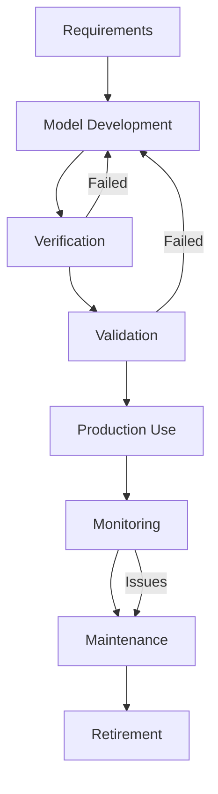

# 📋 A.Q.U.A.-V. Simulation Standards
## SIMULATION_STANDARDS.md

**Document ID**: AQV-STD-25JU0001-OPS-SIM-TLS-TD-SIM-001-00-01-STD-SIM-001-QDAT-v1.0.0

---

### 📋 Document Information

**Owner**: A.Q.U.A. Venture  
**Division**: Q-Data Governance (QDAT)  
**Sub-Division**: Simulation Standards Committee  
**Classification**: AQUA V. INTERNAL - RESTRICTED  

**Creation Date**: July 28, 2025  
**Version**: 1.0.0  
**Status**: ACTIVE  

---

### 🎯 Overview

This document defines the simulation standards, protocols, and best practices for the A.Q.U.A.-V. program. All simulation activities must comply with these standards to ensure consistency, accuracy, and regulatory compliance.

---

## 📊 Simulation Categories

### 1. **Aerodynamics Simulations**

#### CFD Standards
- **Mesh Quality**: y+ < 1 for boundary layers, aspect ratio < 100:1
- **Convergence**: Residuals < 1e-6, monitor forces/moments
- **Turbulence Models**: SST k-ω for external flows, LES for unsteady
- **Validation**: Wind tunnel correlation within ±5%

#### Quantum Enhancement
- **QAOA Optimization**: Minimum 50 qubits for design space exploration
- **Variational Circuits**: Maximum 100 iterations for convergence
- **Error Mitigation**: Zero-noise extrapolation for noisy quantum devices

### 2. **Structural Simulations**

#### FEA Standards
- **Element Quality**: Aspect ratio < 20:1, skewness < 0.7
- **Convergence**: Displacement change < 0.1%, stress < 1%
- **Material Models**: Linear elastic minimum, nonlinear for certification
- **Safety Factors**: Ultimate 1.5x, yield 1.25x per CS-25/FAR-25

#### Composite Analysis
- **Layup Definition**: Minimum 4 plies, symmetric stacking
- **Failure Criteria**: Tsai-Wu, Hashin for progressive damage
- **Delamination**: Cohesive zone modeling for critical areas

### 3. **Flight Dynamics**

#### 6DOF Models
- **Integration**: 4th order Runge-Kutta, fixed time step
- **Aerodynamic Data**: Table lookup with interpolation
- **Control System**: Digital autopilot with 100Hz update rate
- **Navigation**: GPS/INS fusion with quantum backup

#### Mission Simulation
- **Weather**: Real-time meteorological data integration
- **Traffic**: ADS-B integration for collision avoidance
- **Fuel Planning**: ±2% accuracy for range calculations

### 4. **Quantum Simulations**

#### Hardware Requirements
- **Classical**: Minimum 32 cores, 256GB RAM
- **Quantum**: IBM Quantum, IonQ, or equivalent access
- **Hybrid**: Classical-quantum interface < 10ms latency

#### Algorithm Standards
- **VQE**: Maximum 1000 iterations, gradient tolerance 1e-4
- **QAOA**: Minimum p=3 layers for optimization
- **Error Correction**: Surface code for fault-tolerant computation

---

## 🔧 Technical Requirements

### Computing Standards

#### Hardware Specifications
```yaml
minimum_requirements:
  cpu: "Intel Xeon Gold 6248 or AMD EPYC 7542"
  cores: 32
  memory: "256 GB DDR4-3200"
  storage: "2TB NVMe SSD"
  gpu: "NVIDIA RTX A6000 or Tesla V100"
  
recommended_requirements:
  cpu: "Intel Xeon Platinum 8380 or AMD EPYC 7763"
  cores: 80
  memory: "1TB DDR4-3200"
  storage: "10TB NVMe SSD RAID"
  gpu: "NVIDIA A100 80GB"
  interconnect: "InfiniBand HDR 200Gb/s"
```

#### Software Stack
```yaml
operating_system:
  primary: "Ubuntu 22.04 LTS"
  secondary: "RHEL 8.5, CentOS Stream 9"
  
compilers:
  c_cpp: "GCC 11.2+, Intel oneAPI 2022.1+"
  fortran: "gfortran 11.2+, Intel ifort 2022.1+"
  python: "Python 3.9+, Anaconda 2022.05+"
  
mpi_libraries:
  - "OpenMPI 4.1.2+"
  - "Intel MPI 2021.5+"
  - "MPICH 4.0+"
  
quantum_sdk:
  - "Qiskit 0.39+"
  - "Cirq 1.0+"
  - "PennyLane 0.27+"
```

### Data Management

#### File Formats
- **Geometry**: STEP, IGES, STL for CAD exchange
- **Mesh**: CGNS, Exodus II, VTK for simulation data
- **Results**: HDF5, NetCDF for large datasets
- **Documentation**: Markdown, LaTeX, PDF

#### Version Control
- **Code**: Git with GitLFS for large files
- **Data**: DVC (Data Version Control) integration
- **Models**: MLflow for machine learning models
- **Quantum**: Qiskit versioning for quantum circuits

#### Backup & Archive
- **Local**: Daily incremental, weekly full backup
- **Cloud**: AWS S3, Azure Blob, Google Cloud Storage
- **Long-term**: Tape archive for historical data
- **Retention**: 7 years minimum per aerospace regulations

---

## 📈 Quality Assurance

### Verification & Validation

#### Code Verification
```yaml
static_analysis:
  - "Coverity Scan"
  - "SonarQube"
  - "PVS-Studio"
  
unit_testing:
  coverage: ">95%"
  framework: "pytest, Google Test, Catch2"
  
integration_testing:
  ci_cd: "GitLab CI, GitHub Actions"
  containers: "Docker, Singularity"
```

#### Model Validation
```yaml
experimental_correlation:
  wind_tunnel: "±5% for forces and moments"
  flight_test: "±10% for performance metrics"
  
benchmark_problems:
  cfd: "NASA CRM, DPW-6 test cases"
  fea: "NAFEMS benchmarks"
  quantum: "VQE H2, QAOA MaxCut"
  
uncertainty_quantification:
  method: "Monte Carlo, Polynomial Chaos"
  samples: "minimum 1000 for statistical significance"
```

### Documentation Standards

#### Simulation Reports
```markdown
1. Executive Summary
2. Problem Definition
3. Methodology
4. Results & Discussion
5. Validation & Verification
6. Conclusions & Recommendations
7. References
8. Appendices
```

#### Code Documentation
- **Comments**: 20% minimum comment-to-code ratio
- **Docstrings**: NumPy/Google style for Python
- **API**: OpenAPI/Swagger for REST services
- **Quantum**: Qiskit circuit documentation

---

## 🔒 Security & Compliance

### Data Classification

#### Security Levels
```yaml
public:
  description: "Open source, published research"
  examples: ["tutorials", "benchmarks", "documentation"]
  
internal:
  description: "Proprietary but non-sensitive"
  examples: ["design studies", "optimization results"]
  
confidential:
  description: "Competitive advantage, IP protection"
  examples: ["production models", "performance data"]
  
restricted:
  description: "Export controlled, military applications"
  examples: ["defense contracts", "classified algorithms"]
```

#### Access Controls
- **Authentication**: Multi-factor authentication required
- **Authorization**: Role-based access control (RBAC)
- **Audit**: Complete simulation activity logging
- **Encryption**: AES-256 for data at rest, TLS 1.3 in transit

### Regulatory Compliance

#### Aviation Standards
- **DO-178C**: Software considerations in airborne systems
- **DO-254**: Design assurance for electronic hardware
- **ARP4754A**: Guidelines for development of civil aircraft
- **CS-25/FAR-25**: Airworthiness standards for transport aircraft

#### Space Standards
- **ECSS**: European Cooperation for Space Standardization
- **NASA-STD**: NASA technical standards
- **ISO 14300**: Space systems management standards

#### Export Control
- **ITAR**: International Traffic in Arms Regulations
- **EAR**: Export Administration Regulations
- **Wassenaar**: Dual-use export controls

---

## 🚀 Performance Requirements

### Computational Metrics

#### Scalability Requirements
```yaml
parallel_efficiency:
  target: ">80% up to 1000 cores"
  measurement: "weak and strong scaling"
  
memory_usage:
  maximum: "90% of available RAM"
  monitoring: "continuous during execution"
  
network_bandwidth:
  requirement: "InfiniBand or 100GbE"
  utilization: ">70% for large simulations"
```

#### Response Time Standards
```yaml
interactive_analysis:
  target: "<5 seconds for visualization updates"
  
optimization_loops:
  target: "<1 hour per design iteration"
  
quantum_computation:
  classical_preprocessing: "<10 minutes"
  quantum_execution: "<30 minutes"
  postprocessing: "<5 minutes"
```

### Accuracy Requirements

#### Numerical Precision
- **CFD**: Double precision (64-bit) minimum
- **FEA**: Mixed precision acceptable for linear problems
- **Quantum**: Complex128 for state vectors
- **Optimization**: Convergence tolerance 1e-6

#### Physical Validation
- **Aerodynamics**: ±5% for forces, ±2° for angles
- **Structures**: ±10% for stresses, ±5% for displacements
- **Flight**: ±5% for performance, ±10% for handling qualities
- **Quantum**: Fidelity >95% for quantum states

---

## 🔄 Process Workflows

### Simulation Lifecycle



### Review Process

#### Design Reviews
- **PDR**: Preliminary Design Review
- **CDR**: Critical Design Review
- **TRR**: Test Readiness Review
- **FRR**: Flight Readiness Review

#### Documentation Reviews
- **Technical**: Peer review by simulation experts
- **Quality**: QA team verification
- **Security**: Information security assessment
- **Management**: Program office approval

### Change Management

#### Version Control Strategy
```yaml
branching_model: "GitFlow"
release_cycle: "Quarterly major, monthly minor"
hotfix_process: "Emergency patches within 24 hours"

code_review:
  required_approvers: 2
  automated_checks: "CI/CD pipeline"
  security_scan: "Before merge to main"
```

---

## 📞 Support & Training

### Training Requirements

#### Personnel Certification
- **CFD Analysts**: 40 hours initial training, 16 hours annual
- **FEA Engineers**: 32 hours initial training, 12 hours annual
- **Quantum Developers**: 60 hours initial training, 24 hours annual
- **System Administrators**: 24 hours initial training, 8 hours annual

#### Training Materials
- **Online Courses**: Internal LMS platform
- **Hands-on Labs**: Virtual environments
- **Certification Tests**: Quarterly assessments
- **External Training**: Vendor-specific courses

### Support Structure

#### Technical Support
- **Level 1**: General usage, basic troubleshooting
- **Level 2**: Advanced configuration, performance tuning
- **Level 3**: Code development, algorithm implementation
- **Vendor Support**: Commercial software assistance

#### Escalation Process
```yaml
response_times:
  critical: "1 hour"
  high: "4 hours"
  medium: "1 business day"
  low: "3 business days"

escalation_path:
  level_1: "Local support team"
  level_2: "Simulation experts"
  level_3: "Development team"
  vendor: "External support"
```

---

## 📊 Metrics & KPIs

### Performance Indicators

#### Technical Metrics
- **Simulation Accuracy**: Validation error < 5%
- **Computational Efficiency**: >80% parallel scaling
- **System Uptime**: >99.5% availability
- **User Satisfaction**: >4.5/5.0 rating

#### Business Metrics
- **Cost per Simulation**: Target reduction 20% annually
- **Time to Results**: <50% of previous methods
- **Design Cycles**: 30% reduction in iterations
- **Certification Time**: 25% faster approval

### Reporting Requirements

#### Monthly Reports
- Simulation usage statistics
- Performance metrics
- Issue summary and resolution
- Resource utilization

#### Quarterly Reviews
- Technology roadmap updates
- Training completion rates
- Budget variance analysis
- Stakeholder feedback

---

---

**Document Control**
- **Document ID**: AQV-STD-25JU0001-OPS-SIM-TLS-TD-SIM-001-00-01-STD-SIM-001-QDAT-v1.0.0
- **Version**: 1.0.0
- **Date**: July 28, 2025
- **Owner**: A.Q.U.A.-V. Simulation Standards Committee
- **Classification**: AQUA V. INTERNAL - RESTRICTED
- **Approval**: Chief Technology Officer
- **Next Review**: January 28, 2026

**Contact Information**
- **Email**: simulation-standards@aqua-v.aerospace
- **Teams**: A.Q.U.A.-V. Simulation Standards
- **Documentation**: https://docs.aqua-v.aerospace/simulation-standards

---

**© 2025 A.Q.U.A. Venture. All rights reserved.**  
**This document is CONFIDENTIAL and PROPRIETARY to A.Q.U.A. Venture.**
