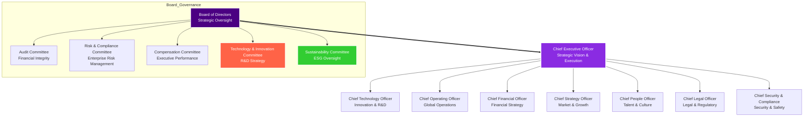
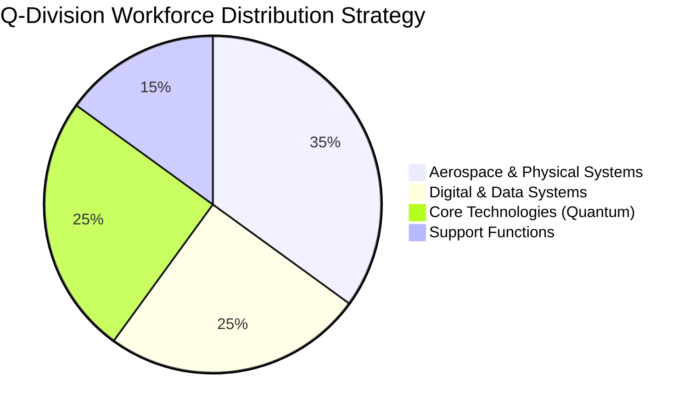
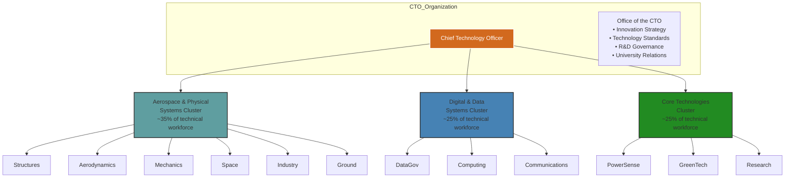
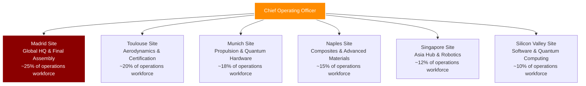
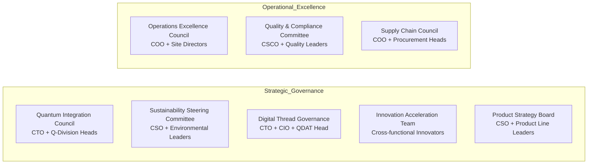
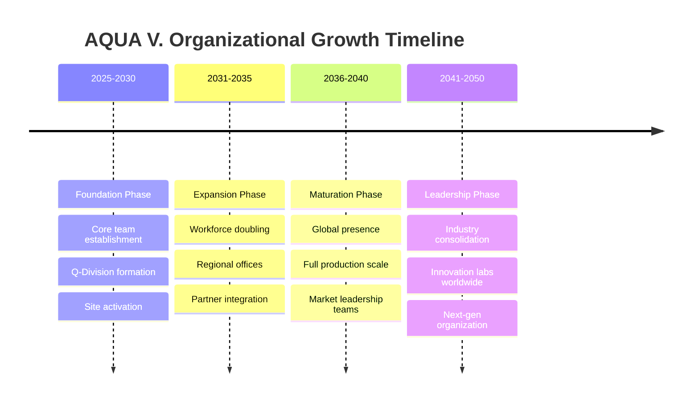

# ANNEX A: Detailed Organization Chart v2.0

**Document Status:** ✅ Complete  
**Version:** 2.0  
**Last Updated:** 2025-08-03  
**Artifact ID:** `AQUART-ORG-POL-ORG-DF-PA-ORGC-RDIG-300-10-00-v2.0.0`

---

## Executive Summary

AQUA V.'s organizational structure embodies our commitment to revolutionizing aerospace through quantum integration. Our matrix organization balances deep technical expertise with agile project execution, supporting our ambitious goal of becoming a global aerospace leader by 2050. The structure is designed to scale from our current foundation phase through our planned €144B annual revenue target by 2045.

### Strategic Organizational Principles
- **Quantum-First Architecture:** Every division integrates quantum capabilities from inception
- **Digital Thread Governance:** All roles interconnected through our advanced PLM ecosystem
- **Global Collaboration Model:** Follow-the-sun operations across six strategic sites
- **Innovation at Scale:** Structure enables both breakthrough R&D and industrial production
- **Adaptive Growth Framework:** Designed to scale 10x while maintaining agility

---

## 1.0 Executive Leadership Structure

### 1.1 Board Governance & C-Suite Architecture

### 1.2 Executive Portfolio Distribution

| Executive Role | Strategic Portfolio | Organizational Scale | Key Success Metrics |
|----------------|-------------------|---------------------|-------------------|
| **CEO** | • Corporate Strategy & Vision • Stakeholder Relations • Strategic Partnerships • Board Interface | Direct: C-Suite Indirect: Entire Organization | • Shareholder Value • Strategic Milestone Achievement • Market Position |
| **CTO** | • Technology Roadmap • Quantum Integration Strategy • R&D Portfolio • Innovation Pipeline | ~40% of total workforce 12 Q-Divisions High-complexity operations | • Technology Readiness Levels • Patent Portfolio Growth • Innovation Index |
| **COO** | • Manufacturing Excellence • Global Site Operations • Supply Chain • Quality Systems | ~35% of total workforce 6 Global Sites Production scaling | • Production Efficiency • Quality Metrics • Delivery Performance |
| **CFO** | • Financial Planning • Investment Strategy • Risk Management • Investor Relations | ~5% of total workforce Centralized function High expertise | • Financial Performance • ROI Metrics • Capital Efficiency |
| **CSO** | • Market Strategy • Business Development • Customer Success • Competitive Intelligence | ~3% of total workforce Strategic focus External orientation | • Market Share • Revenue Growth • Customer Satisfaction |
| **CPO** | • Talent Strategy • Culture Development • Learning & Development • Performance Systems | ~4% of total workforce Enterprise-wide impact Culture catalyst | • Employee Engagement • Talent Retention • Capability Development |
| **CLO** | • Legal Strategy • Regulatory Compliance • IP Management • Contract Excellence | ~3% of total workforce Specialized expertise Risk mitigation | • Compliance Score • IP Portfolio Value • Legal Risk Mitigation |
| **CSCO** | • Cybersecurity • Data Protection • Safety Management • Compliance Systems | ~5% of total workforce Critical infrastructure Zero-failure mandate | • Security Incidents • Safety Record • Compliance Audits |

---

## 2.0 Q-Division Architecture

### 2.1 Strategic Workforce Distribution Model

Our Q-Division structure reflects AQUA V.'s strategic priorities, with workforce allocation designed to support our quantum-first approach while maintaining excellence in traditional aerospace disciplines.

### 2.2 Technology & Innovation Directorate

### 2.3 Q-Division Strategic Profiles

#### Aerospace & Physical Systems Cluster

| Division | Strategic Role | Workforce Allocation Rationale | Key Interfaces |
|----------|---------------|-------------------------------|----------------|
| **QSTR - Structures** | Foundation of all flight vehicles | Largest engineering division (~12% of tech workforce) • Complex certification requirements • Multiple material technologies • Extensive testing infrastructure | QAIR, QMEC, QIND |
| **QAIR - Aerodynamics** | Performance and efficiency optimization | Significant computational and experimental resources (~10%) • CFD expertise concentration • Wind tunnel operations • Flight test coordination | QSTR, QPOW, QHPC |
| **QMEC - Mechanics** | Systems integration excellence | Moderate scale with high complexity (~9%) • Multi-disciplinary integration • Safety-critical systems • MRO planning expertise | All Divisions |
| **QSPA - Space** | Beyond-atmosphere operations | Specialized but growing (~7%) • Unique space environment • Satellite constellation management • Deep space capabilities | QCOM, QSCI |
| **QIND - Industry** | Manufacturing revolution | Largest operational division (~13%) • Digital factory implementation • Multi-site coordination • Production scaling | All Manufacturing Sites |
| **QGRO - Ground** | Infrastructure and operations | Lean but critical (~5%) • Test facility management • Ground support systems • Customer operations support | QIND, Sites |

#### Digital & Data Systems Cluster

| Division | Strategic Role | Workforce Allocation Rationale | Key Interfaces |
|----------|---------------|-------------------------------|----------------|
| **QDAT - DataGov** | Digital Thread guardian | Moderate but influential (~7%) • Enterprise data architecture • Cybersecurity leadership • Compliance automation | All Divisions |
| **QHPC - Computing** | Computational supremacy | High-expertise concentration (~8%) • Quantum computing development • HPC infrastructure • AI/ML platforms | QSCI, QAIR |
| **QCOM - Communications** | Connected ecosystem | Balanced team (~6%) • Quantum communications • Global connectivity • Secure networks | QSPA, QDAT |

#### Core Technologies Cluster

| Division | Strategic Role | Workforce Allocation Rationale | Key Interfaces |
|----------|---------------|-------------------------------|----------------|
| **QPOW - PowerSense** | Energy revolution | Large multidisciplinary team (~11%) • Propulsion innovation • Energy storage breakthrough • Quantum power management | QAIR, QGRE |
| **QGRE - GreenTech** | Sustainability leadership | Growing strategic importance (~6%) • Zero-emission technologies • Circular materials • Environmental compliance | All Divisions |
| **QSCI - Research** | Future technologies | Pure R&D focus (~5%) • Low-TRL exploration • University partnerships • Breakthrough innovations | QHPC, Universities |

---

## 3.0 Global Site Organization

### 3.1 Site Leadership Structure

### 3.2 Site Specialization Matrix

| Site | Primary Focus | Strategic Importance | Workforce Characteristics |
|------|---------------|---------------------|-------------------------|
| **Madrid** | • Global headquarters • Final assembly lines • Systems integration • Executive functions | Central nervous system of AQUA V. Largest site by workforce Most diverse operations | Mixed: Executive, Engineering, Production, Support |
| **Toulouse** | • Aerodynamic excellence • EASA certification • Flight test center • European operations | Leverages European aerospace heritage Critical for certification R&D concentration | High engineering density Test pilots and engineers Regulatory specialists |
| **Munich** | • Propulsion systems • Quantum hardware • Advanced manufacturing • German engineering | Technology powerhouse Quantum-classical integration Precision manufacturing | Highly specialized PhD concentration Advanced manufacturing |
| **Naples** | • Composite materials • Advanced structures • Material science • Supply chain hub | Cost-effective innovation Materials expertise Southern Europe gateway | Materials scientists Production specialists Quality experts |
| **Singapore** | • Asia-Pacific HQ • UAV production • Robotics assembly • Regional support | Strategic Asia presence Government partnerships Rapid prototyping | Diverse Asian talent Automation experts Regional specialists |
| **Silicon Valley** | • Software development • Quantum algorithms • AI/ML center • Digital innovation | Tech ecosystem access Talent magnet Innovation culture | Software engineers Quantum scientists Silicon Valley culture |

---

## 4.0 Cross-Functional Excellence

### 4.1 Strategic Committees & Councils

### 4.2 Matrix Organization Interfaces

The matrix structure ensures that functional expertise (Q-Divisions) seamlessly integrates with program execution (Product Lines):

| Product Line | Primary Q-Division Interfaces | Integration Model |
|--------------|------------------------------|-------------------|
| **AMPEL360** | QSTR (structures), QAIR (aerodynamics), QPOW (propulsion), QIND (manufacturing) | Integrated Product Teams (IPTs) with dedicated Q-Division liaisons |
| **GAIA** | QSPA (space systems), QCOM (communications), QHPC (computing), QDAT (data systems) | Agile development teams with embedded Q-Division experts |
| **ROBBBO-T** | QIND (automation), QHPC (AI/ML), QMEC (mechanisms), QGRO (ground systems) | Cross-functional robotics teams with rotating leadership |
| **QUANTUM** | QSCI (research), QHPC (quantum computing), All Q-Divisions (integration) | Center of Excellence model with dotted-line reporting |

---

## 5.0 Organizational Evolution Path

### 5.1 Scaling Strategy (2025-2050)

### 5.2 Dynamic Organizational Principles

As AQUA V. scales toward our 2050 vision, the organization will evolve based on:

1. **Adaptive Scaling:** Structure flexes with market demands while maintaining core architecture
2. **Digital-First Operations:** Increasing automation reduces administrative overhead
3. **Global Talent Network:** Virtual teams and digital collaboration expand talent access
4. **Innovation Velocity:** Smaller, faster innovation cells within larger operational framework
5. **Quantum Integration Maturity:** As quantum technologies mature, dedicated divisions may merge into operational units

---

## 6.0 Implementation & Governance

### 6.1 Organizational Change Management

- **Quarterly Organizational Reviews:** CEO and CPO assess structure effectiveness
- **Annual Restructuring Window:** Major organizational changes implemented in Q1
- **Change Communication Protocol:** 90-day notice for significant restructuring
- **Talent Retention Framework:** Internal mobility prioritized during changes

### 6.2 Document Control & References

| Reference | Document | Purpose |
|-----------|----------|---------|
| ANNEX B | Q-Division Competency Matrix | Detailed capability mapping |
| ANNEX C | Core Policies and Procedures | Governance framework |
| ANNEX H | Q-Division Interface Control | Collaboration protocols |
| ANNEX I | Training & Development Programs | Capability building |

---

**Document Approval:**

| Role | Signature | Date |
|------|-----------|------|
| Chief Executive Officer | [Digital Signature] | 2025-08-03 |
| Chief People Officer | [Digital Signature] | 2025-08-03 |
| Chief Technology Officer | [Digital Signature] | 2025-08-03 |

---

© 2025 AQUA V. Aerospace. This document contains proprietary information and is subject to controlled distribution.
