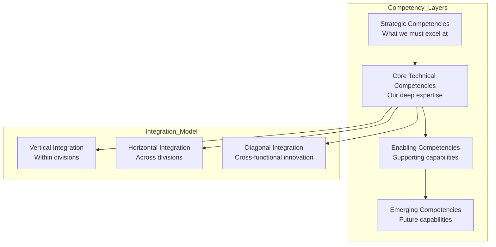
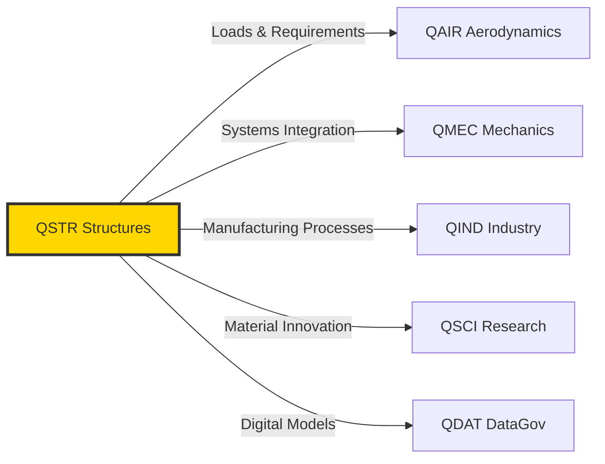
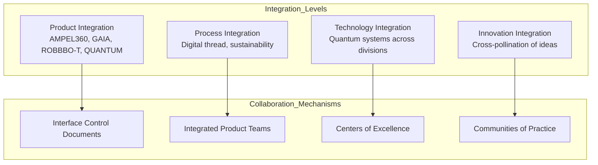
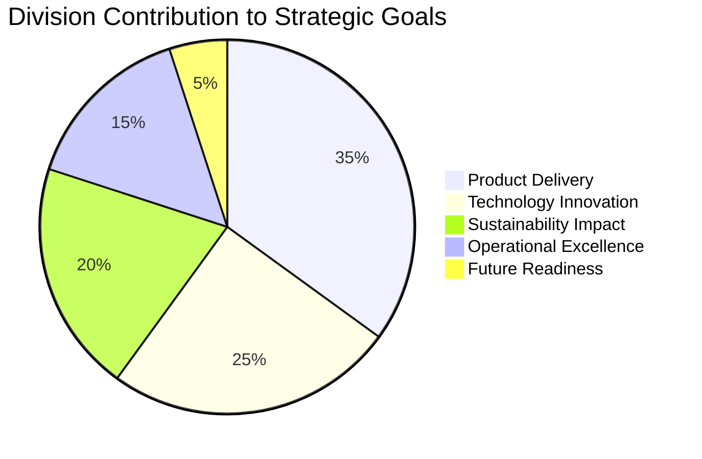

# ANNEX B: Q-Division Competency Matrix v1.5

**Document Status:** ✅ Complete  
**Version:** 1.5  
**Last Updated:** 2025-08-03  
**Artifact ID:** `AQUART-ORG-POL-QDV-DF-PA-COMP-RDIG-301-00-00-v1.5.0`

---

## Executive Summary

The Q-Division Competency Matrix defines the strategic capabilities, technical domains, and collaborative interfaces that enable AQUA V.'s quantum aerospace revolution. This document serves as the authoritative reference for understanding how our 12 specialized divisions combine deep expertise with cross-functional integration to deliver on our €144B revenue vision by 2045.

### Strategic Competency Principles
- **Quantum Integration:** Every division incorporates quantum technologies as core competencies
- **Digital Thread Excellence:** All competencies mapped to digital capabilities
- **Sustainability by Design:** Environmental competencies embedded across divisions
- **Global Best Practices:** Competencies benchmarked against aerospace leaders
- **Future-Ready Skills:** Continuous evolution of competencies with technology

---

## 1.0 Q-Division Competency Architecture

### 1.1 Competency Framework Overview

### 1.2 Competency Maturity Scale

| Level | Description | Characteristics | % of Competencies Target |
|-------|-------------|-----------------|-------------------------|
| **L1 - Foundational** | Basic capability | Industry standard practices | 10% |
| **L2 - Proficient** | Solid expertise | Competitive parity | 20% |
| **L3 - Advanced** | Leading edge | Industry leadership | 40% |
| **L4 - Breakthrough** | Revolutionary | Quantum-enhanced innovation | 25% |
| **L5 - Transformational** | Game-changing | Redefining aerospace | 5% |

---

## 2.0 Aerospace & Physical Systems Cluster

### 2.1 Cluster Overview
**Mission:** Design, develop, and deliver revolutionary aerospace systems that integrate quantum technologies with traditional engineering excellence.

**Strategic Importance:** This cluster represents the core product realization capability, transforming innovative concepts into certified, manufacturable aerospace systems.

### 2.2 QSTR - Structures Division

**Mission:** Pioneer quantum-enhanced structural systems that redefine aerospace performance, weight, and reliability standards.

#### Core Competency Portfolio

| Competency Domain | Specific Capabilities | Maturity Target | Strategic Impact |
|-------------------|----------------------|-----------------|------------------|
| **Quantum-Enhanced Materials** | • Quantum material characterization • Nano-engineered composites • Self-healing structures • Quantum fatigue prediction | L4-L5 | Revolutionary weight reduction & reliability |
| **Advanced Composites** | • Automated fiber placement • Out-of-autoclave processing • Hybrid material systems • Bio-based composites | L3-L4 | Sustainability & performance |
| **Structural Optimization** | • Topology optimization • Quantum algorithms for design • Multi-scale modeling • Biomimetic structures | L4 | Optimal strength-to-weight |
| **Health Monitoring** | • Embedded quantum sensors • Real-time damage detection • Predictive maintenance AI • Digital twin integration | L4-L5 | Zero unexpected failures |
| **Certification Excellence** | • Virtual testing & certification • Regulatory pathway innovation • Test correlation databases • Quantum simulation validation | L3-L4 | Faster time to market |

#### Key Deliverables & Metrics
- **Primary Deliverables:** Certified structures, material specifications, test reports, digital models
- **Performance Metrics:** Weight reduction vs. baseline (target: 30%), development cycle time (target: -40%), first-pass certification rate (target: 95%)
- **Innovation Metrics:** Patents filed annually (target: 50+), new material systems qualified (target: 5/year)

#### Critical Interfaces

### 2.3 QAIR - Aerodynamics Division

**Mission:** Achieve aerodynamic supremacy through quantum-enhanced computational methods and revolutionary flow control technologies.

#### Core Competency Portfolio

| Competency Domain | Specific Capabilities | Maturity Target | Strategic Impact |
|-------------------|----------------------|-----------------|------------------|
| **Quantum CFD** | • Quantum flow solvers • Turbulence modeling • Multi-fidelity simulation • Real-time optimization | L4-L5 | 10x faster design cycles |
| **Experimental Aerodynamics** | • Cryogenic wind tunnels • Pressure sensitive paint • Particle image velocimetry • Quantum flow visualization | L3-L4 | Validation excellence |
| **Flow Control** | • Active flow control • Plasma actuators • Morphing surfaces • Quantum vortex control | L4-L5 | 15% efficiency gain |
| **Multi-Domain Integration** | • Aero-acoustics • Aero-elasticity • Aero-thermal • Urban air mobility flows | L3-L4 | Holistic optimization |
| **Flight Sciences** | • Flight envelope expansion • Stability & control • Performance prediction • Quantum navigation integration | L3-L4 | Superior flight characteristics |

#### Key Deliverables & Metrics
- **Primary Deliverables:** Aerodynamic databases, performance guarantees, flight manuals, certification reports
- **Performance Metrics:** L/D improvement (target: 25%), CFD correlation accuracy (target: 98%), wind tunnel productivity (target: 2x)
- **Innovation Metrics:** Breakthrough configurations tested (target: 10/year), quantum CFD adoption (target: 80% by 2030)

### 2.4 QMEC - Mechanics Division

**Mission:** Integrate mechanical systems with unprecedented reliability through quantum sensing and predictive technologies.

#### Core Competency Portfolio

| Competency Domain | Specific Capabilities | Maturity Target | Strategic Impact |
|-------------------|----------------------|-----------------|------------------|
| **Smart Actuation** | • Quantum position sensing • Self-diagnosing actuators • Energy harvesting systems • Morphing mechanisms | L4 | Zero unscheduled maintenance |
| **Systems Integration** | • Model-based engineering • Digital mock-up • Virtual integration • Quantum system optimization | L3-L4 | First-time quality |
| **Advanced Hydraulics** | • Smart fluids • Leak-free systems • Health monitoring • Quantum pressure sensing | L3-L4 | 50% weight reduction |
| **Environmental Control** | • Quantum HVAC • Advanced filtration • Pressure optimization • Thermal management | L3-L4 | Passenger comfort revolution |
| **Landing Systems** | • Active shock absorption • Quantum brake control • Health monitoring • Autonomous steering | L4 | All-weather capability |

### 2.5 QSPA - Space Division

**Mission:** Extend AQUA V.'s reach beyond Earth's atmosphere with quantum-enabled space systems.

#### Core Competency Portfolio

| Competency Domain | Specific Capabilities | Maturity Target | Strategic Impact |
|-------------------|----------------------|-----------------|------------------|
| **Quantum Space Systems** | • Quantum communication satellites • Quantum navigation • Quantum sensing arrays • Quantum computing in space | L4-L5 | Space leadership |
| **Orbital Mechanics** | • Trajectory optimization • Station keeping • Formation flying • Debris avoidance | L3-L4 | Mission success |
| **Space Environment** | • Radiation hardening • Thermal cycling • Vacuum compatibility • Micro-meteoroid protection | L3 | Reliability in space |
| **Planetary Systems** | • Entry, descent, landing • Rover systems • In-situ resource use • Life support | L3-L4 | Multi-planetary capability |

### 2.6 QIND - Industry Division

**Mission:** Revolutionize aerospace manufacturing through quantum-enhanced production systems and digital factories.

#### Core Competency Portfolio

| Competency Domain | Specific Capabilities | Maturity Target | Strategic Impact |
|-------------------|----------------------|-----------------|------------------|
| **Digital Manufacturing** | • Digital thread implementation • Virtual factory • Quantum quality control • Predictive maintenance | L4 | Industry 5.0 leadership |
| **Automation Excellence** | • Collaborative robotics • AGV systems • Automated assembly • Quantum inspection | L3-L4 | 3x productivity |
| **Supply Chain Mastery** | • Quantum optimization • Blockchain tracking • Predictive logistics • Supplier integration | L4 | Zero delays |
| **Quality Systems** | • Zero-defect manufacturing • In-process monitoring • Quantum metrology • Automated certification | L4 | 6-sigma excellence |

### 2.7 QGRO - Ground Division

**Mission:** Enable seamless ground operations through quantum-enhanced support systems and infrastructure.

#### Core Competency Portfolio

| Competency Domain | Specific Capabilities | Maturity Target | Strategic Impact |
|-------------------|----------------------|-----------------|------------------|
| **Smart Infrastructure** | • Quantum-secured facilities • Automated ground handling • Predictive maintenance bays • Energy optimization | L3-L4 | Operational excellence |
| **Test Systems** | • Iron bird integration • Hardware-in-loop • Quantum simulation • Automated testing | L3-L4 | Accelerated validation |
| **Ground Support** | • Autonomous GSE • Quantum diagnostics • AR/VR maintenance • Digital work instructions | L3-L4 | 50% faster turnaround |

---

## 3.0 Digital & Data Systems Cluster

### 3.1 QDAT - DataGov Division

**Mission:** Architect and govern the digital nervous system that enables AQUA V.'s data-driven transformation.

#### Core Competency Portfolio

| Competency Domain | Specific Capabilities | Maturity Target | Strategic Impact |
|-------------------|----------------------|-----------------|------------------|
| **Quantum Data Architecture** | • Quantum databases • Distributed ledgers • Real-time analytics • Federated learning | L4-L5 | Data supremacy |
| **Cybersecurity Leadership** | • Quantum encryption • Zero-trust architecture • AI threat detection • Resilient systems | L4-L5 | Impenetrable defense |
| **Digital Thread Mastery** | • End-to-end traceability • Configuration management • Change propagation • Version control | L4 | Seamless integration |
| **Governance Excellence** | • Data standards • Compliance automation • Privacy protection • Ethical AI | L3-L4 | Trust & compliance |

### 3.2 QHPC - Computing Division

**Mission:** Provide unlimited computational power through quantum-classical hybrid systems.

#### Core Competency Portfolio

| Competency Domain | Specific Capabilities | Maturity Target | Strategic Impact |
|-------------------|----------------------|-----------------|------------------|
| **Quantum Computing** | • QPU development • Algorithm design • Error correction • Quantum advantage | L5 | Computational revolution |
| **HPC Infrastructure** | • Exascale systems • GPU acceleration • Cloud integration • Edge computing | L3-L4 | Unlimited scale |
| **AI/ML Platforms** | • Deep learning • Reinforcement learning • Explainable AI • Federated learning | L4 | Intelligence everywhere |
| **Software Excellence** | • DO-178C compliance • DevSecOps • Continuous integration • Quantum SDKs | L3-L4 | Reliable systems |

### 3.3 QCOM - Communications Division

**Mission:** Enable secure, instantaneous communication across all domains through quantum networks.

#### Core Competency Portfolio

| Competency Domain | Specific Capabilities | Maturity Target | Strategic Impact |
|-------------------|----------------------|-----------------|------------------|
| **Quantum Communications** | • QKD networks • Quantum internet • Entanglement distribution • Quantum repeaters | L4-L5 | Unhackable comms |
| **Advanced Networks** | • 6G integration • Satellite mesh • Software-defined • Network slicing | L3-L4 | Global connectivity |
| **Secure Systems** | • Post-quantum crypto • Secure protocols • Identity management • Threat mitigation | L4 | Absolute security |

---

## 4.0 Core Technologies Cluster

### 4.1 QPOW - PowerSense Division

**Mission:** Revolutionize aerospace energy systems through quantum sensing and management.

#### Core Competency Portfolio

| Competency Domain | Specific Capabilities | Maturity Target | Strategic Impact |
|-------------------|----------------------|-----------------|------------------|
| **Quantum Power Systems** | • Quantum batteries • Superconducting systems • Quantum generators • Energy harvesting | L4-L5 | Unlimited endurance |
| **Propulsion Innovation** | • Hybrid-electric • Hydrogen systems • Quantum thrust optimization • Thermal management | L4 | Zero emissions |
| **Sensing Excellence** | • Quantum sensors • Distributed sensing • Sensor fusion • Predictive analytics | L4-L5 | Perfect awareness |

### 4.2 QGRE - GreenTech Division

**Mission:** Lead the aerospace industry's transformation to complete sustainability.

#### Core Competency Portfolio

| Competency Domain | Specific Capabilities | Maturity Target | Strategic Impact |
|-------------------|----------------------|-----------------|------------------|
| **Circular Economy** | • Recycling technologies • Bio-materials • Waste-to-resource • Design for disassembly | L4 | Zero waste |
| **Environmental Systems** | • Carbon capture • Emission monitoring • Life cycle assessment • Quantum env. modeling | L3-L4 | Carbon negative |
| **Sustainable Energy** | • Solar integration • Fuel cells • Green hydrogen • Energy storage | L3-L4 | Energy independence |

### 4.3 QSCI - Research Division

**Mission:** Explore the frontiers of science to discover breakthrough technologies for tomorrow's aerospace.

#### Core Competency Portfolio

| Competency Domain | Specific Capabilities | Maturity Target | Strategic Impact |
|-------------------|----------------------|-----------------|------------------|
| **Quantum Research** | • Fundamental physics • New qubit types • Quantum materials • Quantum biology | L5 | Scientific breakthroughs |
| **Advanced Concepts** | • Metamaterials • Plasma physics • Nano-technology • Synthetic biology | L4-L5 | Future technologies |
| **Innovation Process** | • Tech scouting • University partnerships • Startup ecosystem • IP development | L3-L4 | Innovation pipeline |

---

## 5.0 Competency Integration Framework

### 5.1 Cross-Division Synergies

### 5.2 Competency Development Roadmap

| Phase | Period | Focus Areas | Expected Outcomes |
|-------|--------|-------------|-------------------|
| **Foundation** | 2025-2027 | Core competency establishment Quantum integration basics Digital infrastructure | Operational readiness |
| **Acceleration** | 2028-2030 | Advanced quantum capabilities Cross-division integration First product applications | Market entry |
| **Expansion** | 2031-2035 | Breakthrough innovations Global best practices Ecosystem leadership | Market leadership |
| **Transformation** | 2036-2050 | Revolutionary capabilities Industry redefinition Quantum supremacy | Global dominance |

---

## 6.0 Performance Measurement

### 6.1 Competency Health Metrics

Each division tracks competency development through:

1. **Technical Readiness Level (TRL):** Progress from research to deployment
2. **Competency Maturity Index (CMI):** L1-L5 progression tracking
3. **Integration Effectiveness Score (IES):** Cross-division collaboration success
4. **Innovation Velocity Rate (IVR):** Speed of new capability development
5. **Talent Density Metric (TDM):** Expertise concentration by competency

### 6.2 Strategic Alignment Dashboard

---

## 7.0 Implementation Governance

### 7.1 Competency Development Board

- **Chair:** Chief Technology Officer
- **Members:** All Q-Division Directors, Chief People Officer
- **Frequency:** Monthly reviews, quarterly strategic updates
- **Charter:** Ensure competency development aligns with strategic objectives

### 7.2 Document Control & References

| Reference | Document | Integration Points |
|-----------|----------|-------------------|
| ANNEX A | Organization Chart | Reporting structures |
| ANNEX H | Interface Control | Collaboration protocols |
| ANNEX I | Training Programs | Competency development |
| ANNEX O | WIR Framework | Strategic alignment |

---

**Document Approval:**

| Role | Signature | Date |
|------|-----------|------|
| Chief Technology Officer | [Digital Signature] | 2025-08-03 |
| VP Quantum Integration | [Digital Signature] | 2025-08-03 |
| All Q-Division Directors | [Digital Signatures] | 2025-08-03 |

---

© 2025 AQUA V. Aerospace. This document contains proprietary information and is subject to controlled distribution.
