# ANNEX C: Core Policies and Procedures v1.0

**Document Status:** ✅ Complete  
**Version:** 1.0  
**Last Updated:** 2025-08-03  
**Artifact ID:** `AQUART-OPS-POL-STD-DC-PA-CPOL-RDIG-304-00-01-v1.0.0`

---

## Executive Summary

This document establishes the foundational policies and procedures that govern all AQUA V. operations globally. These policies ensure regulatory compliance, operational excellence, and ethical conduct while enabling innovation and agility. Every policy is designed to support our journey toward €144B annual revenue by 2045 while maintaining the highest standards of safety, quality, and integrity.

### Core Policy Principles
- **Quantum-Enhanced Governance:** AI and quantum systems augment human decision-making
- **Zero-Tolerance Safety Culture:** Safety is never compromised for schedule or cost
- **Sustainability by Design:** Environmental impact considered in every decision
- **Ethical Innovation:** Technology development guided by moral imperatives
- **Continuous Improvement:** Policies evolve with technology and best practices

---

## 1.0 Governance Framework

### 1.1 Corporate Governance Architecture

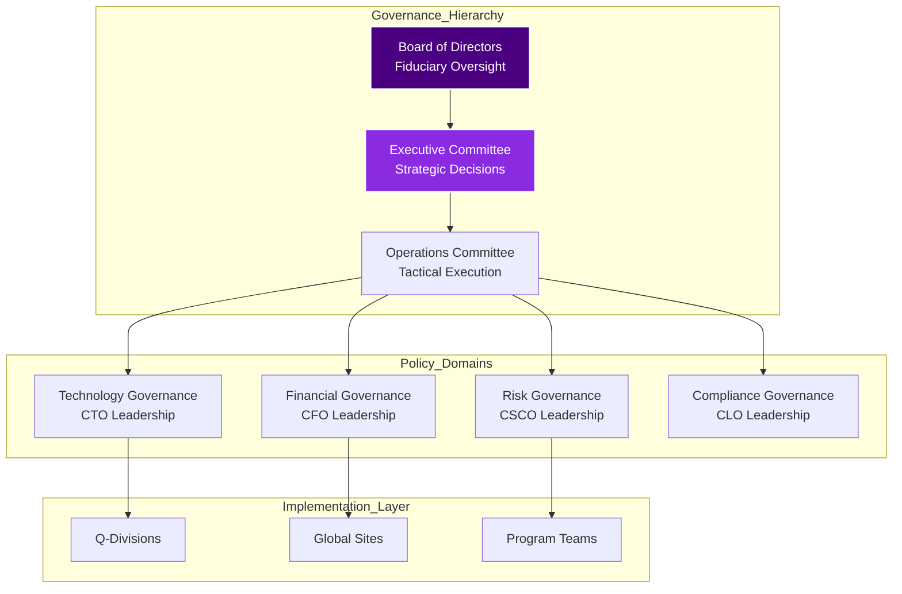

### 1.2 Decision Authority Matrix (RACI)

| Decision Type | Board | CEO | CxO | Division Director | Site Director |
|--------------|-------|-----|-----|------------------|---------------|
| **Strategic Investment >€100M** | A | R | C | I | I |
| **Technology Roadmap** | I | A | R | C | I |
| **Major Partnerships** | A | R | C | I | - |
| **Product Launch** | I | A | R | C | C |
| **Operational Changes** | - | I | A | R | C |
| **Safety Critical** | I | I | A | R | R |

*R=Responsible, A=Accountable, C=Consulted, I=Informed*

### 1.3 Policy Lifecycle Management

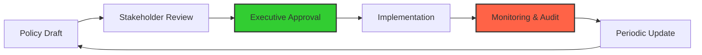

**Policy Review Cycles:**
- **Critical Policies:** Quarterly review
- **Operational Policies:** Semi-annual review
- **Administrative Policies:** Annual review
- **Emergency Updates:** As required with 24-hour approval

---

## 2.0 Technical Governance Policies

### 2.1 Engineering Standards & Practices

#### Policy Statement
All engineering activities shall follow established best practices, leverage quantum-enhanced design tools, and maintain full traceability through the digital thread.

#### Key Requirements

| Requirement | Description | Compliance Metric |
|-------------|-------------|-------------------|
| **Design Standards** | • Model-Based Systems Engineering (MBSE) mandatory • Quantum optimization for all critical designs • Digital twin from concept to retirement | 100% MBSE adoption |
| **Documentation** | • Nomenclature System v10.0 compliance • Version control for all artifacts • Immutable audit trails | 100% compliance rate |
| **Review Gates** | • Preliminary Design Review (PDR) • Critical Design Review (CDR) • Production Readiness Review (PRR) | Zero gate bypasses |
| **Change Control** | • Engineering Change Request (ECR) process • Impact analysis mandatory • Quantum simulation validation | <48hr approval cycle |

### 2.2 Technology Development Policy

#### Innovation Framework

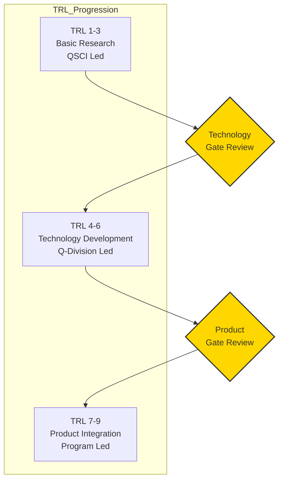

#### Quantum Technology Policies

1. **Quantum Advantage Threshold:** Technologies must demonstrate >10x improvement over classical approaches
2. **Quantum-Classical Integration:** All quantum systems must seamlessly integrate with existing infrastructure
3. **Quantum Safety:** Fail-safe mechanisms required for all quantum control systems
4. **IP Protection:** All quantum innovations immediately filed for patent protection

---

## 3.0 Quality Management System (QMS)

### 3.1 Quality Policy Statement

"AQUA V. is committed to achieving quantum leaps in quality through continuous improvement, zero-defect manufacturing, and predictive quality systems that anticipate and prevent issues before they occur."

### 3.2 Quality Architecture

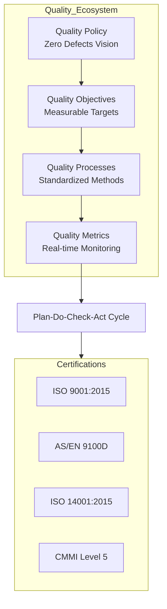

### 3.3 Quality Metrics Dashboard

| Metric Category | Target | Measurement Method | Review Frequency |
|-----------------|--------|-------------------|------------------|
| **First Pass Yield** | >99.5% | Automated inspection | Real-time |
| **Supplier Quality** | >99% | Incoming inspection | Daily |
| **Customer Satisfaction** | >95% | NPS surveys | Monthly |
| **Internal Audit Findings** | <5 per quarter | Audit reports | Quarterly |
| **Cost of Quality** | <2% of revenue | Financial analysis | Monthly |
| **Escape Rate** | <0.1% | Field reports | Weekly |

### 3.4 Advanced Quality Technologies

1. **Quantum Inspection Systems:** 100% automated inspection using quantum sensors
2. **Predictive Quality:** AI/ML models predict quality issues 72 hours in advance
3. **Digital Thread Quality:** Every quality event tracked through product lifecycle
4. **Blockchain Certificates:** Immutable quality records for all critical components

---

## 4.0 Safety Management System (SMS)

### 4.1 Safety Policy Statement

"Safety is the foundation of AQUA V.'s operations. We maintain a proactive safety culture where every employee is empowered to identify and mitigate risks."

### 4.2 Safety Architecture

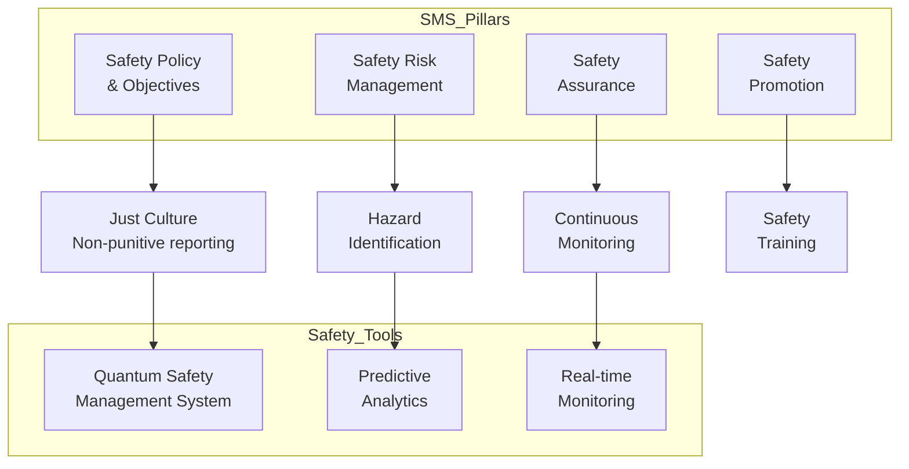

### 4.3 Safety Performance Indicators

| Indicator | Target | Current Performance | Trend |
|-----------|--------|-------------------|--------|
| **Lost Time Injury Rate** | <0.5 | Real-time tracking | ↓ |
| **Near Miss Reports** | >100/month | Encouraging reporting | ↑ |
| **Safety Training Completion** | 100% | Automated tracking | → |
| **Risk Mitigation Effectiveness** | >95% | Quantum analysis | ↑ |
| **Emergency Response Time** | <3 min | Drill results | → |

---

## 5.0 Security & Data Governance

### 5.1 Cybersecurity Policy Framework

#### Zero-Trust Security Model

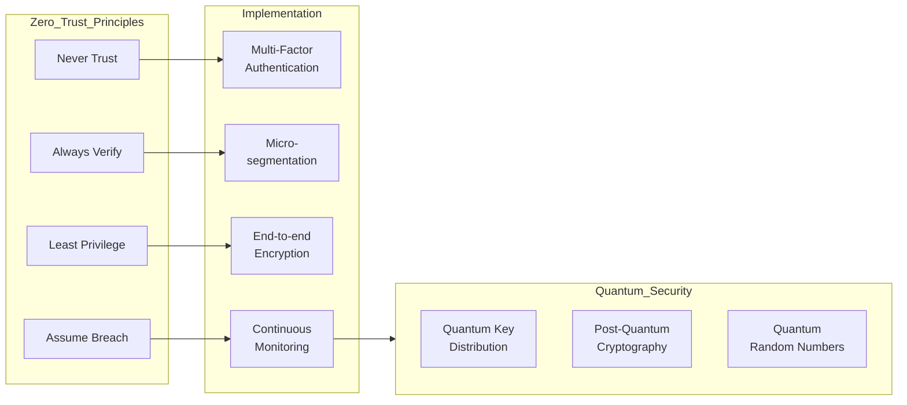

### 5.2 Data Classification & Protection

| Classification | Description | Protection Requirements | Example Data |
|----------------|-------------|------------------------|---------------|
| **AQUA-SECRET** | Highest sensitivity | Quantum encryption, air-gapped systems | Quantum algorithms, strategic plans |
| **AQUA-CONFIDENTIAL** | High sensitivity | AES-256, need-to-know | Design data, financial models |
| **AQUA-RESTRICTED** | Moderate sensitivity | Encrypted at rest/transit | Supplier data, procedures |
| **AQUA-INTERNAL** | Low sensitivity | Standard protection | General communications |
| **AQUA-PUBLIC** | No sensitivity | No special requirements | Marketing materials |

### 5.3 Incident Response Protocol

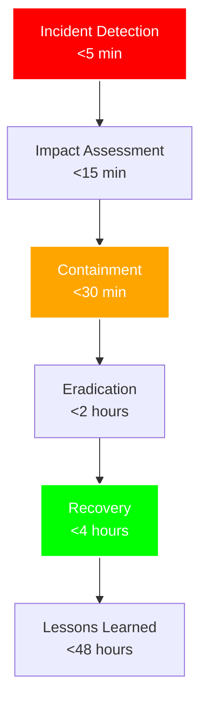

---

## 6.0 Ethics & Business Conduct

### 6.1 Code of Ethics

#### Core Ethical Principles

1. **Integrity:** We act honestly and transparently in all dealings
2. **Respect:** We value diversity and treat everyone with dignity
3. **Excellence:** We strive for the highest standards in everything we do
4. **Responsibility:** We are accountable for our actions and their impacts
5. **Innovation:** We pursue breakthrough technologies ethically

### 6.2 AI Ethics Framework

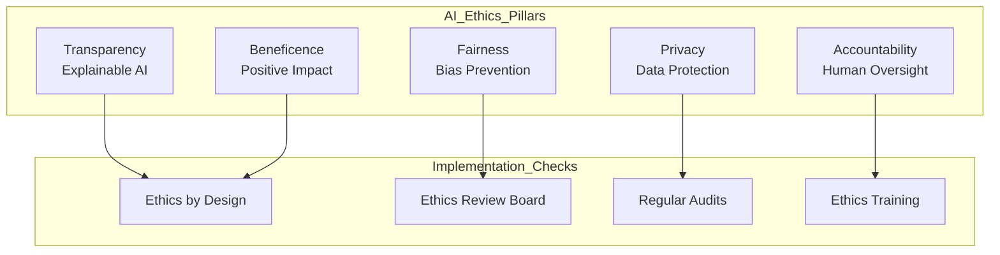

### 6.3 Compliance & Anti-Corruption

| Policy Area | Requirements | Monitoring | Consequences |
|-------------|--------------|------------|--------------|
| **Anti-Bribery** | Zero tolerance, mandatory reporting | Transaction monitoring | Immediate termination |
| **Gifts & Entertainment** | <€50 value, pre-approval required | Expense audits | Disciplinary action |
| **Conflicts of Interest** | Annual disclosure, immediate updates | Review board | Remediation required |
| **Trade Compliance** | Export control training mandatory | Automated screening | Legal prosecution |
| **Fair Competition** | No collusion, price fixing | Market monitoring | Regulatory penalties |

---

## 7.0 Environmental & Sustainability Policies

### 7.1 Environmental Policy Statement

"AQUA V. commits to achieving net-zero operations by 2035 and carbon-negative products by 2040 through revolutionary green technologies and circular economy principles."

### 7.2 Sustainability Framework

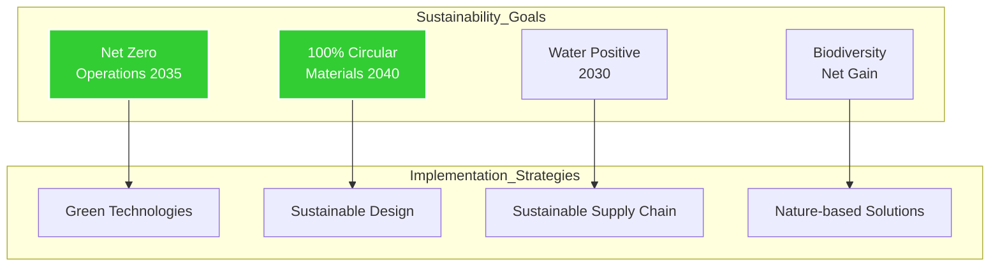

### 7.3 Environmental Metrics

| Metric | 2025 Baseline | 2030 Target | 2040 Target | 2050 Target |
|--------|---------------|-------------|-------------|-------------|
| **Carbon Emissions** | 100% | 50% | -20% | -100% |
| **Renewable Energy** | 25% | 75% | 100% | 100% |
| **Waste to Landfill** | 100% | 25% | 0% | 0% |
| **Water Consumption** | 100% | 50% | 25% | 10% |
| **Recycled Materials** | 15% | 50% | 90% | 100% |

---

## 8.0 Supply Chain & Procurement Policies

### 8.1 Supplier Code of Conduct

All suppliers must adhere to AQUA V.'s standards for:
- **Ethics & Integrity:** Same standards as AQUA V. employees
- **Sustainability:** Environmental targets and reporting
- **Quality:** AS/EN 9100 certification required
- **Security:** Cybersecurity maturity assessment
- **Innovation:** Participation in joint R&D programs

### 8.2 Strategic Sourcing Framework

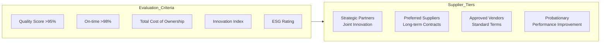

---

## 9.0 Human Resources & Talent Policies

### 9.1 Talent Philosophy

"We attract, develop, and retain the world's best aerospace and quantum technology talent through competitive compensation, continuous learning, and a culture of innovation."

### 9.2 Performance Management

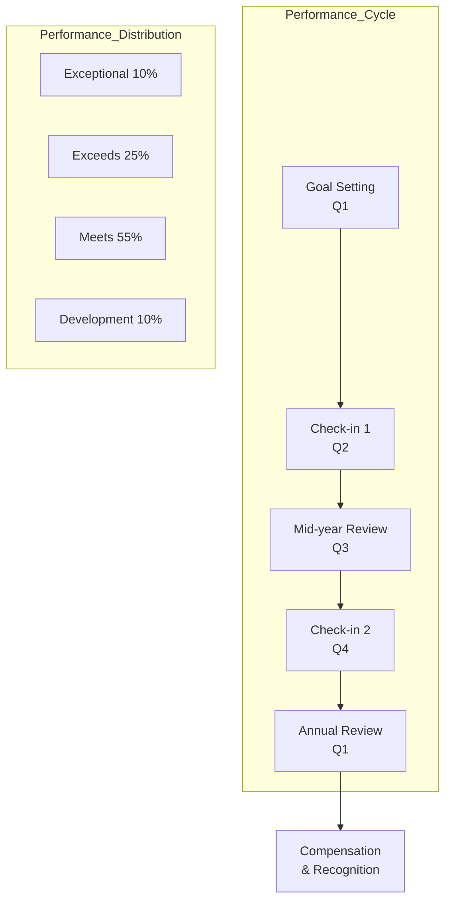

### 9.3 Diversity, Equity & Inclusion

| Dimension | 2025 Target | 2030 Target | Initiatives |
|-----------|-------------|-------------|-------------|
| **Gender Balance** | 35% women | 45% women | STEM outreach, mentoring |
| **Global Diversity** | 40+ nationalities | 60+ nationalities | Global recruitment |
| **Leadership Diversity** | 30% diverse | 40% diverse | Leadership development |
| **Pay Equity** | <2% gap | 0% gap | Annual audits |

---

## 10.0 Financial & Risk Management Policies

### 10.1 Financial Control Framework

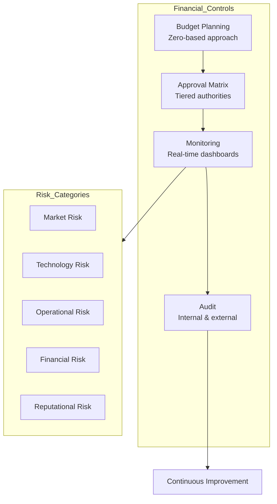

### 10.2 Investment Approval Thresholds

| Investment Type | Division Director | CxO | CEO | Board |
|----------------|------------------|-----|-----|-------|
| **Operational** | <€1M | <€10M | <€50M | >€50M |
| **R&D** | <€5M | <€25M | <€100M | >€100M |
| **Strategic** | - | <€10M | <€100M | >€100M |
| **M&A** | - | - | <€500M | >€500M |

---

## 11.0 Crisis Management & Business Continuity

### 11.1 Crisis Response Framework

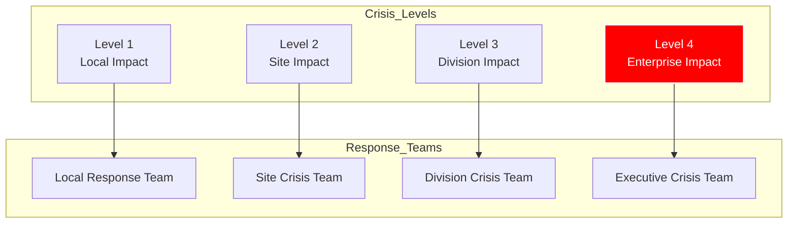

### 11.2 Business Continuity Priorities

1. **Life Safety:** Protect all personnel and visitors
2. **Critical Operations:** Maintain essential functions
3. **Data Protection:** Secure all critical data
4. **Stakeholder Communication:** Timely, accurate updates
5. **Recovery:** Return to normal operations

---

## 12.0 Policy Implementation & Compliance

### 12.1 Implementation Roadmap

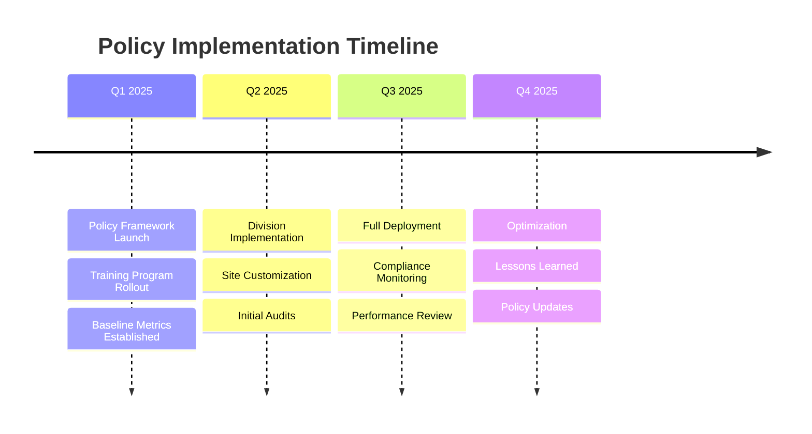

### 12.2 Compliance Monitoring Dashboard

| Policy Domain | Compliance Target | Current Status | Trend | Action Required |
|---------------|------------------|----------------|-------|-----------------|
| **Technical Governance** | 100% | 98% | ↑ | Minor corrections |
| **Quality Management** | 100% | 99% | → | Maintain |
| **Safety Management** | 100% | 100% | → | Maintain |
| **Security Governance** | 100% | 97% | ↑ | Focus on training |
| **Ethics & Conduct** | 100% | 99% | → | Maintain |
| **Environmental** | 95% | 92% | ↑ | Accelerate initiatives |

### 12.3 Policy Exceptions Process

1. **Request:** Formal exception request with business justification
2. **Risk Assessment:** Impact analysis by relevant teams
3. **Approval:** Based on risk level and authority matrix
4. **Monitoring:** Enhanced oversight during exception period
5. **Closure:** Exception expires or becomes policy update

---

## 13.0 Document Control & References

### 13.1 Related Documents

| Reference | Document | Relationship |
|-----------|----------|--------------|
| ANNEX A | Organization Chart | Defines policy ownership |
| ANNEX D | Nomenclature System | Document control standards |
| ANNEX H | Interface Control | Cross-division policies |
| ANNEX O | WIR Framework | Policy context integration |
| External | ISO/AS Standards | Compliance requirements |

### 13.2 Policy Maintenance

- **Owner:** Chief Security & Compliance Officer
- **Review Cycle:** Quarterly with annual comprehensive review
- **Update Authority:** Executive Committee approval required
- **Distribution:** Controlled via digital thread, accessible to all employees
- **Training:** Mandatory within 30 days of significant updates

---

**Policy Effectiveness Date:** January 1, 2025

**Document Approval:**

| Role | Name | Signature | Date |
|------|------|-----------|------|
| Chief Executive Officer | [Name] | [Digital Signature] | 2025-08-03 |
| Chief Security & Compliance Officer | [Name] | [Digital Signature] | 2025-08-03 |
| Chief Legal Officer | [Name] | [Digital Signature] | 2025-08-03 |
| Board Risk Committee Chair | [Name] | [Digital Signature] | 2025-08-03 |

---

**Revision History:**

| Version | Date | Author | Changes |
|---------|------|--------|---------|
| 1.0 | 2025-08-03 | Policy Committee | Initial release |

---

© 2025 AQUA V. Aerospace. This document contains proprietary information and is subject to controlled distribution. Unauthorized reproduction is prohibited.
