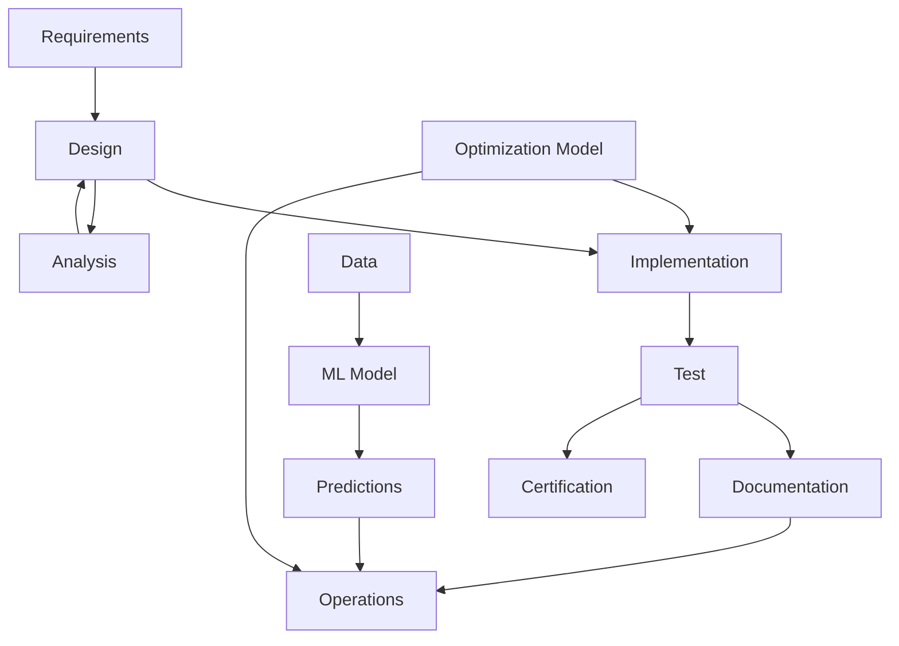
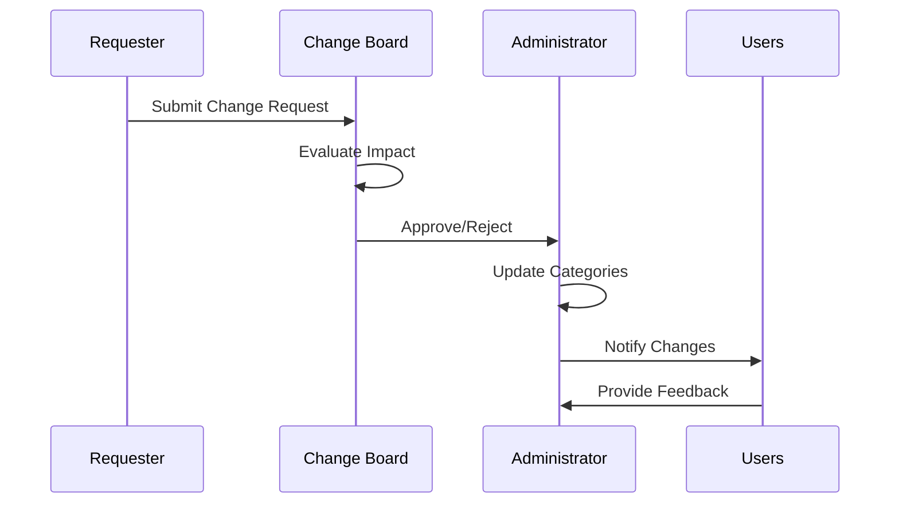

# Annex E: Master Artifact Categories v12.3.2

**Document ID:** `AQUART-OPS-SC-POL-STD-DC-PA-MAC-RDIG0-30500000001-MUL-v12.3.2`  
**Status:** ✅ APPROVED  
**Effective Date:** 2025-08-05  
**Classification:** AQUA V. STANDARD - MANDATORY COMPLIANCE

---

## 1. Introduction

This annex establishes the comprehensive categorization framework for all artifacts within the AQUA V. program. The Master Artifact Categories (MAC) system provides a standardized taxonomy for classifying, organizing, and managing the diverse range of artifacts generated across the program lifecycle.

### 1.1 Purpose
- Standardize artifact identification and classification
- Enable efficient search and retrieval of artifacts
- Support traceability and impact analysis
- Facilitate knowledge management and transfer
- Integrate with the Nomenclature System v12.3

### 1.2 Scope
Applies to all artifacts created, managed, or maintained within the AQUA V. program, including:
- Documents and documentation
- Software and code artifacts
- Hardware and physical components
- Models and simulations
- Test artifacts and results
- Configuration items

---

## 2. Artifact Category Framework

### 2.1 Primary Classification Dimensions

| Dimension | Description | Values |
|-----------|-------------|--------|
| **Type** | Fundamental nature of the artifact | Document, Software, Hardware, Model, Test, Configuration |
| **Domain** | Technical or business area | Engineering, Manufacturing, Operations, Quality, Safety, Security, Business |
| **Lifecycle Phase** | Stage in product lifecycle | Strategy, Conceptual, Design, Development, Testing, Integration, Certification, Production, Operations, Maintenance, Repair, Upgrade, Extension, Retirement, Audit |
| **Criticality** | Importance to program success | Critical, Essential, Important, Standard |
| **Format** | Physical or digital form | Physical, Digital, Hybrid |

### 2.2 Category Hierarchy
```
Artifact
├── Type
│   ├── Document
│   ├── Software
│   ├── Hardware
│   ├── Model
│   ├── Test
│   └── Configuration
├── Domain
│   ├── Engineering
│   ├── Manufacturing
│   ├── Operations
│   ├── Quality
│   ├── Safety
│   ├── Security
│   └── Business
├── Lifecycle Phase
│   └── [15 phases as defined in Nomenclature System]
├── Criticality
│   ├── Critical
│   ├── Essential
│   ├── Important
│   └── Standard
└── Format
    ├── Physical
    ├── Digital
    └── Hybrid
```

---

## 3. Detailed Artifact Categories

### 3.1 By Type

#### 3.1.1 Document Artifacts
| Category | Description | Examples | DOC Codes |
|----------|-------------|----------|-----------|
| **Requirements** | Formal statements of needs | Specifications, Statements of Work | RQS, SRD, MRD |
| **Design** | Technical design documentation | Drawings, Schematics, Models | SDS, ICD, HDD, SDD |
| **Procedures** | Step-by-step instructions | Manuals, Work Instructions | AMM, CMM, SOP |
| **Analysis** | Evaluation and study documents | Reports, Assessments, Studies | TRM, FAS, FHA |
| **Management** | Program control documents | Plans, Policies, Charters | BSP, FIN, RSK |
| **Records** | Evidence of activities | Logs, Certificates, Minutes | COC, FAI, CCB |

#### 3.1.2 Software Artifacts
| Category | Description | Examples |
|----------|-------------|----------|
| **Source Code** | Human-readable program instructions | .py, .cpp, .java files |
| **Executable Code** | Machine-readable program instructions | .exe, .bin, .jar files |
| **Libraries** | Reusable code collections | .dll, .so, .a files |
| **Configuration** | Software settings and parameters | .xml, .json, .yaml files |
| **Documentation** | Code-related documentation | API docs, README files |
| **Test Code** | Software for testing | Unit tests, Integration tests |

#### 3.1.3 Hardware Artifacts
| Category | Description | Examples |
|----------|-------------|----------|
| **Components** | Individual hardware parts | Sensors, Actuators, Connectors |
| **Assemblies** | Multiple components combined | Circuit boards, Subsystems |
| **Systems** | Complete functional units | Engines, Avionics suites |
| **Tools** | Equipment for production/repair | Test rigs, Assembly tools |
| **Facilities** | Physical infrastructure | Manufacturing plants, Test sites |

#### 3.1.4 Model Artifacts
| Category | Description | Examples |
|----------|-------------|----------|
| **CAD Models** | 3D design representations | .step, .iges, .catpart files |
| **Simulation Models** | Mathematical representations | FEA, CFD, System dynamics |
| **Digital Twins** | Virtual replicas of physical assets | Real-time simulations |
| **Data Models** | Data structure definitions | Database schemas, API models |
| **Process Models** | Business process representations | BPMN, Flowcharts |
| **Predictive/ML Models** | Machine learning models for prediction | Trained neural networks, regression models, forecasting models |
| **AI/Agentic Models** | Artificial intelligence and autonomous agent systems | Multi-agent systems, reinforcement learning models, autonomous decision-making models |
| **Optimization Models** | Mathematical optimization frameworks | Linear programming, genetic algorithms, constraint satisfaction models |

#### 3.1.5 Test Artifacts
| Category | Description | Examples |
|----------|-------------|----------|
| **Test Plans** | Strategy and approach documents | QTP, DTP, FTP |
| **Test Procedures** | Step-by-step test instructions | TCP, TRP |
| **Test Results** | Outcomes of test execution | QTR, DTR, FTR |
| **Test Data** | Inputs and outputs from tests | Measurement files, Logs |
| **Test Environments** | Setup for test execution | Test benches, Simulators |

#### 3.1.6 Configuration Artifacts
| Category | Description | Examples |
|----------|-------------|----------|
| **Baselines** | Reference configurations | Design baselines, Build baselines |
| **Change Records** | Documentation of changes | ECR, ECP, EO |
| **Version Records** | Version history information | Release notes, Change logs |
| **Build Records** | Build process documentation | Build scripts, Manifests |
| **Deployment Records** | Deployment information | Installation records, Release packages |

### 3.2 By Domain

#### 3.2.1 Engineering Domain
| Sub-domain | Artifact Types | Examples |
|------------|----------------|----------|
| **Aerodynamics** | Models, Analysis, Test | Wind tunnel data, CFD models, Predictive airflow models |
| **Structures** | Models, Analysis, Test | FEA results, Stress reports, AI structural health monitoring |
| **Propulsion** | Models, Hardware, Test | Engine test data, Performance curves, Optimization models |
| **Avionics** | Software, Hardware, Test | Flight control code, Sensor data, Agentic navigation systems |
| **Systems** | Models, Documents, Test | System architecture, Integration results, Digital twins |

#### 3.2.2 Manufacturing Domain
| Sub-domain | Artifact Types | Examples |
|------------|----------------|----------|
| **Production** | Procedures, Hardware, Config | Work instructions, Tooling specs, AI quality control |
| **Quality** | Documents, Test, Records | Inspection reports, Quality plans, ML defect detection |
| **Supply Chain** | Documents, Records | Supplier specs, Purchase orders, Predictive inventory models |
| **Maintenance** | Procedures, Records | Maintenance manuals, Service records, AI predictive maintenance |

#### 3.2.3 Operations Domain
| Sub-domain | Artifact Types | Examples |
|------------|----------------|----------|
| **Flight Operations** | Procedures, Documents | Flight manuals, Checklists, AI flight optimization |
| **Ground Operations** | Procedures, Documents | Ground handling procedures, Autonomous ground systems |
| **Training** | Documents, Models | Training materials, Simulators, AI training systems |
| **Customer Support** | Documents, Records | Service bulletins, Customer feedback, AI support agents |

#### 3.2.4 Quality Domain
| Sub-domain | Artifact Types | Examples |
|------------|----------------|----------|
| **Quality Assurance** | Documents, Procedures | Quality plans, Audit procedures, AI quality prediction |
| **Quality Control** | Test, Records | Inspection reports, Test results, ML defect classification |
| **Continuous Improvement** | Documents, Analysis | Improvement plans, Performance reports, Optimization models |

#### 3.2.5 Safety Domain
| Sub-domain | Artifact Types | Examples |
|------------|----------------|----------|
| **Safety Management** | Documents, Procedures | Safety manuals, Emergency procedures, AI risk assessment |
| **Risk Assessment** | Analysis, Documents | Hazard analyses, Risk assessments, Predictive safety models |
| **Certification** | Documents, Records | Certification reports, Compliance evidence, AI compliance checking |

#### 3.2.6 Security Domain
| Sub-domain | Artifact Types | Examples |
|------------|----------------|----------|
| **Cybersecurity** | Documents, Software, Config | Security policies, Firewall configs, AI threat detection |
| **Physical Security** | Documents, Procedures | Access control procedures, Security plans, AI surveillance |
| **Data Security** | Documents, Software | Encryption policies, Data handling procedures, AI data protection |

#### 3.2.7 Business Domain
| Sub-domain | Artifact Types | Examples |
|------------|----------------|----------|
| **Program Management** | Documents, Plans | Project plans, Status reports, AI project optimization |
| **Financial** | Documents, Models | Budgets, Financial models, AI financial forecasting |
| **Legal** | Documents, Records | Contracts, Agreements, Patents, AI contract analysis |
| **Stakeholder** | Documents, Communications | Meeting minutes, Presentations, AI sentiment analysis |

---

## 4. Artifact Relationships and Dependencies

### 4.1 Relationship Types

| Relationship | Description | Example |
|--------------|-------------|---------|
| **Derives From** | Artifact is based on another | Test procedure derives from requirements |
| **Implements** | Artifact fulfills another | Code implements design specification |
| **Validates** | Artifact verifies another | Test report validates design |
| **References** | Artifact cites another | Analysis report references test data |
| **Supersedes** | Artifact replaces another | New version replaces old version |
| **Complements** | Artifact completes another | User manual complements product |
| **Trains** | AI model is trained using data | ML model trained on historical data |
| **Optimizes** | Model improves another system | Optimization model enhances production efficiency |

### 4.2 Dependency Graph Example


---

## 5. Classification Matrix

### 5.1 Artifact Classification by Phase

| Phase | Primary Artifact Types | Key DOC Codes | Criticality Focus | Typical REALIDAD |
|-------|----------------------|---------------|------------------|-------------------|
| **STR** | Management, Analysis | BSP, MKA, TRM, FIN | Business Critical | VRTUL, SIMUL |
| **CON** | Requirements, Analysis | SRD, FHA, COP, FAS | Essential | VRTUL, SIMUL |
| **DES** | Design, Models | SDS, ICD, HDD, SDD | Critical | SDIG, SIMUL |
| **DEV** | Software, Implementation | SRC, EOC, BLD, API | Critical | SDIG, VRTUL |
| **TST** | Test, Results | QTP, QTR, DTP, DTR | Critical | SIMUL, HYBRD |
| **INT** | Configuration, Test | ITP, ITR, ICR, IVR | Essential | HYBRD, OPERT |
| **CRT** | Records, Compliance | TC, STC, CMP, DAS | Critical | OPERT, PHYSL |
| **PRD** | Procedures, Hardware | MPS, QCP, BOM, FAI | Essential | PHYSL, OPERT |
| **OPS** | Procedures, Documentation | AFM, FCOM, SOP, FOM | Critical | OPERT, AUGMT |
| **MNT** | Procedures, Records | AMM, CMM, SB, WDM | Essential | OPERT, AUGMT |
| **REP** | Procedures, Analysis | EO, CAR, CAPA, NDT | Important | PHYSL, STAND |
| **UPG** | Plans, Procedures | UCR, UCP, UTR, UIP | Important | HYBRD, EXTND |
| **EXT** | Analysis, Plans | LEP, LEA, DTA, EIP | Essential | OPERT, EXTND |
| **RET** | Procedures, Records | DCP, EDS, RET, DIS | Standard | PHYSL, STAND |
| **AUD** | Records, Analysis | IQA, EQA, ACR, KPI | Important | VRTUL, OPERT |

### 5.2 Cross-Domain Artifact Mapping

| Domain → Type | Document | Software | Hardware | Model | Test | Configuration |
|---------------|----------|----------|----------|-------|-------|---------------|
| **Engineering** | ✅ | ✅ | ✅ | ✅ | ✅ | ✅ |
| **Manufacturing** | ✅ | ✅ | ✅ | ⚠️ | ✅ | ✅ |
| **Operations** | ✅ | ✅ | ⚠️ | ⚠️ | ⚠️ | ✅ |
| **Quality** | ✅ | ⚠️ | ⚠️ | ❌ | ✅ | ✅ |
| **Safety** | ✅ | ⚠️ | ❌ | ⚠️ | ✅ | ✅ |
| **Security** | ✅ | ✅ | ✅ | ❌ | ⚠️ | ✅ |
| **Business** | ✅ | ⚠️ | ❌ | ✅ | ❌ | ✅ |

✅ = Primary artifacts<br>
⚠️ = Secondary artifacts<br>
❌ = Minimal or no artifacts

---

## 6. Examples and Use Cases

### 6.1 Aircraft Design Example

**Artifact:** `AMPEL3-BWB-Q100-0001-DES-SDS-ARC-DF-PA-S001-SIMUL-020-00-00-v1.0.0`

**Classification:**
- **Type:** Document (Design Specification)
- **Domain:** Engineering (Systems Architecture)
- **Lifecycle Phase:** Design
- **Criticality:** Critical
- **Format:** Digital
- **REALIDAD:** SIMUL (Réplica digital para diseño)

**Relationships:**
- Derives from: Requirements documents
- Implements: System requirements
- Referenced by: Hardware design documents
- Validated by: Test procedures

### 6.2 Quantum Service Example

**Artifact:** `QSERVS-QPS-CORE-0001-DEV-SRC-QML-DF-PA-A001-SENTN-900-00-00-v4.0.0`

**Classification:**
- **Type:** Software (Source Code)
- **Domain:** Engineering (Quantum Processing)
- **Lifecycle Phase:** Development
- **Criticality:** Critical
- **Format:** Digital
- **REALIDAD:** SENTN (Sistema autónomo consciente)

**Relationships:**
- Implements: Design specifications
- Referenced by: Test procedures
- Supersedes: Previous version
- Complements: Documentation

### 6.3 Maintenance Procedure Example

**Artifact:** `AMPEL3-BWB-Q100-0001-MNT-SE-AMM-TSG-TR-VF-E001-0001-MULTI-071-50-00-00-v2.0.0`

**Classification:**
- **Type:** Document (Maintenance Manual)
- **Domain:** Operations (Maintenance)
- **Lifecycle Phase:** Maintenance
- **Criticality:** Essential
- **Format:** Hybrid
- **REALIDAD:** MULTI (Multicontextual)

**Relationships:**
- Derives from: Design documentation
- References: Parts catalogs
- Used by: Maintenance technicians
- Complements: Training materials

### 6.4 Additional Clarifying Examples

#### Example 6.4.1: CAD Model (SDIG)
**Artifact:** `AMPEL3-BWB-Q100-0001-DES-SDD-CAD-DF-PA-M001-SDIG-020-00-00-v1.0.0`

**Classification:**
- **Type:** Model (CAD Model)
- **Domain:** Engineering (Design)
- **Lifecycle Phase:** Design
- **Criticality:** Essential
- **Format:** Digital
- **REALIDAD:** SDIG (Modelo virtual puro)

#### Example 6.4.2: Digital Twin (SIMUL)
**Artifact:** `AMPEL3-BWB-Q100-0001-TST-QTP-SYS-TS-VF-S001-SIMUL-024-00-00-v1.0.0`

**Classification:**
- **Type:** Test (Test Plan)
- **Domain:** Engineering (Systems)
- **Lifecycle Phase:** Testing
- **Criticality:** Critical
- **Format:** Digital
- **REALIDAD:** SIMUL (Réplica digital de lo físico)

#### Example 6.4.3: Predictive ML Model
**Artifact:** `AMPEL3-BWB-Q100-0001-OPS-SRC-QML-DF-PA-M001-SENTN-900-30-00-v3.2.0`

**Classification:**
- **Type:** Model (Predictive/ML Model)
- **Domain:** Operations (Maintenance)
- **Lifecycle Phase:** Operations
- **Criticality:** Critical
- **Format:** Digital
- **REALIDAD:** SENTN (Sistema autónomo consciente)

**Relationships:**
- Trains on: Historical maintenance data
- Optimizes: Maintenance schedules
- Complements: Maintenance procedures
- Used by: Maintenance planning systems

#### Example 6.4.4: Optimization Model
**Artifact:** `INFRAM-MANU-LINE1-0001-PRD-SRC-OPT-DF-PA-O001-SDIG-600-10-00-v2.1.0`

**Classification:**
- **Type:** Model (Optimization Model)
- **Domain:** Manufacturing (Production)
- **Lifecycle Phase:** Production
- **Criticality:** Essential
- **Format:** Digital
- **REALIDAD:** SDIG (Modelo virtual puro)

**Relationships:**
- Optimizes: Production line efficiency
- References: Production constraints
- Used by: Manufacturing planning systems
- Complements: Production procedures

#### Example 6.4.5: AI/Agentic Model
**Artifact:** `QSERVS-QPS-CORE-0001-OPS-SRC-AI-DF-PA-A001-SENTN-900-40-00-v5.0.0`

**Classification:**
- **Type:** Model (AI/Agentic Model)
- **Domain:** Engineering (Quantum Processing)
- **Lifecycle Phase:** Operations
- **Criticality:** Critical
- **Format:** Digital
- **REALIDAD:** SENTN (Sistema autónomo consciente)

**Relationships:**
- Implements: Autonomous decision-making
- Trains on: Operational data
- Optimizes: Resource allocation
- Complements: Operational procedures

---

## 7. Maintenance and Updates

### 7.1 Category Maintenance Process

1. **Annual Review**: Complete review of all categories and classifications
2. **Continuous Improvement**: Ongoing refinement based on user feedback
3. **Change Management**: Formal process for adding/modifying categories
4. **Version Control**: Track changes to classification system
5. **Stakeholder Review**: Regular review by domain experts

### 7.2 Change Request Process



### 7.3 Update Schedule

| Activity | Frequency | Responsible |
|----------|------------|-------------|
| Minor Updates | Quarterly | MAC Administrator |
| Major Review | Annually | Change Control Board |
| Stakeholder Review | Semi-annually | Domain Experts |
| User Feedback Collection | Continuous | All Users |

---

## 8. Integration with Other Systems

### 8.1 Nomenclature System Integration v12.3

The Master Artifact Categories directly integrate with the Nomenclature System v12.3:

- **DOC Field**: Maps to Document artifact types
- **APP Field**: Maps to Domain classifications
- **PHASE Field**: Maps to Lifecycle Phase
- **CRIT Field**: Maps to Criticality levels
- **REALIDAD Field**: Maps to Format types and contexts

**Mapping Table:**

| Nomenclature Field | MAC Dimension | Example Mapping |
|-------------------|---------------|-----------------|
| DOC | Type | SDS → Document (Design) |
| APP | Domain | ARC → Engineering (Architecture) |
| PHASE | Lifecycle Phase | DES → Design Phase |
| CRIT | Criticality | SC → Critical |
| REALIDAD | Format + Context | SDIG → Digital (Virtual Models) |
| REALIDAD | Format + Context | PHYSL → Physical (Hardware) |
| REALIDAD | Format + Context | MULTI → Hybrid (Multi-context) |

### 8.2 Digital Thread Integration

Artifact categories enable Digital Thread capabilities by:
- Providing consistent classification across the product lifecycle
- Enabling traceability between related artifacts
- Supporting impact analysis across domains
- Facilitating knowledge discovery and reuse

### 8.3 Configuration Management Integration

Categories support configuration management by:
- Defining what constitutes a configuration item
- Establishing baselines by category
- Managing changes within category constraints
- Supporting variant management

---

## 9. Compliance and Governance

### 9.1 Mandatory Compliance Requirements

1. **All artifacts must be classified** using the MAC system
2. **Classification must be consistent** with artifact content and purpose
3. **Changes to classification** require formal approval
4. **Legacy artifacts** must be reclassified during migration
5. **Regular audits** ensure classification accuracy

### 9.2 Governance Structure

| Role | Responsibilities |
|------|------------------|
| **MAC Administrator** | Day-to-day maintenance, User support |
| **Domain Experts** | Provide domain-specific guidance |
| **Change Control Board** | Approve major changes |
| **Program Management** | Ensure compliance across program |
| **Quality Assurance** | Audit classification accuracy |

### 9.3 Non-Compliance Consequences

- **Minor Issues**: Documentation and retraining
- **Major Issues**: Formal corrective action plans
- **Repeated Issues**: Escalation to program leadership
- **Critical Issues**: Impact on program milestones and budget

---

## 10. Implementation Guidelines

### 10.1 Classification Best Practices

1. **Be Specific**: Choose the most specific category applicable
2. **Consider Purpose**: Classify based on primary purpose, not format
3. **Maintain Consistency**: Apply similar logic to similar artifacts
4. **Document Exceptions**: Justify non-standard classifications
5. **Review Regularly**: Ensure classifications remain accurate

### 10.2 Tool Support

Recommended tools for MAC implementation:
- **Classification Wizards**: Guided classification process
- **Bulk Classification Tools**: Process multiple artifacts
- **Validation Rules**: Ensure classification accuracy
- **Reporting Tools**: Analyze classification distribution
- **Search Integration**: Find artifacts by category

### 10.3 Training Requirements

| Audience | Training Content | Duration |
|----------|------------------|----------|
| All Users | MAC overview and basic classification | 2 hours |
| Artifact Creators | Detailed classification guidance | 4 hours |
| Administrators | MAC maintenance and governance | 8 hours |
| Managers | Compliance and oversight | 2 hours |

---

## 11. Future Enhancements

### 11.1 Planned Improvements

1. **AI-Assisted Classification**: Machine learning for automatic classification
2. **Enhanced Visualization**: Interactive category relationship maps
3. **Integration with External Standards**: Alignment with industry standards
4. **Mobile Support**: Classification tools for mobile devices
5. **Advanced Analytics**: Category usage and effectiveness metrics

### 11.2 Research Areas

1. **Dynamic Classification**: Categories that adapt to artifact evolution
2. **Cross-Program Standardization**: Alignment with partner programs
3. **Semantic Classification**: Meaning-based categorization
4. **Predictive Classification**: Suggesting categories based on content

---

## 12. Appendix: REALIDAD Code Reference

### 12.1 Contextos Individuales

| Código | Contexto | Descripción | Ejemplos de Uso |
|--------|----------|-------------|------------------|
| VRTUL | Virtual | Existe solo en entorno digital | Software, documentos digitales |
| AUGMT | Aumentado | Superpone digital sobre físico | AR para mantenimiento, HUD |
| EXTND | Extendido | Amplía capacidades físicas | Exoesqueletos, sistemas híbridos |
| SENTN | Sentiente | Sistema autónomo consciente | IA avanzada, sistemas de decisión |
| **SDIG** | **Simulated Digital** | **Modelos virtuales puros** | **CAD 3D, modelos matemáticos** |
| **SIMUL** | **Simulado** | **Réplica digital de lo físico** | **Gemelos digitales, entornos de prueba** |
| OPERT | Operativo | En uso activo/producción | Sistemas en servicio, equipos activos |
| STAND | Standing | En espera/almacenado | Inventario, backup, reserva |
| PHYSL | Físico | Tangible y material | Hardware, componentes, estructuras |
| HYBRD | Híbrido | Combinación física-digital | IoT, sistemas cyber-físicos |

### 12.2 Contextos Múltiples

| Código | Contexto | Descripción | Casos de Uso |
|-------|---------|:------------|:-------------|
| MULTI | Multicontextual | Válido en múltiples realidades | Documentos con versiones física, digital y AR |
| OMNIR | Omnirealidad | Válido en todas las realidades | Estándares universales, políticas |
| ADAPT | Adaptativo | Se ajusta según contexto | Contenido que cambia según plataforma |

---

**END OF DOCUMENT**

© 2025 AQUA V. Aerospace. Controlled Document.  
**Distribution:** A - Internal Unlimited | B - Authorized Partners | C - Regulatory Authorities
