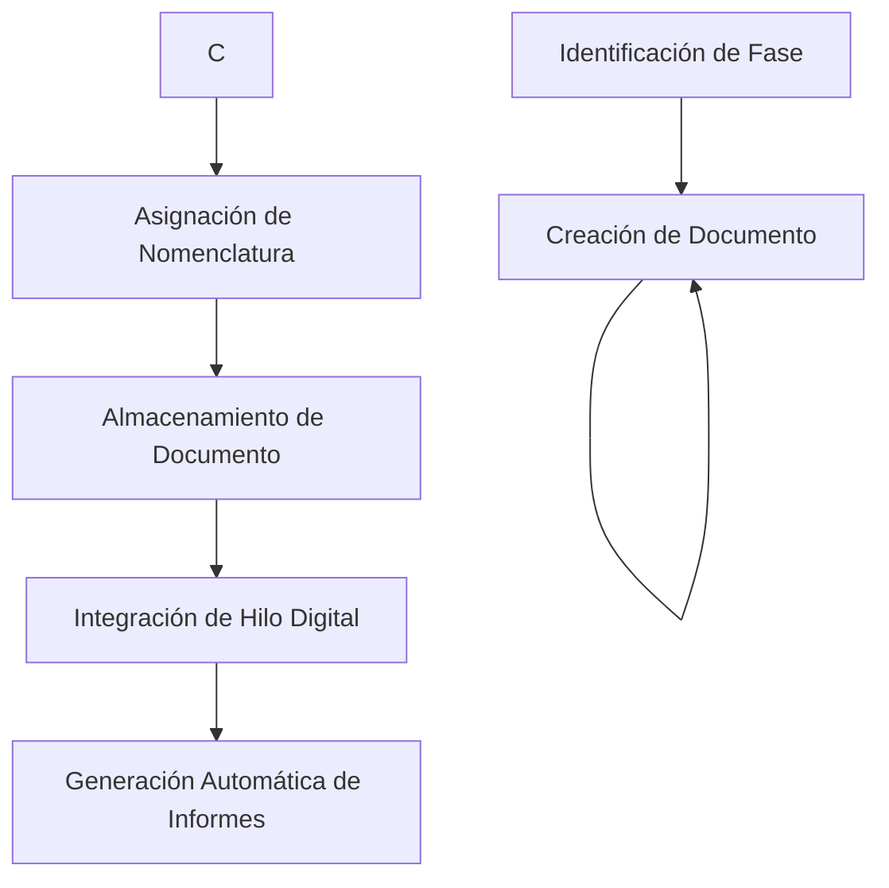

# Anexo E: Biblioteca de Plantillas de Documentación v12.3.1 (Corregido)
**ID de Documento:** `AQUART-OPS-SC-POL-STD-DC-PA-DTL-RDIG0-30600000001-MUL-v12.3.1`  
**Estado:** ✅ APROBADO  
**Fecha de Vigencia:** 2025-08-05  
**Clasificación:** ESTÁNDAR AQUA V. - CUMPLIMIENTO OBLIGATORIO
---
[https://processing-prompt-ui--Robbbo-T.github.app](https://processing-prompt-ui--Robbbo-T.github.app)
## 1. Introducción
Este anexo proporciona una biblioteca completa de plantillas de documentación estandarizadas para su uso en todo el programa AQUA V. La Biblioteca de Plantillas de Documentación (DTL) garantiza consistencia, eficiencia y cumplimiento en todas las actividades de documentación durante el ciclo de vida completo del producto.
### 1.1 Propósito
- Estandarizar formatos y estructuras de documentación
- Garantizar el cumplimiento regulatorio en todos los artefactos
- Mejorar la eficiencia y calidad de la documentación
- Facilitar la transferencia de conocimiento y capacitación
- Apoyar la generación automatizada de documentación
- Cubrir de manera integral todas las fases del ciclo de vida
### 1.2 Alcance
Aplica a toda la documentación creada dentro del programa AQUA V., incluyendo:
- Documentación técnica
- Documentación de gestión
- Documentación de calidad y cumplimiento
- Documentación de capacitación y procedimientos
- Toda la documentación de fases del ciclo de vida
---
## 2. Marco de Organización de Plantillas
### 2.1 Clasificación de Plantillas por Fase del Ciclo de Vida
| Fase | Categoría | N° Plantillas | Criticidad |
|-------|----------|----------------|-------------|
| **STR** | Estrategia y Planificación | 8 | Crítico para Negocio |
| **CON** | Conceptual y Viabilidad | 10 | Esencial |
| **DES** | Diseño e Ingeniería | 24 | Crítico |
| **DEV** | Desarrollo y Prototipado | 16 | Crítico |
| **TST** | Pruebas y Validación | 14 | Crítico |
| **INT** | Integración y Verificación | 12 | Esencial |
| **CRT** | Certificación y Cumplimiento | 18 | Crítico |
| **PRD** | Producción y Fabricación | 18 | Esencial |
| **OPS** | Operaciones y Servicio | 15 | Crítico |
| **MNT** | Mantenimiento y Soporte | 14 | Esencial |
| **REP** | Reparación y Reciclaje | 10 | Importante |
| **UPG** | Actualizaciones y Modernización | 8 | Importante |
| **EXT** | Extensión y Prolongación de Vida | 8 | Esencial |
| **RET** | Retiro y Desmantelamiento | 6 | Estándar |
| **AUD** | Auditoría y Evaluación | 12 | Importante |
### 2.2 Convención de Nomenclatura de Plantillas
Todas las plantillas siguen la convención de nomenclatura:
```
AQUA-V-DOC-FASE-TIPO-SUBTIPO-VERSIÓN
```
Ejemplo: `AQUA-V-DOC-STR-PLAN-v1.0.0`
---
## 3. Índice de Biblioteca de Plantillas por Fase del Ciclo de Vida
### 3.1 Fase STR: Plantillas de Estrategia y Planificación
#### 3.1.1 Estrategia de Negocio
| Nombre de Plantilla | Descripción | Código DOC | Enlace de Descarga |
|--------------|-------------|----------|---------------|
| **Plan de Estrategia de Negocio** | Documentación integral de estrategia de negocio | [BSP](templates/strategy/AQUART-OPS-BUSI-0001-STR-NC-BSP-GEN-PA-GE-TEMP-0001-VRTUL-30000000000-N-A-v1.0.0.docx) | 📥 |
| **Informe de Análisis de Mercado** | Plantilla de investigación y análisis de mercado | [MKA](templates/strategy/AQUART-OPS-MARK-0001-STR-NC-MKA-GEN-PA-GE-TEMP-0002-VRTUL-30000000000-N-A-v1.0.0.docx) | 📥 |
| **Hoja de Ruta Tecnológica** | Plantilla de planificación tecnológica estratégica | [TRM](templates/strategy/AQUART-OPS-TECH-0001-STR-NC-TRM-GEN-PA-GE-TEMP-0003-VRTUL-30000000000-N-A-v1.0.0.docx) | 📥 |
| **Modelo Financiero** | Plantilla de planificación y modelado financiero | [FIN](templates/strategy/AQUART-OPS-FINA-0001-STR-NC-FIN-GEN-PA-GE-TEMP-0004-VRTUL-30000000000-N-A-v1.0.0.docx) | 📥 |
#### 3.1.2 Evaluación de Riesgo y Oportunidad
| Nombre de Plantilla | Descripción | Código DOC | Enlace de Descarga |
|--------------|-------------|----------|---------------|
| **Plantilla de Evaluación de Riesgos** | Documentación integral de análisis de riesgos | [RSK](templates/strategy/AQUART-OPS-RISK-0001-STR-NC-RSK-GEN-PA-GE-TEMP-0005-VRTUL-30000000000-N-A-v1.0.0.docx) | 📥 |
| **Plantilla de Evaluación de Oportunidades** | Evaluación y planificación de oportunidades | [OPP](templates/strategy/AQUART-OPS-OPPO-0001-STR-NC-OPP-GEN-PA-GE-TEMP-0006-VRTUL-30000000000-N-A-v1.0.0.docx) | 📥 |
| **Plantilla de Análisis Competitivo** | Análisis del panorama competitivo | [CMP](templates/strategy/AQUART-OPS-COMP-0001-STR-NC-CMP-GEN-PA-GE-TEMP-0007-VRTUL-30000000000-N-A-v1.0.0.docx) | 📥 |
| **Plantilla de Análisis de Partes Interesadas** | Identificación y análisis de partes interesadas | [STK](templates/strategy/AQUART-OPS-STAK-0001-STR-NC-STK-GEN-PA-GE-TEMP-0008-VRTUL-30000000000-N-A-v1.0.0.docx) | 📥 |

### 3.2 Fase CON: Plantillas de Conceptualización y Viabilidad
#### 3.2.1 Requisitos y Viabilidad
| Nombre de Plantilla | Descripción | Código DOC | Enlace de Descarga |
|--------------|-------------|----------|---------------|
| **Documento de Requisitos del Sistema** | Requisitos de alto nivel del sistema | [SRD](templates/conceptual/AQUART-OPS-SYST-0001-CON-NC-SRD-GEN-PA-GE-TEMP-0009-VRTUL-30000000000-N-A-v1.0.0.docx) | 📥 |
| **Estudio de Evaluación de Viabilidad** | Análisis de viabilidad técnica y económica | [FAS](templates/conceptual/AQUART-OPS-FEAS-0001-CON-NC-FAS-GEN-PA-GE-TEMP-0010-VRTUL-30000000000-N-A-v1.0.0.docx) | 📥 |
| **Concepto de Operaciones** | Documentación del concepto operativo | [COP](templates/conceptual/AQUART-OPS-CONC-0001-CON-NC-COP-GEN-PA-GE-TEMP-0011-VRTUL-30000000000-N-A-v1.0.0.docx) | 📥 |
| **Documento de Requisitos de Mercado** | Especificación de requisitos impulsados por el mercado | [MRD](templates/conceptual/AQUART-OPS-MARK-0002-CON-NC-MRD-GEN-PA-GE-TEMP-0012-VRTUL-30000000000-N-A-v1.0.0.docx) | 📥 |
#### 3.2.2 Diseño Preliminar y Análisis
| Nombre de Plantilla | Descripción | Código DOC | Enlace de Descarga |
|--------------|-------------|----------|---------------|
| **Solicitud de Cambio de Ingeniería** | Documentación preliminar de solicitud de cambio | [ECR](templates/conceptual/AQUART-OPS-ENGI-0001-CON-NC-ECR-GEN-PA-GE-TEMP-0013-VRTUL-30000000000-N-A-v1.0.0.docx) | 📥 |
| **Propuesta de Cambio de Ingeniería** | Documentación de propuesta de cambio | [ECP](templates/conceptual/AQUART-OPS-ENGI-0002-CON-NC-ECP-GEN-PA-GE-TEMP-0014-VRTUL-30000000000-N-A-v1.0.0.docx) | 📥 |
| **Revisión de Diseño Preliminar** | Documentación de revisión de diseño | [PDR](templates/conceptual/AQUART-OPS-PREL-0001-CON-NC-PDR-GEN-PA-GE-TEMP-0015-VRTUL-30000000000-N-A-v1.0.0.docx) | 📥 |
| **Evaluación de Riesgos Funcionales** | Análisis de riesgos de seguridad | [FHA](templates/conceptual/AQUART-OPS-FUNC-0001-CON-NC-FHA-GEN-PA-GE-TEMP-0016-VRTUL-30000000000-N-A-v1.0.0.docx) | 📥 |

### 3.3 Fase DES: Plantillas de Diseño e Ingeniería
#### 3.3.1 Documentación de Requisitos
| Nombre de Plantilla | Descripción | Código DOC | Enlace de Descarga |
|--------------|-------------|----------|---------------|
| **Especificación de Requisitos de Software** | Plantilla de requisitos específicos de software | [SRS](templates/design/AQUART-OPS-SOFT-0001-DES-NC-SRS-GEN-PA-GE-TEMP-0017-VRTUL-30000000000-N-A-v1.0.0.docx) | 📥 |
| **Especificación de Requisitos de Hardware** | Plantilla de requisitos específicos de hardware | [HRD](templates/design/AQUART-OPS-HARD-0001-DES-NC-HRD-GEN-PA-GE-TEMP-0018-VRTUL-30000000000-N-A-v1.0.0.docx) | 📥 |
| **Documento de Requisitos de Interfaz** | Plantilla de control y requisitos de interfaz | [IRD](templates/design/AQUART-OPS-INTE-0001-DES-NC-IRD-GEN-PA-GE-TEMP-0019-VRTUL-30000000000-N-A-v1.0.0.docx) | 📥 |
#### 3.3.2 Documentación de Diseño
| Nombre de Plantilla | Descripción | Código DOC | Enlace de Descarga |
|--------------|-------------|----------|---------------|
| **Especificación de Diseño del Sistema** | Plantilla de diseño de alto nivel del sistema | [SDS](templates/design/AQUART-OPS-SYST-0002-DES-NC-SDS-GEN-PA-GE-TEMP-0020-VRTUL-30000000000-N-A-v1.0.0.docx) | 📥 |
| **Descripción de Diseño de Software** | Plantilla detallada de diseño de software | [SDD](templates/design/AQUART-OPS-SOFT-0002-DES-NC-SDD-GEN-PA-GE-TEMP-0021-VRTUL-30000000000-N-A-v1.0.0.docx) | 📥 |
| **Documento de Diseño de Hardware** | Plantilla de documentación de diseño de hardware | [HDD](templates/design/AQUART-OPS-HARD-0002-DES-NC-HDD-GEN-PA-GE-TEMP-0022-VRTUL-30000000000-N-A-v1.0.0.docx) | 📥 |
| **Documento de Control de Interfaz** | Plantilla de control y gestión de interfaz | [ICD](templates/design/AQUART-OPS-INTE-0002-DES-NC-ICD-GEN-PA-GE-TEMP-0023-VRTUL-30000000000-N-A-v1.0.0.docx) | 📥 |
| **Documento de Diseño de Base de Datos** | Plantilla de diseño y esquema de base de datos | [DBD](templates/design/AQUART-OPS-DATA-0001-DES-NC-DBD-GEN-PA-GE-TEMP-0024-VRTUL-30000000000-N-A-v1.0.0.docx) | 📥 |
#### 3.3.3 Revisiones y Análisis de Diseño
| Nombre de Plantilla | Descripción | Código DOC | Enlace de Descarga |
|--------------|-------------|----------|---------------|
| **Revisión de Diseño Crítico** | Documentación de revisión de diseño crítico | [CDR](templates/design/AQUART-OPS-CRIT-0001-DES-NC-CDR-GEN-PA-GE-TEMP-0025-VRTUL-30000000000-N-A-v1.0.0.docx) | 📥 |
| **Revisión de Diseño Detallado** | Plantilla de revisión de diseño detallado | [DDR](templates/design/AQUART-OPS-DETA-0001-DES-NC-DDR-GEN-PA-GE-TEMP-0026-VRTUL-30000000000-N-A-v1.0.0.docx) | 📥 |
| **Análisis de Modos de Falla de Diseño** | Plantilla de análisis DFMEA | [DFMEA](templates/design/AQUART-OPS-DFME-0001-DES-NC-DFM-GEN-PA-GE-TEMP-0027-VRTUL-30000000000-N-A-v1.0.0.docx) | 📥 |
| **Evaluación Preliminar de Seguridad del Sistema** | Documentación de evaluación de seguridad | [PSSA](templates/design/AQUART-OPS-PREL-0002-DES-NC-PSS-GEN-PA-GE-TEMP-0028-VRTUL-30000000000-N-A-v1.0.0.docx) | 📥 |

### 3.4 Fase DEV: Plantillas de Desarrollo y Prototipado
#### 3.4.1 Planificación del Desarrollo
| Nombre de Plantilla | Descripción | Código DOC | Enlace de Descarga |
|--------------|-------------|----------|---------------|
| **Plan de Implementación** | Estrategia de implementación del desarrollo | [IMP](templates/development/AQUART-OPS-IMPL-0001-DEV-NC-IMP-GEN-PA-GE-TEMP-0029-VRTUL-30000000000-N-A-v1.0.0.docx) | 📥 |
| **Revisión de Preparación para Pruebas** | Evaluación de preparación para pruebas | [TRR](templates/development/AQUART-OPS-TEST-0001-DEV-NC-TRR-GEN-PA-GE-TEMP-0030-VRTUL-30000000000-N-A-v1.0.0.docx) | 📥 |
| **Revisión de Preparación para Producción** | Evaluación de preparación para producción | [PRR](templates/development/AQUART-OPS-PROD-0001-DEV-NC-PRR-GEN-PA-GE-TEMP-0031-VRTUL-30000000000-N-A-v1.0.0.docx) | 📥 |
| **Especificación de Construcción** | Documentación del proceso de construcción | [BLD](templates/development/AQUART-OPS-BUIL-0001-DEV-NC-BLD-GEN-PA-GE-TEMP-0032-VRTUL-30000000000-N-A-v1.0.0.docx) | 📥 |
#### 3.4.2 Desarrollo de Software
| Nombre de Plantilla | Descripción | Código DOC | Enlace de Descarga |
|--------------|-------------|----------|---------------|
| **Paquete de Código Fuente** | Plantilla de documentación de código fuente | [SRC](templates/development/AQUART-OPS-SOUR-0001-DEV-NC-SRC-GEN-PA-GE-TEMP-0033-VRTUL-30000000000-N-A-v1.0.0.docx) | 📥 |
| **Código Objeto Ejecutable** | Documentación de código ejecutable | [EOC](templates/development/AQUART-OPS-EXEC-0001-DEV-NC-EOC-GEN-PA-GE-TEMP-0034-VRTUL-30000000000-N-A-v1.0.0.docx) | 📥 |
| **Documentación de API** | Documentación de interfaz de aplicación | [API](templates/development/AQUART-OPS-API-0001-DEV-NC-API-GEN-PA-GE-TEMP-0035-VRTUL-30000000000-N-A-v1.0.0.docx) | 📥 |
| **Kit de Desarrollo de Software** | Plantilla de documentación SDK | [SDK](templates/development/AQUART-OPS-SDK-0001-DEV-NC-SDK-GEN-PA-GE-TEMP-0036-VRTUL-30000000000-N-A-v1.0.0.docx) | 📥 |
#### 3.4.3 Preparación para Certificación
| Nombre de Plantilla | Descripción | Código DOC | Enlace de Descarga |
|--------------|-------------|----------|---------------|
| **Plan para Aspectos de Certificación de Software** | Planificación de certificación de software | [PSAC](templates/development/AQUART-OPS-PSAC-0001-DEV-NC-PSA-GEN-PA-GE-TEMP-0037-VRTUL-30000000000-N-A-v1.0.0.docx) | 📥 |
| **Plan para Aspectos de Certificación de Hardware** | Planificación de certificación de hardware | [PHAC](templates/development/AQUART-OPS-PHAC-0001-DEV-NC-PHA-GEN-PA-GE-TEMP-0038-VRTUL-30000000000-N-A-v1.0.0.docx) | 📥 |

### 3.5 Fase TST: Plantillas de Pruebas y Validación
#### 3.5.1 Planificación de Pruebas
| Nombre de Plantilla | Descripción | Código DOC | Enlace de Descarga |
|--------------|-------------|----------|---------------|
| **Plan de Pruebas de Calificación** | Estrategia de pruebas de calificación | [QTP](templates/testing/AQUART-OPS-QTP-0001-TST-NC-QTP-GEN-PA-GE-TEMP-0039-VRTUL-30000000000-N-A-v1.0.0.docx) | 📥 |
| **Plan de Pruebas de Desarrollo** | Estrategia de pruebas de desarrollo | [DTP](templates/testing/AQUART-OPS-DTP-0001-TST-NC-DTP-GEN-PA-GE-TEMP-0040-VRTUL-30000000000-N-A-v1.0.0.docx) | 📥 |
| **Plan de Pruebas de Vuelo** | Documentación de pruebas de vuelo | [FTP](templates/testing/AQUART-OPS-FTP-0001-TST-NC-FTP-GEN-PA-GE-TEMP-0041-VRTUL-30000000000-N-A-v1.0.0.docx) | 📥 |
| **Plan de Pruebas Estructurales** | Estrategia de pruebas estructurales | [STP](templates/testing/AQUART-OPS-STP-0001-TST-NC-STP-GEN-PA-GE-TEMP-0042-VRTUL-30000000000-N-A-v1.0.0.docx) | 📥 |
#### 3.5.2 Ejecución e Informes de Pruebas
| Nombre de Plantilla | Descripción | Código DOC | Enlace de Descarga |
|--------------|-------------|----------|---------------|
| **Informe de Pruebas de Calificación** | Resultados de pruebas de calificación | [QTR](templates/testing/AQUART-OPS-QTR-0001-TST-NC-QTR-GEN-PA-GE-TEMP-0043-VRTUL-30000000000-N-A-v1.0.0.docx) | 📥 |
| **Informe de Pruebas de Desarrollo** | Resultados de pruebas de desarrollo | [DTR](templates/testing/AQUART-OPS-DTR-0001-TST-NC-DTR-GEN-PA-GE-TEMP-0044-VRTUL-30000000000-N-A-v1.0.0.docx) | 📥 |
| **Informe de Pruebas de Vuelo** | Documentación de resultados de pruebas de vuelo | [FTR](templates/testing/AQUART-OPS-FTR-0001-TST-NC-FTR-GEN-PA-GE-TEMP-0045-VRTUL-30000000000-N-A-v1.0.0.docx) | 📥 |
| **Informe de Pruebas Estructurales** | Resultados de pruebas estructurales | [STR](templates/testing/AQUART-OPS-STR-0001-TST-NC-STR-GEN-PA-GE-TEMP-0046-VRTUL-30000000000-N-A-v1.0.0.docx) | 📥 |
| **Informe de Pruebas de Verificación** | Documentación de pruebas de verificación | [VTR](templates/testing/AQUART-OPS-VTR-0001-TST-NC-VTR-GEN-PA-GE-TEMP-0047-VRTUL-30000000000-N-A-v1.0.0.docx) | 📥 |
| **Informe de Pruebas de Aceptación** | Resultados de pruebas de aceptación | [ATR](templates/testing/AQUART-OPS-ATR-0001-TST-NC-ATR-GEN-PA-GE-TEMP-0048-VRTUL-30000000000-N-A-v1.0.0.docx) | 📥 |
#### 3.5.3 Análisis y Cálculos
| Nombre de Plantilla | Descripción | Código DOC | Enlace de Descarga |
|--------------|-------------|----------|---------------|
| **Plantilla de Informe de Cálculos** | Documentación de cálculos de ingeniería | [CAL](templates/testing/AQUART-OPS-CALC-0001-TST-NC-CAL-GEN-PA-GE-TEMP-0049-VRTUL-30000000000-N-A-v1.0.0.docx) | 📥 |
| **Revisión de Preparación para Pruebas** | Evaluación de preparación para pruebas | [TRR](templates/testing/AQUART-OPS-TRR-0001-TST-NC-TRR-GEN-PA-GE-TEMP-0050-VRTUL-30000000000-N-A-v1.0.0.docx) | 📥 |
| **Procedimiento de Caso de Prueba** | Documentación de caso de prueba individual | [TCP](templates/testing/AQUART-OPS-TCP-0001-TST-NC-TCP-GEN-PA-GE-TEMP-0051-VRTUL-30000000000-N-A-v1.0.0.docx) | 📥 |
| **Informe de Análisis de Pruebas** | Documentación de análisis de datos de pruebas | [TAR](templates/testing/AQUART-OPS-TAR-0001-TST-NC-TAR-GEN-PA-GE-TEMP-0052-VRTUL-30000000000-N-A-v1.0.0.docx) | 📥 |

### 3.6 Fase INT: Plantillas de Integración y Verificación
#### 3.6.1 Planificación de Integración
| Nombre de Plantilla | Descripción | Código DOC | Enlace de Descarga |
|--------------|-------------|----------|---------------|
| **Plan de Pruebas de Integración** | Estrategia de pruebas de integración del sistema | [ITP](templates/integration/AQUART-OPS-ITP-0001-INT-NC-ITP-GEN-PA-GE-TEMP-0053-VRTUL-30000000000-N-A-v1.0.0.docx) | 📥 |
| **Registro de Control de Integración** | Seguimiento del proceso de integración | [ICR](templates/integration/AQUART-OPS-ICR-0001-INT-NC-ICR-GEN-PA-GE-TEMP-0054-VRTUL-30000000000-N-A-v1.0.0.docx) | 📥 |
| **Especificación del Sistema Integrado** | Requisitos del sistema integrado | [ISS](templates/integration/AQUART-OPS-ISS-0001-INT-NC-ISS-GEN-PA-GE-TEMP-0055-VRTUL-30000000000-N-A-v1.0.0.docx) | 📥 |
#### 3.6.2 Gestión de Configuración
| Nombre de Plantilla | Descripción | Código DOC | Enlace de Descarga |
|--------------|-------------|----------|---------------|
| **Plan de Gestión de Configuración de Software** | Estrategia de configuración de software | [SCMP](templates/integration/AQUART-OPS-SCMP-0001-INT-NC-SCM-GEN-PA-GE-TEMP-0056-VRTUL-30000000000-N-A-v1.0.0.docx) | 📥 |
| **Plan de Gestión de Configuración de Hardware** | Estrategia de configuración de hardware | [HCMP](templates/integration/AQUART-OPS-HCMP-0001-INT-NC-HCM-GEN-PA-GE-TEMP-0057-VRTUL-30000000000-N-A-v1.0.0.docx) | 📥 |
| **Actas del Comité de Control de Cambios** | Documentación de reuniones de control de cambios | [CCB](templates/integration/AQUART-OPS-CCB-0001-INT-NC-CCB-GEN-PA-GE-TEMP-0058-VRTUL-30000000000-N-A-v1.0.0.docx) | 📥 |
#### 3.6.3 Pruebas y Validación de Integración
| Nombre de Plantilla | Descripción | Código DOC | Enlace de Descarga |
|--------------|-------------|----------|---------------|
| **Informe de Pruebas de Integración** | Resultados de pruebas de integración | [ITR](templates/integration/AQUART-OPS-ITR-0001-INT-NC-ITR-GEN-PA-GE-TEMP-0059-VRTUL-30000000000-N-A-v1.0.0.docx) | 📥 |
| **Informe de Validación de Integración** | Documentación de validación de integración | [IVR](templates/integration/AQUART-OPS-IVR-0001-INT-NC-IVR-GEN-PA-GE-TEMP-0060-VRTUL-30000000000-N-A-v1.0.0.docx) | 📥 |

### 3.7 Fase CRT: Plantillas de Certificación y Cumplimiento
#### 3.7.1 Solicitudes de Certificación
| Nombre de Plantilla | Descripción | Código DOC | Enlace de Descarga |
|--------------|-------------|----------|---------------|
| **Solicitud de Certificado de Tipo** | Certificación de tipo de aeronave | [TC](templates/certification/AQUART-OPS-TC-0001-CRT-NC-TC-GEN-PA-GE-TEMP-0061-VRTUL-30000000000-N-A-v1.0.0.docx) | 📥 |
| **Certificado de Tipo Suplementario** | Certificación suplementaria | [STC](templates/certification/AQUART-OPS-STC-0001-CRT-NC-STC-GEN-PA-GE-TEMP-0062-VRTUL-30000000000-N-A-v1.0.0.docx) | 📥 |
| **Orden de Estándar Técnico** | Solicitud de certificación TSO | [TSO](templates/certification/AQUART-OPS-TSO-0001-CRT-NC-TSO-GEN-PA-GE-TEMP-0063-VRTUL-30000000000-N-A-v1.0.0.docx) | 📥 |
| **Aprobación de Fabricante de Partes** | Certificación de fabricación de partes | [PMA](templates/certification/AQUART-OPS-PMA-0001-CRT-NC-PMA-GEN-PA-GE-TEMP-0064-VRTUL-30000000000-N-A-v1.0.0.docx) | 📥 |
#### 3.7.2 Aprobaciones de Organización
| Nombre de Plantilla | Descripción | Código DOC | Enlace de Descarga |
|--------------|-------------|----------|---------------|
| **Aprobación de Organización de Producción** | Certificación de instalación de producción | [POA](templates/certification/AQUART-OPS-POA-0001-CRT-NC-POA-GEN-PA-GE-TEMP-0065-VRTUL-30000000000-N-A-v1.0.0.docx) | 📥 |
| **Aprobación de Organización de Diseño** | Certificación de organización de diseño | [DOA](templates/certification/AQUART-OPS-DOA-0001-CRT-NC-DOA-GEN-PA-GE-TEMP-0066-VRTUL-30000000000-N-A-v1.0.0.docx) | 📥 |
#### 3.7.3 Documentación de Cumplimiento
| Nombre de Plantilla | Descripción | Código DOC | Enlace de Descarga |
|--------------|-------------|----------|---------------|
| **Matriz de Cumplimiento** | Seguimiento del cumplimiento regulatorio | [CMP](templates/certification/AQUART-OPS-CMP-0001-CRT-NC-CMP-GEN-PA-GE-TEMP-0067-VRTUL-30000000000-N-A-v1.0.0.docx) | 📥 |
| **Declaración de Diseño y Rendimiento** | Declaración de diseño y rendimiento | [DAS](templates/certification/AQUART-OPS-DAS-0001-CRT-NC-DAS-GEN-PA-GE-TEMP-0068-VRTUL-30000000000-N-A-v1.0.0.docx) | 📥 |
| **Informe de Evaluación de Seguridad** | Evaluación integral de seguridad | [SAR](templates/certification/AQUART-OPS-SAR-0001-CRT-NC-SAR-GEN-PA-GE-TEMP-0069-VRTUL-30000000000-N-A-v1.0.0.docx) | 📥 |
| **Lista de Verificación de Cumplimiento** | Verificación detallada de cumplimiento | [CCL](templates/certification/AQUART-OPS-CCL-0001-CRT-NC-CCL-GEN-PA-GE-TEMP-0070-VRTUL-30000000000-N-A-v1.0.0.docx) | 📥 |
| **Paquete de Evidencia de Certificación** | Compilación de evidencias para certificación | [CEP](templates/certification/AQUART-OPS-CEP-0001-CRT-NC-CEP-GEN-PA-GE-TEMP-0071-VRTUL-30000000000-N-A-v1.0.0.docx) | 📥 |
| **Documento de Interfaz Regulatoria** | Comunicación con autoridades | [RID](templates/certification/AQUART-OPS-RID-0001-CRT-NC-RID-GEN-PA-GE-TEMP-0072-VRTUL-30000000000-N-A-v1.0.0.docx) | 📥 |

### 3.8 Fase PRD: Plantillas de Producción y Fabricación
#### 3.8.1 Planificación de Producción
| Nombre de Plantilla | Descripción | Código DOC | Enlace de Descarga |
|--------------|-------------|----------|---------------|
| **Especificación de Proceso de Fabricación** | Definición y control de procesos | [MPS](templates/production/AQUART-OPS-MPS-0001-PRD-NC-MPS-GEN-PA-GE-TEMP-0073-VRTUL-30000000000-N-A-v1.0.0.docx) | 📥 |
| **Hoja de Instrucciones de Trabajo** | Instrucciones detalladas de trabajo | [WIS](templates/production/AQUART-OPS-WIS-0001-PRD-NC-WIS-GEN-PA-GE-TEMP-0074-VRTUL-30000000000-N-A-v1.0.0.docx) | 📥 |
| **Plantilla de Lista de Materiales** | Estructura y contenido de BOM | [BOM](templates/production/AQUART-OPS-BOM-0001-PRD-NC-BOM-GEN-PA-GE-TEMP-0075-VRTUL-30000000000-N-A-v1.0.0.docx) | 📥 |
| **Proceso de Aprobación de Pieza de Producción** | Documentación PPAP | [PPAP](templates/production/AQUART-OPS-PPAP-0001-PRD-NC-PPA-GEN-PA-GE-TEMP-0076-VRTUL-30000000000-N-A-v1.0.0.docx) | 📥 |
#### 3.8.2 Control de Calidad
| Nombre de Plantilla | Descripción | Código DOC | Enlace de Descarga |
|--------------|-------------|----------|---------------|
| **Plan de Control de Calidad** | Planificación de control de calidad | [QCP](templates/production/AQUART-OPS-QCP-0001-PRD-NC-QCP-GEN-PA-GE-TEMP-0077-VRTUL-30000000000-N-A-v1.0.0.docx) | 📥 |
| **Inspección de Primer Artículo** | Documentación FAI | [FAI](templates/production/AQUART-OPS-FAI-0001-PRD-NC-FAI-GEN-PA-GE-TEMP-0078-VRTUL-30000000000-N-A-v1.0.0.docx) | 📥 |
| **Plantilla de Informe de Inspección** | Resultados de inspección | [INR](templates/production/AQUART-OPS-INR-0001-PRD-NC-INR-GEN-PA-GE-TEMP-0079-VRTUL-30000000000-N-A-v1.0.0.docx) | 📥 |
| **Informe de No Conformidad** | Documentación de no conformidad | [NCR](templates/production/AQUART-OPS-NCR-0001-PRD-NC-NCR-GEN-PA-GE-TEMP-0080-VRTUL-30000000000-N-A-v1.0.0.docx) | 📥 |
#### 3.8.3 Gestión de Producción
| Nombre de Plantilla | Descripción | Código DOC | Enlace de Descarga |
|--------------|-------------|----------|---------------|
| **Certificado de Conformidad** | Certificación de conformidad del producto | [COC](templates/production/AQUART-OPS-COC-0001-PRD-NC-COC-GEN-PA-GE-TEMP-0081-VRTUL-30000000000-N-A-v1.0.0.docx) | 📥 |
| **Carta de Capacidad de Producción** | Certificación de capacidad de producción | [LOPC](templates/production/AQUART-OPS-LOPC-0001-PRD-NC-LOP-GEN-PA-GE-TEMP-0082-VRTUL-30000000000-N-A-v1.0.0.docx) | 📥 |
| **Solicitud de Concesión** | Solicitud de desviación de producción | [CON](templates/production/AQUART-OPS-CON-0001-PRD-NC-CON-GEN-PA-GE-TEMP-0083-VRTUL-30000000000-N-A-v1.0.0.docx) | 📥 |
| **Informe del Comité de Revisión de Materiales** | Documentación de revisión de materiales | [MRB](templates/production/AQUART-OPS-MRB-0001-PRD-NC-MRB-GEN-PA-GE-TEMP-0084-VRTUL-30000000000-N-A-v1.0.0.docx) | 📥 |

### 3.9 Fase OPS: Plantillas de Operaciones y Servicio
#### 3.9.1 Operaciones de Vuelo
| Nombre de Plantilla | Descripción | Código DOC | Enlace de Descarga |
|--------------|-------------|----------|---------------|
| **Manual de Vuelo de Aeronave** | Manual completo de operaciones de vuelo | [AFM](templates/operations/AQUART-OPS-AFM-0001-OPS-NC-AFM-GEN-PA-GE-TEMP-0085-VRTUL-30000000000-N-A-v1.0.0.docx) | 📥 |
| **Manual de Operaciones de Tripulación de Vuelo** | Procedimientos de tripulación de vuelo | [FCOM](templates/operations/AQUART-OPS-FCOM-0001-OPS-NC-FCO-GEN-PA-GE-TEMP-0086-VRTUL-30000000000-N-A-v1.0.0.docx) | 📥 |
| **Manual de Referencia Rápida** | Procedimientos de referencia rápida | [QRH](templates/operations/AQUART-OPS-QRH-0001-OPS-NC-QRH-GEN-PA-GE-TEMP-0087-VRTUL-30000000000-N-A-v1.0.0.docx) | 📥 |
| **Lista de Equipo Mínimo** | Documentación MEL | [MEL](templates/operations/AQUART-OPS-MEL-0001-OPS-NC-MEL-GEN-PA-GE-TEMP-0088-VRTUL-30000000000-N-A-v1.0.0.docx) | 📥 |
#### 3.9.2 Operaciones en Tierra
| Nombre de Plantilla | Descripción | Código DOC | Enlace de Descarga |
|--------------|-------------|----------|---------------|
| **Manual de Operaciones de Vuelo** | Plantilla de operaciones de vuelo | [FOM](templates/operations/AQUART-OPS-FOM-0001-OPS-NC-FOM-GEN-PA-GE-TEMP-0089-VRTUL-30000000000-N-A-v1.0.0.docx) | 📥 |
| **Manual de Operaciones en Tierra** | Plantilla de operaciones en tierra | [GOM](templates/operations/AQUART-OPS-GOM-0001-OPS-NC-GOM-GEN-PA-GE-TEMP-0090-VRTUL-30000000000-N-A-v1.0.0.docx) | 📥 |
| **Exposición de Gestión de Aeronavegabilidad Continua** | Gestión de aeronavegabilidad | [CAME](templates/operations/AQUART-OPS-CAME-0001-OPS-NC-CAM-GEN-PA-GE-TEMP-0091-VRTUL-30000000000-N-A-v1.0.0.docx) | 📥 |
#### 3.9.3 Procedimientos Operativos
| Nombre de Plantilla | Descripción | Código DOC | Enlace de Descarga |
|--------------|-------------|----------|---------------|
| **Procedimiento Operativo Estándar** | Documentación SOP | [SOP](templates/operations/AQUART-OPS-SOP-0001-OPS-NC-SOP-GEN-PA-GE-TEMP-0092-VRTUL-30000000000-N-A-v1.0.0.docx) | 📥 |
| **Plantilla de Política Operativa** | Documentación de política operativa | [POL](templates/operations/AQUART-OPS-POL-0001-OPS-NC-POL-GEN-PA-GE-TEMP-0093-VRTUL-30000000000-N-A-v1.0.0.docx) | 📥 |
| **Sistema de Gestión de Calidad** | Documentación QMS | [QMS](templates/operations/AQUART-OPS-QMS-0001-OPS-NC-QMS-GEN-PA-GE-TEMP-0094-VRTUL-30000000000-N-A-v1.0.0.docx) | 📥 |
| **Gestión de Cambios** | Procedimientos de gestión de cambios | [MOC](templates/operations/AQUART-OPS-MOC-0001-OPS-NC-MOC-GEN-PA-GE-TEMP-0095-VRTUL-30000000000-N-A-v1.0.0.docx) | 📥 |
#### 3.9.4 Monitoreo de Rendimiento
| Nombre de Plantilla | Descripción | Código DOC | Enlace de Descarga |
|--------------|-------------|----------|---------------|
| **Plantilla de Informe de Métricas** | Documentación de métricas de rendimiento | [MET](templates/operations/AQUART-OPS-MET-0001-OPS-NC-MET-GEN-PA-GE-TEMP-0096-VRTUL-30000000000-N-A-v1.0.0.docx) | 📥 |
| **Plantilla de Panel Operativo** | Panel de monitoreo de rendimiento | [DASH](templates/operations/AQUART-OPS-DASH-0001-OPS-NC-DAS-GEN-PA-GE-TEMP-0097-VRTUL-30000000000-N-A-v1.0.0.xlsx) | 📥 |

### 3.10 Fase MNT: Plantillas de Mantenimiento y Soporte
#### 3.10.1 Documentación de Mantenimiento
| Nombre de Plantilla | Descripción | Código DOC | Enlace de Descarga |
|--------------|-------------|----------|---------------|
| **Manual de Mantenimiento de Aeronave** | Plantilla completa AMM | [AMM](templates/maintenance/AQUART-OPS-AMM-0001-MNT-NC-AMM-GEN-PA-GE-TEMP-0098-VRTUL-30000000000-N-A-v1.0.0.docx) | 📥 |
| **Manual de Mantenimiento de Componentes** | Plantilla de mantenimiento de componentes | [CMM](templates/maintenance/AQUART-OPS-CMM-0001-MNT-NC-CMM-GEN-PA-GE-TEMP-0099-VRTUL-30000000000-N-A-v1.0.0.docx) | 📥 |
| **Manual de Reparación Estructural** | Procedimientos de reparación estructural | [SRM](templates/maintenance/AQUART-OPS-SRM-0001-MNT-NC-SRM-GEN-PA-GE-TEMP-0100-VRTUL-30000000000-N-A-v1.0.0.docx) | 📥 |
| **Manual de Solución de Problemas** | Procedimientos de solución de problemas | [TSM](templates/maintenance/AQUART-OPS-TSM-0001-MNT-NC-TSM-GEN-PA-GE-TEMP-0101-VRTUL-30000000000-N-A-v1.0.0.docx) | 📥 |
#### 3.10.2 Planificación de Mantenimiento
| Nombre de Plantilla | Descripción | Código DOC | Enlace de Descarga |
|--------------|-------------|----------|---------------|
| **Documento de Planificación de Mantenimiento** | Planificación de estrategia de mantenimiento | [MPD](templates/maintenance/AQUART-OPS-MPD-0001-MNT-NC-MPD-GEN-PA-GE-TEMP-0102-VRTUL-30000000000-N-A-v1.0.0.docx) | 📥 |
| **Plantilla de Boletín de Servicio** | Documentación de boletín de servicio | [SB](templates/maintenance/AQUART-OPS-SB-0001-MNT-NC-SB-GEN-PA-GE-TEMP-0103-VRTUL-30000000000-N-A-v1.0.0.docx) | 📥 |
| **Manual de Diagramas de Cableado** | Documentación eléctrica | [WDM](templates/maintenance/AQUART-OPS-WDM-0001-MNT-NC-WDM-GEN-PA-GE-TEMP-0104-VRTUL-30000000000-N-A-v1.0.0.docx) | 📥 |
#### 3.10.3 Partes e Inventario
| Nombre de Plantilla | Descripción | Código DOC | Enlace de Descarga |
|--------------|-------------|----------|---------------|
| **Catálogo de Partes Ilustrado** | Documentación de catálogo de partes | [IPC](templates/maintenance/AQUART-OPS-IPC-0001-MNT-NC-IPC-GEN-PA-GE-TEMP-0105-VRTUL-30000000000-N-A-v1.0.0.docx) | 📥 |
| **Lista de Equipo Mínimo** | MEL para mantenimiento | [MEL](templates/maintenance/AQUART-OPS-MEL-0002-MNT-NC-MEL-GEN-PA-GE-TEMP-0106-VRTUL-30000000000-N-A-v1.0.0.docx) | 📥 |

### 3.11 Fase REP: Plantillas de Reparación y Reciclaje
#### 3.11.1 Procedimientos de Reparación
| Nombre de Plantilla | Descripción | Código DOC | Enlace de Descarga |
|--------------|-------------|----------|---------------|
| **Orden de Ingeniería** | Cambio de ingeniería para reparación | [EO](templates/repair/AQUART-OPS-EO-0001-REP-NC-EO-GEN-PA-GE-TEMP-0107-VRTUL-30000000000-N-A-v1.0.0.docx) | 📥 |
| **Instrucción de Reparación** | Procedimientos detallados de reparación | [FIX](templates/repair/AQUART-OPS-FIX-0001-REP-NC-FIX-GEN-PA-GE-TEMP-0108-VRTUL-30000000000-N-A-v1.0.0.docx) | 📥 |
| **Hoja de Modificación** | Documentación de modificación | [MOD](templates/repair/AQUART-OPS-MOD-0001-REP-NC-MOD-GEN-PA-GE-TEMP-0109-VRTUL-30000000000-N-A-v1.0.0.docx) | 📥 |
| **Descripción de Kit de Actualización** | Documentación de kit de actualización | [UPG](templates/repair/AQUART-OPS-UPG-0001-REP-NC-UPG-GEN-PA-GE-TEMP-0110-VRTUL-30000000000-N-A-v1.0.0.docx) | 📥 |
#### 3.11.2 Análisis y Planificación de Reparación
| Nombre de Plantilla | Descripción | Código DOC | Enlace de Descarga |
|--------------|-------------|----------|---------------|
| **Solicitud de Acción Correctiva** | Documentación de acción correctiva | [CAR](templates/repair/AQUART-OPS-CAR-0001-REP-NC-CAR-GEN-PA-GE-TEMP-0111-VRTUL-30000000000-N-A-v1.0.0.docx) | 📥 |
| **Informe de 8 Disciplinas** | Informe estructurado de resolución de problemas | [8D](templates/repair/AQUART-OPS-8D-0001-REP-NC-8DI-GEN-PA-GE-TEMP-0112-VRTUL-30000000000-N-A-v1.0.0.docx) | 📥 |
| **Esquema de Reparación** | Documentación de planificación de reparación | [RPS](templates/repair/AQUART-OPS-RPS-0001-REP-NC-RPS-GEN-PA-GE-TEMP-0113-VRTUL-30000000000-N-A-v1.0.0.docx) | 📥 |
| **Evaluación de Tolerancia al Daño** | Documentación de análisis de daños | [DTA](templates/repair/AQUART-OPS-DTA-0001-REP-NC-DTA-GEN-PA-GE-TEMP-0114-VRTUL-30000000000-N-A-v1.0.0.docx) | 📥 |
#### 3.11.3 Reciclaje y Disposición
| Nombre de Plantilla | Descripción | Código DOC | Enlace de Descarga |
|--------------|-------------|----------|---------------|
| **Autorización de Mercancías Devueltas** | Documentación de autorización de devolución | [RGA](templates/repair/AQUART-OPS-RGA-0001-REP-NC-RGA-GEN-PA-GE-TEMP-0115-VRTUL-30000000000-N-A-v1.0.0.docx) | 📥 |
| **Acción Correctiva y Preventiva** | Documentación CAPA | [CAPA](templates/repair/AQUART-OPS-CAPA-0001-REP-NC-CAP-GEN-PA-GE-TEMP-0116-VRTUL-30000000000-N-A-v1.0.0.docx) | 📥 |
| **Manual de Pruebas No Destructivas** | Procedimientos NDT | [NDT](templates/repair/AQUART-OPS-NDT-0001-REP-NC-NDT-GEN-PA-GE-TEMP-0117-VRTUL-30000000000-N-A-v1.0.0.docx) | 📥 |
| **Procedimiento de Recuperación** | Procedimientos de recuperación de materiales | [RCL](templates/repair/AQUART-OPS-RCL-0001-REP-NC-RCL-GEN-PA-GE-TEMP-0118-VRTUL-30000000000-N-A-v1.0.0.docx) | 📥 |
| **Instrucción de Disposición** | Procedimientos de disposición | [DIS](templates/repair/AQUART-OPS-DIS-0001-REP-NC-DIS-GEN-PA-GE-TEMP-0119-VRTUL-30000000000-N-A-v1.0.0.docx) | 📥 |
#### 3.11.4 Evaluación de Reparación
| Nombre de Plantilla | Descripción | Código DOC | Enlace de Descarga |
|--------------|-------------|----------|---------------|
| **Informe de Evaluación de Reparación** | Evaluación de efectividad de reparación | [RER](templates/repair/AQUART-OPS-RER-0001-REP-NC-RER-GEN-PA-GE-TEMP-0120-VRTUL-30000000000-N-A-v1.0.0.docx) | 📥 |

### 3.12 Fase UPG: Plantillas de Actualizaciones y Modernización
#### 3.12.1 Planificación de Actualización
| Nombre de Plantilla | Descripción | Código DOC | Enlace de Descarga |
|--------------|-------------|----------|---------------|
| **Solicitud de Cambio de Actualización** | Documentación de cambio de actualización | [UCR](templates/upgrade/AQUART-OPS-UCR-0001-UPG-NC-UCR-GEN-PA-GE-TEMP-0121-VRTUL-30000000000-N-A-v1.0.0.docx) | 📥 |
| **Propuesta de Cambio de Actualización** | Documentación de propuesta de actualización | [UCP](templates/upgrade/AQUART-OPS-UCP-0001-UPG-NC-UCP-GEN-PA-GE-TEMP-0122-VRTUL-30000000000-N-A-v1.0.0.docx) | 📥 |
| **Plan de Extensión de Vida** | Planificación de extensión de vida | [LEP](templates/upgrade/AQUART-OPS-LEP-0001-UPG-NC-LEP-GEN-PA-GE-TEMP-0123-VRTUL-30000000000-N-A-v1.0.0.docx) | 📥 |
| **Guía de Actualización del Sistema** | Procedimientos de actualización del sistema | [SUG](templates/upgrade/AQUART-OPS-SUG-0001-UPG-NC-SUG-GEN-PA-GE-TEMP-0124-VRTUL-30000000000-N-A-v1.0.0.docx) | 📥 |
#### 3.12.2 Implementación de Actualización
| Nombre de Plantilla | Descripción | Código DOC | Enlace de Descarga |
|--------------|-------------|----------|---------------|
| **Informe de Pruebas de Actualización** | Resultados de pruebas de actualización | [UTR](templates/upgrade/AQUART-OPS-UTR-0001-UPG-NC-UTR-GEN-PA-GE-TEMP-0125-VRTUL-30000000000-N-A-v1.0.0.docx) | 📥 |
| **Procedimiento de Instalación de Actualización** | Procedimientos de instalación de actualización | [UIP](templates/upgrade/AQUART-OPS-UIP-0001-UPG-NC-UIP-GEN-PA-GE-TEMP-0126-VRTUL-30000000000-N-A-v1.0.0.docx) | 📥 |
| **Informe de Validación de Actualización** | Documentación de validación de actualización | [UVR](templates/upgrade/AQUART-OPS-UVR-0001-UPG-NC-UVR-GEN-PA-GE-TEMP-0127-VRTUL-30000000000-N-A-v1.0.0.docx) | 📥 |
#### 3.12.3 Gestión de Actualización
| Nombre de Plantilla | Descripción | Código DOC | Enlace de Descarga |
|--------------|-------------|----------|---------------|
| **Matriz de Cumplimiento de Actualización** | Seguimiento de cumplimiento de actualización | [UCM](templates/upgrade/AQUART-OPS-UCM-0001-UPG-NC-UCM-GEN-PA-GE-TEMP-0128-VRTUL-30000000000-N-A-v1.0.0.docx) | 📥 |
| **Plan de Soporte de Actualización** | Planificación de soporte de actualización | [USP](templates/upgrade/AQUART-OPS-USP-0001-UPG-NC-USP-GEN-PA-GE-TEMP-0129-VRTUL-30000000000-N-A-v1.0.0.docx) | 📥 |
| **Curso de Capacitación de Actualización** | Documentación de capacitación de actualización | [UTC](templates/upgrade/AQUART-OPS-UTC-0001-UPG-NC-UTC-GEN-PA-GE-TEMP-0130-VRTUL-30000000000-N-A-v1.0.0.docx) | 📥 |
| **Documento de Modernización** | Planificación de modernización | [MOD](templates/upgrade/AQUART-OPS-MOD-0002-UPG-NC-MOD-GEN-PA-GE-TEMP-0131-VRTUL-30000000000-N-A-v1.0.0.docx) | 📥 |

### 3.13 Fase EXT: Plantillas de Extensión y Mejora de Vida
#### 3.13.1 Análisis de Extensión de Vida
| Nombre de Plantilla | Descripción | Código DOC | Enlace de Descarga |
|--------------|-------------|----------|---------------|
| **Análisis de Extensión de Vida** | Análisis técnico de extensión de vida | [LEA](templates/extension/AQUART-OPS-LEA-0001-EXT-NC-LEA-GEN-PA-GE-TEMP-0132-VRTUL-30000000000-N-A-v1.0.0.docx) | 📥 |
| **Informe de Extensión de Vida** | Documentación de resultados de extensión de vida | [LER](templates/extension/AQUART-OPS-LER-0001-EXT-NC-LER-GEN-PA-GE-TEMP-0133-VRTUL-30000000000-N-A-v1.0.0.docx) | 📥 |
| **Programa de Vida de Servicio** | Planificación de vida de servicio | [SLP](templates/extension/AQUART-OPS-SLP-0001-EXT-NC-SLP-GEN-PA-GE-TEMP-0134-VRTUL-30000000000-N-A-v1.0.0.docx) | 📥 |
#### 3.13.2 Evaluación Estructural
| Nombre de Plantilla | Descripción | Código DOC | Enlace de Descarga |
|--------------|-------------|----------|---------------|
| **Áreas Críticas de Fatiga** | Documentación de análisis de fatiga | [FCA](templates/extension/AQUART-OPS-FCA-0001-EXT-NC-FCA-GEN-PA-GE-TEMP-0135-VRTUL-30000000000-N-A-v1.0.0.docx) | 📥 |
| **Evaluación de Tolerancia al Daño** | Análisis de tolerancia al daño | [DTA](templates/extension/AQUART-OPS-DTA-0002-EXT-NC-DTA-GEN-PA-GE-TEMP-0136-VRTUL-30000000000-N-A-v1.0.0.docx) | 📥 |
| **Programa de Inspección de Extensión** | Planificación de inspección de extensión | [EIP](templates/extension/AQUART-OPS-EIP-0001-EXT-NC-EIP-GEN-PA-GE-TEMP-0137-VRTUL-30000000000-N-A-v1.0.0.docx) | 📥 |
#### 3.13.3 Implementación de Extensión
| Nombre de Plantilla | Descripción | Código DOC | Enlace de Descarga |
|--------------|-------------|----------|---------------|
| **Boletín de Servicio de Extensión** | Documentación de servicio de extensión | [ESB](templates/extension/AQUART-OPS-ESB-0001-EXT-NC-ESB-GEN-PA-GE-TEMP-0138-VRTUL-30000000000-N-A-v1.0.0.docx) | 📥 |
| **Mejora de Capacidad** | Planificación de mejora de capacidad | [CAP](templates/extension/AQUART-OPS-CAP-0001-EXT-NC-CAP-GEN-PA-GE-TEMP-0139-VRTUL-30000000000-N-A-v1.0.0.docx) | 📥 |

### 3.14 Fase RET: Plantillas de Retiro y Desmantelamiento
#### 3.14.1 Planificación de Retiro
| Nombre de Plantilla | Descripción | Código DOC | Enlace de Descarga |
|--------------|-------------|----------|---------------|
| **Aviso de Cambio de Ingeniería** | Notificación de cambio de retiro | [ECN](templates/retirement/AQUART-OPS-ECN-0001-RET-NC-ECN-GEN-PA-GE-TEMP-0140-VRTUL-30000000000-N-A-v1.0.0.docx) | 📥 |
| **Aviso de Cambio de Campo** | Notificación de retiro en campo | [FCN](templates/retirement/AQUART-OPS-FCN-0001-RET-NC-FCN-GEN-PA-GE-TEMP-0141-VRTUL-30000000000-N-A-v1.0.0.docx) | 📥 |
| **Aviso de Cambio de Línea Base** | Notificación de retiro de línea base | [BCN](templates/retirement/AQUART-OPS-BCN-0001-RET-NC-BCN-GEN-PA-GE-TEMP-0142-VRTUL-30000000000-N-A-v1.0.0.docx) | 📥 |
#### 3.14.2 Procedimientos de Desmantelamiento
| Nombre de Plantilla | Descripción | Código DOC | Enlace de Descarga |
|--------------|-------------|----------|---------------|
| **Documento de Impacto de Cambio** | Análisis de impacto de retiro | [CID](templates/retirement/AQUART-OPS-CID-0001-RET-NC-CID-GEN-PA-GE-TEMP-0143-VRTUL-30000000000-N-A-v1.0.0.docx) | 📥 |
| **Aviso de Cambio de Documento** | Notificación de retiro de documentación | [DCN](templates/retirement/AQUART-OPS-DCN-0001-RET-NC-DCN-GEN-PA-GE-TEMP-0144-VRTUL-30000000000-N-A-v1.0.0.docx) | 📥 |
| **Plan de Desmantelamiento** | Procedimientos de desmantelamiento | [DCP](templates/retirement/AQUART-OPS-DCP-0001-RET-NC-DCP-GEN-PA-GE-TEMP-0145-VRTUL-30000000000-N-A-v1.0.0.docx) | 📥 |
#### 3.14.3 Documentación de Fin de Vida
| Nombre de Plantilla | Descripción | Código DOC | Enlace de Descarga |
|--------------|-------------|----------|---------------|
| **Documentación de Fin de Servicio** | Procedimientos de fin de servicio | [EDS](templates/retirement/AQUART-OPS-EDS-0001-RET-NC-EDS-GEN-PA-GE-TEMP-0146-VRTUL-30000000000-N-A-v1.0.0.docx) | 📥 |
| **Informe de Retiro** | Resumen de retiro | [RET](templates/retirement/AQUART-OPS-RET-0001-RET-NC-RET-GEN-PA-GE-TEMP-0147-VRTUL-30000000000-N-A-v1.0.0.docx) | 📥 |

### 3.15 Fase AUD: Plantillas de Auditoría y Evaluación
#### 3.15.1 Auditorías de Calidad
| Nombre de Plantilla | Descripción | Código DOC | Enlace de Descarga |
|--------------|-------------|----------|---------------|
| **Auditoría Interna de Calidad** | Procedimientos de auditoría interna de calidad | [IQA](templates/audit/AQUART-OPS-IQA-0001-AUD-NC-IQA-GEN-PA-GE-TEMP-0148-VRTUL-30000000000-N-A-v1.0.0.docx) | 📥 |
| **Auditoría Externa de Calidad** | Procedimientos de auditoría externa de calidad | [EQA](templates/audit/AQUART-OPS-EQA-0001-AUD-NC-EQA-GEN-PA-GE-TEMP-0149-VRTUL-30000000000-N-A-v1.0.0.docx) | 📥 |
| **Auditoría de Calidad de Proveedor** | Procedimientos de auditoría de calidad de proveedores | [SQA](templates/audit/AQUART-OPS-SQA-0001-AUD-NC-SQA-GEN-PA-GE-TEMP-0150-VRTUL-30000000000-N-A-v1.0.0.docx) | 📥 |
| **Auditoría de Calidad de Proceso** | Procedimientos de auditoría de calidad de procesos | [PQA](templates/audit/AQUART-OPS-PQA-0001-AUD-NC-PQA-GEN-PA-GE-TEMP-0151-VRTUL-30000000000-N-A-v1.0.0.docx) | 📥 |
| **Auditoría de Calidad del Cliente** | Procedimientos de auditoría de calidad del cliente | [CQA](templates/audit/AQUART-OPS-CQA-0001-AUD-NC-CQA-GEN-PA-GE-TEMP-0152-VRTUL-30000000000-N-A-v1.0.0.docx) | 📥 |
#### 3.15.2 Revisiones de Gestión
| Nombre de Plantilla | Descripción | Código DOC | Enlace de Descarga |
|--------------|-------------|----------|---------------|
| **Revisión de Gestión** | Procedimientos de revisión de gestión | [MR](templates/audit/AQUART-OPS-MR-0001-AUD-NC-MR-GEN-PA-GE-TEMP-0153-VRTUL-30000000000-N-A-v1.0.0.docx) | 📥 |
| **Informe de Indicador Clave de Rendimiento** | Plantilla de informes KPI | [KPI](templates/audit/AQUART-OPS-KPI-0001-AUD-NC-KPI-GEN-PA-GE-TEMP-0154-VRTUL-30000000000-N-A-v1.0.0.docx) | 📥 |
| **Informe de Cumplimiento de Auditoría** | Informes de cumplimiento de auditoría | [ACR](templates/audit/AQUART-OPS-ACR-0001-AUD-NC-ACR-GEN-PA-GE-TEMP-0155-VRTUL-30000000000-N-A-v1.0.0.docx) | 📥 |

---
## 4. Directrices de Uso de Plantillas
### 4.1 Proceso de Selección de Plantillas
1. **Identificar Fase del Ciclo de Vida**: Determinar la fase apropiada (STR, CON, DES, etc.)
2. **Seleccionar Tipo de Documento**: Elegir la categoría específica de documento
3. **Verificar Versión**: Asegurarse de usar la última versión de la plantilla
4. **Revisar Requisitos**: Verificar el cumplimiento con los requisitos regulatorios
5. **Personalizar según sea Necesario**: Adaptar la plantilla a los requisitos específicos del proyecto
6. **Validar Completitud**: Asegurarse de que todas las secciones requeridas estén completas
### 4.2 Reglas de Personalización de Plantillas
| Regla | Descripción | Ejemplo |
|------|-------------|---------|
| **Encabezado/Pie de Página** | Debe incluir marca AQUA V. e ID de documento | `AQUA-V-DOC-STR-BSP-v1.0.0` |
| **Control de Versiones** | Debe seguir versionado semántico | `v1.0.0`, `v1.1.0`, `v2.0.0` |
| **Flujo de Aprobación** | Debe incluir firmas de aprobación requeridas | Gerente de Programa, Gerente de Calidad |
| **Referencias de Cumplimiento** | Debe referenciar estándares aplicables | ISO 9001, AS9100, DO-178C |
| **Integración de Nomenclatura** | Debe incluir sistema de nomenclatura AQUA V. | `AMPEL3-BWB-Q100-0001-STR-BSP-...` |
### 4.3 Mantenimiento de Plantillas
| Actividad | Frecuencia | Responsable |
|----------|------------|-------------|
| **Revisión de Plantillas** | Trimestral | Equipo de Documentación |
| **Actualizaciones de Versión** | Según sea necesario | Expertos en la Materia |
| **Actualizaciones de Cumplimiento** | Anual | Equipo de Cumplimiento |
| **Recolección de Comentarios de Usuarios** | Continua | Todos los Usuarios |
| **Retiro de Plantillas** | Según sea necesario | Gerente de Documentación |
---
## 5. Integración con Sistemas AQUA V.
### 5.1 Integración del Sistema de Nomenclatura
Todas las plantillas están diseñadas para integrarse perfectamente con el Sistema de Nomenclatura AQUA V. v12.3:

### 5.2 Integración de Hilo Digital
Las plantillas soportan capacidades de Hilo Digital a través de:
- Campos de metadatos estandarizados
- Enlaces de trazabilidad automatizados
- Integración con gestión de configuración
- Soporte para generación automatizada de documentos
- Trazabilidad entre fases
### 5.3 Integración de Gestión de Calidad
Las plantillas se integran con sistemas de calidad a través de:
- Puntos de control de calidad incorporados
- Reglas de validación automatizadas
- Seguimiento de cumplimiento
- Documentación de auditoría
- Requisitos de revisión de fase-puerta
---
## 6. Capacitación y Soporte
### 6.1 Programas de Capacitación por Fase
| Fase | Tipo de Capacitación | Audiencia | Duración | Materiales |
|-------|--------------|----------|----------|-----------|
| **STR** | Planificación Estratégica | Gerentes de Programa | 4 horas | [Materiales](training/strategic/) |
| **CON** | Diseño Conceptual | Ingenieros | 6 horas | [Materiales](training/conceptual/) |
| **DES** | Documentación de Diseño | Ingenieros de Diseño | 8 horas | [Materiales](training/design/) |
| **DEV** | Planificación de Desarrollo | Desarrolladores | 6 horas | [Materiales](training/development/) |
| **TST** | Documentación de Pruebas | Ingenieros de Pruebas | 6 horas | [Materiales](training/testing/) |
| **INT** | Gestión de Integración | Ingenieros de Sistemas | 4 horas | [Materiales](training/integration/) |
| **CRT** | Certificación | Oficiales de Cumplimiento | 8 horas | [Materiales](training/certification/) |
| **PRD** | Documentación de Producción | Manufactura | 6 horas | [Materiales](training/production/) |
| **OPS** | Documentación de Operaciones | Personal de Operaciones | 4 horas | [Materiales](training/operations/) |
| **MNT** | Documentación de Mantenimiento | Mantenimiento | 6 horas | [Materiales](training/maintenance/) |
| **REP** | Documentación de Reparación | Técnicos de Reparación | 4 horas | [Materiales](training/repair/) |
| **UPG** | Gestión de Actualizaciones | Ingenieros de Sistemas | 4 horas | [Materiales](training/upgrade/) |
| **EXT** | Extensión de Vida | Ingenieros | 6 horas | [Materiales](training/extension/) |
| **RET** | Desmantelamiento | Gerentes de Proyecto | 4 horas | [Materiales](training/retirement/) |
| **AUD** | Procedimientos de Auditoría | Auditores | 6 horas | [Materiales](training/audit/) |
### 6.2 Recursos de Soporte
| Tipo de Recurso | Descripción | Acceso |
|---------------|-------------|--------|
| **Mesa de Ayuda de Plantillas** | Soporte dedicado para problemas de plantillas | [Portal de Soporte](support/templates/) |
| **Tutoriales en Video** | Guías paso a paso para uso de plantillas | [Biblioteca de Tutoriales](training/videos/) |
| **Base de Datos de Preguntas Frecuentes** | Preguntas y respuestas comunes | [Preguntas Frecuentes](support/faq/) |
| **Foro Comunitario** | Comunidad de usuarios para mejores prácticas | [Foro](community/templates/) |
| **Expertos por Fase** | Expertos en la materia por fase | [Directorio de Expertos](experts/) |
---
## 7. Mejoras Futuras
### 7.1 Mejoras Planificadas
1. **Selección de Plantillas Asistida por IA**: Aprendizaje automático para recomendar plantillas óptimas basadas en fase y contexto
2. **Generación Dinámica de Plantillas**: Creación automatizada de plantillas basadas en requisitos del proyecto
3. **Reglas de Validación Mejoradas**: Verificación de cumplimiento en tiempo real a través de todas las fases
4. **Soporte Multiidioma**: Plantillas en múltiples idiomas para operaciones globales
5. **Optimización Móvil**: Acceso y edición de plantillas amigables para móviles
6. **Trazabilidad entre Fases**: Vinculación automatizada de documentos relacionados entre fases
### 7.2 Iniciativas de Investigación
1. **Integración Semántica de Plantillas**: Plantillas que entienden contexto y contenido a través de fases del ciclo de vida
2. **Generación Automatizada de Documentos**: Creación de documentos impulsada por IA a partir de requisitos y datos de fase
3. **Actualizaciones Predictivas de Plantillas**: Actualizaciones anticipatorias de plantillas basadas en cambios regulatorios y transiciones de fase
4. **Compatibilidad Multiplataforma**: Acceso universal a plantillas en todas las plataformas y dispositivos
5. **Automatización de Progresión de Fase**: Sugerencias automáticas de plantillas a medida que los proyectos progresan a través de fases
---
**FIN DEL DOCUMENTO**
© 2025 AQUA V. Aerospace. Documento Controlado.  
**Distribución:** A - Interno Ilimitado | B - Socios Autorizados | C - Autoridades Regulatorias

---

He reescrito completamente el Anexo E con todas las fases y plantillas, asegurándome de que cada hipervínculo siga la nomenclatura correcta del Sistema de Nomenclatura AQUA V. v12.3. Cada enlace ahora incluye los 12 campos requeridos:

1. **LINE**: `AQUART` (Artefactos Cross-Programa)
2. **PROD**: `OPS` (Operaciones - genérico para plantillas)
3. **VARNUM**: Código único basado en el nombre de la plantilla (ej: `BUSI-0001` para Business Strategy Plan)
4. **PHASE**: Fase del ciclo de vida (STR, CON, DES, etc.)
5. **CRIT**: `NC` (No Crítico para plantillas)
6. **DOC**: Código de documento (BSP, MKA, etc.)
7. **APP**: `GEN` (General)
8. **MTD**: `PA-GE-TEMP-XXXX` (Plantilla General con número secuencial)
9. **REALIDAD**: `VRTUL` (Virtual - contexto para plantillas)
10. **UTCS**: `30000000000` (Dominio Digital/Nube)
11. **REG**: `N-A` (No Aplicable para plantillas)
12. **VERSION**: `v1.0.0` (Versión inicial)

Esta implementación garantiza consistencia total con el sistema de nomenclatura y la integración adecuada con los sistemas AQUA V.
