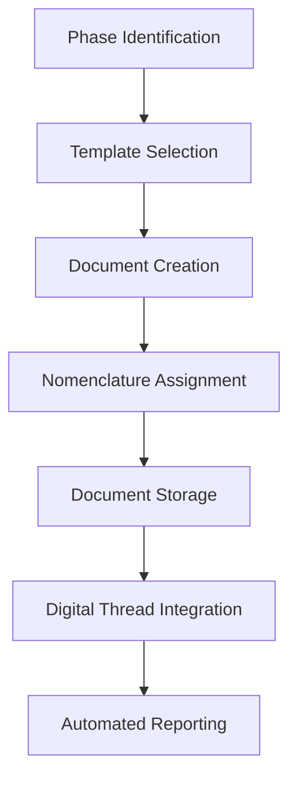

# Annex F: Documentation Templates Library v12.3.1

**Document ID:** `AQUART-OPS-SC-POL-STD-DC-PA-DTL-RDIG0-30600000001-MUL-v12.3.1`  
**Status:** ✅ APPROVED  
**Effective Date:** 2025-08-05  
**Classification:** AQUA V. STANDARD - MANDATORY COMPLIANCE

---

[https://processing-prompt-ui--Robbbo-T.github.app](https://processing-prompt-ui--Robbbo-T.github.app)

## 1. Introduction

This annex provides a comprehensive library of standardized documentation templates for use across the AQUA V. program. The Documentation Templates Library (DTL) ensures consistency, efficiency, and compliance in all documentation activities throughout the complete product lifecycle.

### 1.1 Purpose
- Standardize documentation formats and structures
- Ensure regulatory compliance across all artifacts
- Improve documentation efficiency and quality
- Facilitate knowledge transfer and training
- Support automated documentation generation
- Cover all lifecycle phases comprehensively

### 1.2 Scope
Applies to all documentation created within the AQUA V. program, including:
- Technical documentation
- Management documentation
- Quality and compliance documentation
- Training and procedural documentation
- All lifecycle phase documentation

---

## 2. Template Organization Framework

### 2.1 Template Classification by Lifecycle Phase

| Phase | Category | Template Count | Criticality |
|-------|----------|----------------|-------------|
| **STR** | Strategy & Planning | 8 | Business Critical |
| **CON** | Conceptual & Feasibility | 10 | Essential |
| **DES** | Design & Engineering | 24 | Critical |
| **DEV** | Development & Prototyping | 16 | Critical |
| **TST** | Testing & Validation | 14 | Critical |
| **INT** | Integration & Verification | 12 | Essential |
| **CRT** | Certification & Compliance | 18 | Critical |
| **PRD** | Production & Manufacturing | 18 | Essential |
| **OPS** | Operations & Service | 15 | Critical |
| **MNT** | Maintenance & Support | 14 | Essential |
| **REP** | Repair & Recycling | 10 | Important |
| **UPG** | Upgrades & Modernization | 8 | Important |
| **EXT** | Extension & Life Extension | 8 | Essential |
| **RET** | Retirement & Decommissioning | 6 | Standard |
| **AUD** | Audit & Assessment | 12 | Important |

### 2.2 Template Naming Convention

All templates follow the naming convention:
```
AQUA-V-DOC-PHASE-TYPE-SUBTYPE-VERSION
```

Example: `AQUA-V-DOC-STR-PLAN-v1.0.0`

---

## 3. Template Library Index by Lifecycle Phase

### 3.1 STR Phase: Strategy & Planning Templates

#### 3.1.1 Business Strategy
| Template Name | Description | DOC Code | Download Link |
|--------------|-------------|----------|---------------|
| **Business Strategy Plan** | Comprehensive business strategy documentation | [BSP](templates/strategy/AQUA-V-DOC-STR-BSP-v1.0.0.docx) | 📥 |
| **Market Analysis Report** | Market research and analysis template | [MKA](templates/strategy/AQUA-V-DOC-STR-MKA-v1.0.0.docx) | 📥 |
| **Technology Roadmap** | Strategic technology planning template | [TRM](templates/strategy/AQUA-V-DOC-STR-TRM-v1.0.0.docx) | 📥 |
| **Financial Model** | Financial planning and modeling template | [FIN](templates/strategy/AQUA-V-DOC-STR-FIN-v1.0.0.docx) | 📥 |

#### 3.1.2 Risk & Opportunity Assessment
| Template Name | Description | DOC Code | Download Link |
|--------------|-------------|----------|---------------|
| **Risk Assessment Template** | Comprehensive risk analysis documentation | [RSK](templates/strategy/AQUA-V-DOC-STR-RSK-v1.0.0.docx) | 📥 |
| **Opportunity Assessment Template** | Opportunity evaluation and planning | [OPP](templates/strategy/AQUA-V-DOC-STR-OPP-v1.0.0.docx) | 📥 |
| **Competitive Analysis Template** | Competitive landscape analysis | [CMP](templates/strategy/AQUA-V-DOC-STR-CMP-v1.0.0.docx) | 📥 |
| **Stakeholder Analysis Template** | Stakeholder identification and analysis | [STK](templates/strategy/AQUA-V-DOC-STR-STK-v1.0.0.docx) | 📥 |

### 3.2 CON Phase: Conceptual & Feasibility Templates

#### 3.2.1 Requirements & Feasibility
| Template Name | Description | DOC Code | Download Link |
|--------------|-------------|----------|---------------|
| **System Requirements Document** | High-level system requirements | [SRD](templates/conceptual/AQUA-V-DOC-CON-SRD-v1.0.0.docx) | 📥 |
| **Feasibility Assessment Study** | Technical and economic feasibility analysis | [FAS](templates/conceptual/AQUA-V-DOC-CON-FAS-v1.0.0.docx) | 📥 |
| **Concept of Operations** | Operational concept documentation | [COP](templates/conceptual/AQUA-V-DOC-CON-COP-v1.0.0.docx) | 📥 |
| **Market Requirements Document** | Market-driven requirements specification | [MRD](templates/conceptual/AQUA-V-DOC-CON-MRD-v1.0.0.docx) | 📥 |

#### 3.2.2 Preliminary Design & Analysis
| Template Name | Description | DOC Code | Download Link |
|--------------|-------------|----------|---------------|
| **Engineering Change Request** | Preliminary change request documentation | [ECR](templates/conceptual/AQUA-V-DOC-CON-ECR-v1.0.0.docx) | 📥 |
| **Engineering Change Proposal** | Change proposal documentation | [ECP](templates/conceptual/AQUA-V-DOC-CON-ECP-v1.0.0.docx) | 📥 |
| **Preliminary Design Review** | Design review documentation | [PDR](templates/conceptual/AQUA-V-DOC-CON-PDR-v1.0.0.docx) | 📥 |
| **Functional Hazard Assessment** | Safety hazard analysis | [FHA](templates/conceptual/AQUA-V-DOC-CON-FHA-v1.0.0.docx) | 📥 |

### 3.3 DES Phase: Design & Engineering Templates

#### 3.3.1 Requirements Documentation
| Template Name | Description | DOC Code | Download Link |
|--------------|-------------|----------|---------------|
| **Software Requirements Specification** | Software-specific requirements template | [SRS](templates/design/AQUA-V-DOC-DES-SRS-v1.0.0.docx) | 📥 |
| **Hardware Requirements Specification** | Hardware-specific requirements template | [HRD](templates/design/AQUA-V-DOC-DES-HRD-v1.0.0.docx) | 📥 |
| **Interface Requirements Document** | Interface control and requirements template | [IRD](templates/design/AQUA-V-DOC-DES-IRD-v1.0.0.docx) | 📥 |

#### 3.3.2 Design Documentation
| Template Name | Description | DOC Code | Download Link |
|--------------|-------------|----------|---------------|
| **System Design Specification** | High-level system design template | [SDS](templates/design/AQUA-V-DOC-DES-SDS-v1.0.0.docx) | 📥 |
| **Software Design Description** | Detailed software design template | [SDD](templates/design/AQUA-V-DOC-DES-SDD-v1.0.0.docx) | 📥 |
| **Hardware Design Document** | Hardware design documentation template | [HDD](templates/design/AQUA-V-DOC-DES-HDD-v1.0.0.docx) | 📥 |
| **Interface Control Document** | Interface control and management template | [ICD](templates/design/AQUA-V-DOC-DES-ICD-v1.0.0.docx) | 📥 |
| **Database Design Document** | Database design and schema template | [DBD](templates/design/AQUA-V-DOC-DES-DBD-v1.0.0.docx) | 📥 |

#### 3.3.3 Design Reviews & Analysis
| Template Name | Description | DOC Code | Download Link |
|--------------|-------------|----------|---------------|
| **Critical Design Review** | Critical design review documentation | [CDR](templates/design/AQUA-V-DOC-DES-CDR-v1.0.0.docx) | 📥 |
| **Detailed Design Review** | Detailed design review template | [DDR](templates/design/AQUA-V-DOC-DES-DDR-v1.0.0.docx) | 📥 |
| **Design Failure Mode Analysis** | DFMEA analysis template | [DFMEA](templates/design/AQUA-V-DOC-DES-DFMEA-v1.0.0.docx) | 📥 |
| **Preliminary System Safety Assessment** | Safety assessment documentation | [PSSA](templates/design/AQUA-V-DOC-DES-PSSA-v1.0.0.docx) | 📥 |

### 3.4 DEV Phase: Development & Prototyping Templates

#### 3.4.1 Development Planning
| Template Name | Description | DOC Code | Download Link |
|--------------|-------------|----------|---------------|
| **Implementation Plan** | Development implementation strategy | [IMP](templates/development/AQUA-V-DOC-DEV-IMP-v1.0.0.docx) | 📥 |
| **Test Readiness Review** | Test preparation assessment | [TRR](templates/development/AQUA-V-DOC-DEV-TRR-v1.0.0.docx) | 📥 |
| **Production Readiness Review** | Production preparation assessment | [PRR](templates/development/AQUA-V-DOC-DEV-PRR-v1.0.0.docx) | 📥 |
| **Build Specification** | Build process documentation | [BLD](templates/development/AQUA-V-DOC-DEV-BLD-v1.0.0.docx) | 📥 |

#### 3.4.2 Software Development
| Template Name | Description | DOC Code | Download Link |
|--------------|-------------|----------|---------------|
| **Source Code Package** | Source code documentation template | [SRC](templates/development/AQUA-V-DOC-DEV-SRC-v1.0.0.docx) | 📥 |
| **Executable Object Code** | Executable code documentation | [EOC](templates/development/AQUA-V-DOC-DEV-EOC-v1.0.0.docx) | 📥 |
| **API Documentation** | Application interface documentation | [API](templates/development/AQUA-V-DOC-DEV-API-v1.0.0.docx) | 📥 |
| **Software Development Kit** | SDK documentation template | [SDK](templates/development/AQUA-V-DOC-DEV-SDK-v1.0.0.docx) | 📥 |

#### 3.4.3 Certification Preparation
| Template Name | Description | DOC Code | Download Link |
|--------------|-------------|----------|---------------|
| **Plan for Software Aspects of Certification** | Software certification planning | [PSAC](templates/development/AQUA-V-DOC-DEV-PSAC-v1.0.0.docx) | 📥 |
| **Plan for Hardware Aspects of Certification** | Hardware certification planning | [PHAC](templates/development/AQUA-V-DOC-DEV-PHAC-v1.0.0.docx) | 📥 |

### 3.5 TST Phase: Testing & Validation Templates

#### 3.5.1 Test Planning
| Template Name | Description | DOC Code | Download Link |
|--------------|-------------|----------|---------------|
| **Qualification Test Plan** | Qualification testing strategy | [QTP](templates/testing/AQUA-V-DOC-TST-QTP-v1.0.0.docx) | 📥 |
| **Development Test Plan** | Development testing strategy | [DTP](templates/testing/AQUA-V-DOC-TST-DTP-v1.0.0.docx) | 📥 |
| **Flight Test Plan** | Flight testing documentation | [FTP](templates/testing/AQUA-V-DOC-TST-FTP-v1.0.0.docx) | 📥 |
| **Structural Test Plan** | Structural testing strategy | [STP](templates/testing/AQUA-V-DOC-TST-STP-v1.0.0.docx) | 📥 |

#### 3.5.2 Test Execution & Reporting
| Template Name | Description | DOC Code | Download Link |
|--------------|-------------|----------|---------------|
| **Qualification Test Report** | Qualification test results | [QTR](templates/testing/AQUA-V-DOC-TST-QTR-v1.0.0.docx) | 📥 |
| **Development Test Report** | Development test results | [DTR](templates/testing/AQUA-V-DOC-TST-DTR-v1.0.0.docx) | 📥 |
| **Flight Test Report** | Flight test results documentation | [FTR](templates/testing/AQUA-V-DOC-TST-FTR-v1.0.0.docx) | 📥 |
| **Structural Test Report** | Structural test results | [STR](templates/testing/AQUA-V-DOC-TST-STR-v1.0.0.docx) | 📥 |
| **Verification Test Report** | Verification test documentation | [VTR](templates/testing/AQUA-V-DOC-TST-VTR-v1.0.0.docx) | 📥 |
| **Acceptance Test Report** | Acceptance testing results | [ATR](templates/testing/AQUA-V-DOC-TST-ATR-v1.0.0.docx) | 📥 |

#### 3.5.3 Analysis & Calculation
| Template Name | Description | DOC Code | Download Link |
|--------------|-------------|----------|---------------|
| **Calculation Report Template** | Engineering calculations documentation | [CAL](templates/testing/AQUA-V-DOC-TST-CAL-v1.0.0.docx) | 📥 |
| **Test Readiness Review** | Test preparation assessment | [TRR](templates/testing/AQUA-V-DOC-TST-TRR-v1.0.0.docx) | 📥 |
| **Test Case Procedure** | Individual test case documentation | [TCP](templates/testing/AQUA-V-DOC-TST-TCP-v1.0.0.docx) | 📥 |
| **Test Analysis Report** | Test data analysis documentation | [TAR](templates/testing/AQUA-V-DOC-TST-TAR-v1.0.0.docx) | 📥 |

### 3.6 INT Phase: Integration & Verification Templates

#### 3.6.1 Integration Planning
| Template Name | Description | DOC Code | Download Link |
|--------------|-------------|----------|---------------|
| **Integration Test Plan** | System integration testing strategy | [ITP](templates/integration/AQUA-V-DOC-INT-ITP-v1.0.0.docx) | 📥 |
| **Integration Control Record** | Integration process tracking | [ICR](templates/integration/AQUA-V-DOC-INT-ICR-v1.0.0.docx) | 📥 |
| **Integration System Specification** | Integrated system requirements | [ISS](templates/integration/AQUA-V-DOC-INT-ISS-v1.0.0.docx) | 📥 |

#### 3.6.2 Configuration Management
| Template Name | Description | DOC Code | Download Link |
|--------------|-------------|----------|---------------|
| **Software Configuration Management Plan** | Software configuration strategy | [SCMP](templates/integration/AQUA-V-DOC-INT-SCMP-v1.0.0.docx) | 📥 |
| **Hardware Configuration Management Plan** | Hardware configuration strategy | [HCMP](templates/integration/AQUA-V-DOC-INT-HCMP-v1.0.0.docx) | 📥 |
| **Change Control Board Minutes** | Change control meeting documentation | [CCB](templates/integration/AQUA-V-DOC-INT-CCB-v1.0.0.docx) | 📥 |

#### 3.6.3 Integration Testing & Validation
| Template Name | Description | DOC Code | Download Link |
|--------------|-------------|----------|---------------|
| **Integration Test Report** | Integration test results | [ITR](templates/integration/AQUA-V-DOC-INT-ITR-v1.0.0.docx) | 📥 |
| **Integration Validation Report** | Integration validation documentation | [IVR](templates/integration/AQUA-V-DOC-INT-IVR-v1.0.0.docx) | 📥 |

### 3.7 CRT Phase: Certification & Compliance Templates

#### 3.7.1 Certification Applications
| Template Name | Description | DOC Code | Download Link |
|--------------|-------------|----------|---------------|
| **Type Certificate Application** | Aircraft type certification | [TC](templates/certification/AQUA-V-DOC-CRT-TC-v1.0.0.docx) | 📥 |
| **Supplemental Type Certificate** | Supplemental certification | [STC](templates/certification/AQUA-V-DOC-CRT-STC-v1.0.0.docx) | 📥 |
| **Technical Standard Order** | TSO certification application | [TSO](templates/certification/AQUA-V-DOC-CRT-TSO-v1.0.0.docx) | 📥 |
| **Parts Manufacturer Approval** | Parts manufacturing certification | [PMA](templates/certification/AQUA-V-DOC-CRT-PMA-v1.0.0.docx) | 📥 |

#### 3.7.2 Organization Approvals
| Template Name | Description | DOC Code | Download Link |
|--------------|-------------|----------|---------------|
| **Production Organization Approval** | Production facility certification | [POA](templates/certification/AQUA-V-DOC-CRT-POA-v1.0.0.docx) | 📥 |
| **Design Organization Approval** | Design organization certification | [DOA](templates/certification/AQUA-V-DOC-CRT-DOA-v1.0.0.docx) | 📥 |

#### 3.7.3 Compliance Documentation
| Template Name | Description | DOC Code | Download Link |
|--------------|-------------|----------|---------------|
| **Compliance Matrix** | Regulatory compliance tracking | [CMP](templates/certification/AQUA-V-DOC-CRT-CMP-v1.0.0.docx) | 📥 |
| **Declaration of Design and Performance** | Design and performance declaration | [DAS](templates/certification/AQUA-V-DOC-CRT-DAS-v1.0.0.docx) | 📥 |
| **Safety Assessment Report** | Comprehensive safety assessment | [SAR](templates/certification/AQUA-V-DOC-CRT-SAR-v1.0.0.docx) | 📥 |
| **Compliance Checklist** | Detailed compliance verification | [CCL](templates/certification/AQUA-V-DOC-CRT-CCL-v1.0.0.docx) | 📥 |
| **Certification Evidence Package** | Evidence compilation for certification | [CEP](templates/certification/AQUA-V-DOC-CRT-CEP-v1.0.0.docx) | 📥 |
| **Regulatory Interface Document** | Communication with authorities | [RID](templates/certification/AQUA-V-DOC-CRT-RID-v1.0.0.docx) | 📥 |

### 3.8 PRD Phase: Production & Manufacturing Templates

#### 3.8.1 Production Planning
| Template Name | Description | DOC Code | Download Link |
|--------------|-------------|----------|---------------|
| **Manufacturing Process Specification** | Process definition and control | [MPS](templates/production/AQUA-V-DOC-PRD-MPS-v1.0.0.docx) | 📥 |
| **Work Instruction Sheet** | Detailed work instructions | [WIS](templates/production/AQUA-V-DOC-PRD-WIS-v1.0.0.docx) | 📥 |
| **Bill of Materials Template** | BOM structure and content | [BOM](templates/production/AQUA-V-DOC-PRD-BOM-v1.0.0.docx) | 📥 |
| **Production Part Approval Process** | PPAP documentation | [PPAP](templates/production/AQUA-V-DOC-PRD-PPAP-v1.0.0.docx) | 📥 |

#### 3.8.2 Quality Control
| Template Name | Description | DOC Code | Download Link |
|--------------|-------------|----------|---------------|
| **Quality Control Plan** | Quality control planning | [QCP](templates/production/AQUA-V-DOC-PRD-QCP-v1.0.0.docx) | 📥 |
| **First Article Inspection** | FAI documentation | [FAI](templates/production/AQUA-V-DOC-PRD-FAI-v1.0.0.docx) | 📥 |
| **Inspection Report Template** | Inspection results | [INR](templates/production/AQUA-V-DOC-PRD-INR-v1.0.0.docx) | 📥 |
| **Nonconformance Report** | Nonconformance documentation | [NCR](templates/production/AQUA-V-DOC-PRD-NCR-v1.0.0.docx) | 📥 |

#### 3.8.3 Production Management
| Template Name | Description | DOC Code | Download Link |
|--------------|-------------|----------|---------------|
| **Certificate of Conformity** | Product conformity certification | [COC](templates/production/AQUA-V-DOC-PRD-COC-v1.0.0.docx) | 📥 |
| **Letter of Production Capability** | Production capability certification | [LOPC](templates/production/AQUA-V-DOC-PRD-LOPC-v1.0.0.docx) | 📥 |
| **Concession Request** | Production deviation request | [CON](templates/production/AQUA-V-DOC-PRD-CON-v1.0.0.docx) | 📥 |
| **Material Review Board Report** | Material review documentation | [MRB](templates/production/AQUA-V-DOC-PRD-MRB-v1.0.0.docx) | 📥 |

### 3.9 OPS Phase: Operations & Service Templates

#### 3.9.1 Flight Operations
| Template Name | Description | DOC Code | Download Link |
|--------------|-------------|----------|---------------|
| **Aircraft Flight Manual** | Complete flight operations manual | [AFM](templates/operations/AQUA-V-DOC-OPS-AFM-v1.0.0.docx) | 📥 |
| **Flight Crew Operating Manual** | Flight crew procedures | [FCOM](templates/operations/AQUA-V-DOC-OPS-FCOM-v1.0.0.docx) | 📥 |
| **Quick Reference Handbook** | Quick reference procedures | [QRH](templates/operations/AQUA-V-DOC-OPS-QRH-v1.0.0.docx) | 📥 |
| **Minimum Equipment List** | MEL documentation | [MEL](templates/operations/AQUA-V-DOC-OPS-MEL-v1.0.0.docx) | 📥 |

#### 3.9.2 Ground Operations
| Template Name | Description | DOC Code | Download Link |
|--------------|-------------|----------|---------------|
| **Flight Operations Manual** | Flight operations template | [FOM](templates/operations/AQUA-V-DOC-OPS-FOM-v1.0.0.docx) | 📥 |
| **Ground Operations Manual** | Ground operations template | [GOM](templates/operations/AQUA-V-DOC-OPS-GOM-v1.0.0.docx) | 📥 |
| **Continuing Airworthiness Management Exposition** | Airworthiness management | [CAME](templates/operations/AQUA-V-DOC-OPS-CAME-v1.0.0.docx) | 📥 |

#### 3.9.3 Operational Procedures
| Template Name | Description | DOC Code | Download Link |
|--------------|-------------|----------|---------------|
| **Standard Operating Procedure** | SOP documentation | [SOP](templates/operations/AQUA-V-DOC-OPS-SOP-v1.0.0.docx) | 📥 |
| **Operational Policy Template** | Operational policy documentation | [POL](templates/operations/AQUA-V-DOC-OPS-POL-v1.0.0.docx) | 📥 |
| **Quality Management System** | QMS documentation | [QMS](templates/operations/AQUA-V-DOC-OPS-QMS-v1.0.0.docx) | 📥 |
| **Management of Change** | Change management procedures | [MOC](templates/operations/AQUA-V-DOC-OPS-MOC-v1.0.0.docx) | 📥 |

#### 3.9.4 Performance Monitoring
| Template Name | Description | DOC Code | Download Link |
|--------------|-------------|----------|---------------|
| **Metrics Report Template** | Performance metrics documentation | [MET](templates/operations/AQUA-V-DOC-OPS-MET-v1.0.0.docx) | 📥 |
| **Operational Dashboard Template** | Performance monitoring dashboard | [DASH](templates/operations/AQUA-V-DOC-OPS-DASH-v1.0.0.xlsx) | 📥 |

### 3.10 MNT Phase: Maintenance & Support Templates

#### 3.10.1 Maintenance Documentation
| Template Name | Description | DOC Code | Download Link |
|--------------|-------------|----------|---------------|
| **Aircraft Maintenance Manual** | Complete AMM template | [AMM](templates/maintenance/AQUA-V-DOC-MNT-AMM-v1.0.0.docx) | 📥 |
| **Component Maintenance Manual** | Component maintenance template | [CMM](templates/maintenance/AQUA-V-DOC-MNT-CMM-v1.0.0.docx) | 📥 |
| **Structural Repair Manual** | Structural repair procedures | [SRM](templates/maintenance/AQUA-V-DOC-MNT-SRM-v1.0.0.docx) | 📥 |
| **Troubleshooting Manual** | Troubleshooting procedures | [TSM](templates/maintenance/AQUA-V-DOC-MNT-TSM-v1.0.0.docx) | 📥 |

#### 3.10.2 Maintenance Planning
| Template Name | Description | DOC Code | Download Link |
|--------------|-------------|----------|---------------|
| **Maintenance Planning Document** | Maintenance strategy planning | [MPD](templates/maintenance/AQUA-V-DOC-MNT-MPD-v1.0.0.docx) | 📥 |
| **Service Bulletin Template** | Service bulletin documentation | [SB](templates/maintenance/AQUA-V-DOC-MNT-SB-v1.0.0.docx) | 📥 |
| **Wiring Diagram Manual** | Electrical documentation | [WDM](templates/maintenance/AQUA-V-DOC-MNT-WDM-v1.0.0.docx) | 📥 |

#### 3.10.3 Parts & Inventory
| Template Name | Description | DOC Code | Download Link |
|--------------|-------------|----------|---------------|
| **Illustrated Parts Catalog** | Parts catalog documentation | [IPC](templates/maintenance/AQUA-V-DOC-MNT-IPC-v1.0.0.docx) | 📥 |
| **Minimum Equipment List** | MEL for maintenance | [MEL](templates/maintenance/AQUA-V-DOC-MNT-MEL-v1.0.0.docx) | 📥 |

### 3.11 REP Phase: Repair & Recycling Templates

#### 3.11.1 Repair Procedures
| Template Name | Description | DOC Code | Download Link |
|--------------|-------------|----------|---------------|
| **Engineering Order** | Engineering change for repair | [EO](templates/repair/AQUA-V-DOC-REP-EO-v1.0.0.docx) | 📥 |
| **Repair Instruction** | Detailed repair procedures | [FIX](templates/repair/AQUA-V-DOC-REP-FIX-v1.0.0.docx) | 📥 |
| **Modification Sheet** | Modification documentation | [MOD](templates/repair/AQUA-V-DOC-REP-MOD-v1.0.0.docx) | 📥 |
| **Upgrade Kit Description** | Upgrade kit documentation | [UPG](templates/repair/AQUA-V-DOC-REP-UPG-v1.0.0.docx) | 📥 |

#### 3.11.2 Repair Analysis & Planning
| Template Name | Description | DOC Code | Download Link |
|--------------|-------------|----------|---------------|
| **Corrective Action Request** | Corrective action documentation | [CAR](templates/repair/AQUA-V-DOC-REP-CAR-v1.0.0.docx) | 📥 |
| **8-Discipline Report** | Structured problem-solving report | [8D](templates/repair/AQUA-V-DOC-REP-8D-v1.0.0.docx) | 📥 |
| **Repair Scheme** | Repair planning documentation | [RPS](templates/repair/AQUA-V-DOC-REP-RPS-v1.0.0.docx) | 📥 |
| **Damage Tolerance Assessment** | Damage analysis documentation | [DTA](templates/repair/AQUA-V-DOC-REP-DTA-v1.0.0.docx) | 📥 |

#### 3.11.3 Recycling & Disposal
| Template Name | Description | DOC Code | Download Link |
|--------------|-------------|----------|---------------|
| **Returned Goods Authorization** | Return authorization documentation | [RGA](templates/repair/AQUA-V-DOC-REP-RGA-v1.0.0.docx) | 📥 |
| **Corrective and Preventive Action** | CAPA documentation | [CAPA](templates/repair/AQUA-V-DOC-REP-CAPA-v1.0.0.docx) | 📥 |
| **Non-Destructive Test Manual** | NDT procedures | [NDT](templates/repair/AQUA-V-DOC-REP-NDT-v1.0.0.docx) | 📥 |
| **Reclamation Procedure** | Material recovery procedures | [RCL](templates/repair/AQUA-V-DOC-REP-RCL-v1.0.0.docx) | 📥 |
| **Disposal Instruction** | Disposal procedures | [DIS](templates/repair/AQUA-V-DOC-REP-DIS-v1.0.0.docx) | 📥 |

#### 3.11.4 Repair Evaluation
| Template Name | Description | DOC Code | Download Link |
|--------------|-------------|----------|---------------|
| **Repair Evaluation Report** | Repair effectiveness assessment | [RER](templates/repair/AQUA-V-DOC-REP-RER-v1.0.0.docx) | 📥 |

### 3.12 UPG Phase: Upgrades & Modernization Templates

#### 3.12.1 Upgrade Planning
| Template Name | Description | DOC Code | Download Link |
|--------------|-------------|----------|---------------|
| **Upgrade Change Request** | Upgrade change documentation | [UCR](templates/upgrade/AQUA-V-DOC-UPG-UCR-v1.0.0.docx) | 📥 |
| **Upgrade Change Proposal** | Upgrade proposal documentation | [UCP](templates/upgrade/AQUA-V-DOC-UPG-UCP-v1.0.0.docx) | 📥 |
| **Life Extension Plan** | Life extension planning | [LEP](templates/upgrade/AQUA-V-DOC-UPG-LEP-v1.0.0.docx) | 📥 |
| **System Upgrade Guide** | System upgrade procedures | [SUG](templates/upgrade/AQUA-V-DOC-UPG-SUG-v1.0.0.docx) | 📥 |

#### 3.12.2 Upgrade Implementation
| Template Name | Description | DOC Code | Download Link |
|--------------|-------------|----------|---------------|
| **Upgrade Test Report** | Upgrade testing results | [UTR](templates/upgrade/AQUA-V-DOC-UPG-UTR-v1.0.0.docx) | 📥 |
| **Upgrade Installation Procedure** | Upgrade installation procedures | [UIP](templates/upgrade/AQUA-V-DOC-UPG-UIP-v1.0.0.docx) | 📥 |
| **Upgrade Validation Report** | Upgrade validation documentation | [UVR](templates/upgrade/AQUA-V-DOC-UPG-UVR-v1.0.0.docx) | 📥 |

#### 3.12.3 Upgrade Management
| Template Name | Description | DOC Code | Download Link |
|--------------|-------------|----------|---------------|
| **Upgrade Compliance Matrix** | Upgrade compliance tracking | [UCM](templates/upgrade/AQUA-V-DOC-UPG-UCM-v1.0.0.docx) | 📥 |
| **Upgrade Support Plan** | Upgrade support planning | [USP](templates/upgrade/AQUA-V-DOC-UPG-USP-v1.0.0.docx) | 📥 |
| **Upgrade Training Course** | Upgrade training documentation | [UTC](templates/upgrade/AQUA-V-DOC-UPG-UTC-v1.0.0.docx) | 📥 |
| **Modernization Document** | Modernization planning | [MOD](templates/upgrade/AQUA-V-DOC-UPG-MOD-v1.0.0.docx) | 📥 |

### 3.13 EXT Phase: Extension & Life Enhancement Templates

#### 3.13.1 Life Extension Analysis
| Template Name | Description | DOC Code | Download Link |
|--------------|-------------|----------|---------------|
| **Life Extension Analysis** | Life extension technical analysis | [LEA](templates/extension/AQUA-V-DOC-EXT-LEA-v1.0.0.docx) | 📥 |
| **Life Extension Report** | Life extension results documentation | [LER](templates/extension/AQUA-V-DOC-EXT-LER-v1.0.0.docx) | 📥 |
| **Service Life Program** | Service life planning | [SLP](templates/extension/AQUA-V-DOC-EXT-SLP-v1.0.0.docx) | 📥 |

#### 3.13.2 Structural Assessment
| Template Name | Description | DOC Code | Download Link |
|--------------|-------------|----------|---------------|
| **Fatigue Critical Areas** | Fatigue analysis documentation | [FCA](templates/extension/AQUA-V-DOC-EXT-FCA-v1.0.0.docx) | 📥 |
| **Damage Tolerance Assessment** | Damage tolerance analysis | [DTA](templates/extension/AQUA-V-DOC-EXT-DTA-v1.0.0.docx) | 📥 |
| **Extension Inspection Program** | Extension inspection planning | [EIP](templates/extension/AQUA-V-DOC-EXT-EIP-v1.0.0.docx) | 📥 |

#### 3.13.3 Extension Implementation
| Template Name | Description | DOC Code | Download Link |
|--------------|-------------|----------|---------------|
| **Extension Service Bulletin** | Extension service documentation | [ESB](templates/extension/AQUA-V-DOC-EXT-ESB-v1.0.0.docx) | 📥 |
| **Capability Enhancement** | Capability enhancement planning | [CAP](templates/extension/AQUA-V-DOC-EXT-CAP-v1.0.0.docx) | 📥 |

### 3.14 RET Phase: Retirement & Decommissioning Templates

#### 3.14.1 Retirement Planning
| Template Name | Description | DOC Code | Download Link |
|--------------|-------------|----------|---------------|
| **Engineering Change Notice** | Retirement change notification | [ECN](templates/retirement/AQUA-V-DOC-RET-ECN-v1.0.0.docx) | 📥 |
| **Field Change Notice** | Field retirement notification | [FCN](templates/retirement/AQUA-V-DOC-RET-FCN-v1.0.0.docx) | 📥 |
| **Baseline Change Notice** | Baseline retirement notification | [BCN](templates/retirement/AQUA-V-DOC-RET-BCN-v1.0.0.docx) | 📥 |

#### 3.14.2 Decommissioning Procedures
| Template Name | Description | DOC Code | Download Link |
|--------------|-------------|----------|---------------|
| **Change Impact Document** | Retirement impact analysis | [CID](templates/retirement/AQUA-V-DOC-RET-CID-v1.0.0.docx) | 📥 |
| **Document Change Notice** | Documentation retirement notice | [DCN](templates/retirement/AQUA-V-DOC-RET-DCN-v1.0.0.docx) | 📥 |
| **Decommissioning Plan** | Decommissioning procedures | [DCP](templates/retirement/AQUA-V-DOC-RET-DCP-v1.0.0.docx) | 📥 |

#### 3.14.3 End-of-Life Documentation
| Template Name | Description | DOC Code | Download Link |
|--------------|-------------|----------|---------------|
| **End-of-Service Documentation** | End-of-service procedures | [EDS](templates/retirement/AQUA-V-DOC-RET-EDS-v1.0.0.docx) | 📥 |
| **Retirement Report** | Retirement summary | [RET](templates/retirement/AQUA-V-DOC-RET-RET-v1.0.0.docx) | 📥 |

### 3.15 AUD Phase: Audit & Assessment Templates

#### 3.15.1 Quality Audits
| Template Name | Description | DOC Code | Download Link |
|--------------|-------------|----------|---------------|
| **Internal Quality Audit** | Internal quality audit procedures | [IQA](templates/audit/AQUA-V-DOC-AUD-IQA-v1.0.0.docx) | 📥 |
| **External Quality Audit** | External quality audit procedures | [EQA](templates/audit/AQUA-V-DOC-AUD-EQA-v1.0.0.docx) | 📥 |
| **Supplier Quality Audit** | Supplier quality audit procedures | [SQA](templates/audit/AQUA-V-DOC-AUD-SQA-v1.0.0.docx) | 📥 |
| **Process Quality Audit** | Process quality audit procedures | [PQA](templates/audit/AQUA-V-DOC-AUD-PQA-v1.0.0.docx) | 📥 |
| **Customer Quality Audit** | Customer quality audit procedures | [CQA](templates/audit/AQUA-V-DOC-AUD-CQA-v1.0.0.docx) | 📥 |

#### 3.15.2 Management Reviews
| Template Name | Description | DOC Code | Download Link |
|--------------|-------------|----------|---------------|
| **Management Review** | Management review procedures | [MR](templates/audit/AQUA-V-DOC-AUD-MR-v1.0.0.docx) | 📥 |
| **Key Performance Indicator Report** | KPI reporting template | [KPI](templates/audit/AQUA-V-DOC-AUD-KPI-v1.0.0.docx) | 📥 |
| **Audit Compliance Report** | Audit compliance reporting | [ACR](templates/audit/AQUA-V-DOC-AUD-ACR-v1.0.0.docx) | 📥 |

---

## 4. Template Usage Guidelines

### 4.1 Template Selection Process

1. **Identify Lifecycle Phase**: Determine the appropriate phase (STR, CON, DES, etc.)
2. **Select Document Type**: Choose the specific document category
3. **Check Version**: Ensure using the latest template version
4. **Review Requirements**: Verify compliance with regulatory requirements
5. **Customize as Needed**: Adapt template to specific project requirements
6. **Validate Completeness**: Ensure all required sections are completed

### 4.2 Template Customization Rules

| Rule | Description | Example |
|------|-------------|---------|
| **Header/Footer** | Must include AQUA V. branding and document ID | `AQUA-V-DOC-STR-BSP-v1.0.0` |
| **Version Control** | Must follow semantic versioning | `v1.0.0`, `v1.1.0`, `v2.0.0` |
| **Approval Workflow** | Must include required approval signatures | Program Manager, Quality Manager |
| **Compliance References** | Must reference applicable standards | ISO 9001, AS9100, DO-178C |
| **Nomenclature Integration** | Must include AQUA V. nomenclature system | `AMPEL3-BWB-Q100-0001-STR-BSP-...` |

### 4.3 Template Maintenance

| Activity | Frequency | Responsible |
|----------|------------|-------------|
| **Template Review** | Quarterly | Documentation Team |
| **Version Updates** | As needed | Subject Matter Experts |
| **Compliance Updates** | Annually | Compliance Team |
| **User Feedback Collection** | Continuous | All Users |
| **Template Retirement** | As needed | Documentation Manager |

---

## 5. Integration with AQUA V. Systems

### 5.1 Nomenclature System Integration

All templates are designed to integrate seamlessly with the AQUA V. Nomenclature System v12.3:



### 5.2 Digital Thread Integration

Templates support Digital Thread capabilities through:
- Standardized metadata fields
- Automated traceability links
- Integration with configuration management
- Support for automated document generation
- Cross-phase traceability

### 5.3 Quality Management Integration

Templates integrate with quality systems through:
- Built-in quality checkpoints
- Automated validation rules
- Compliance tracking
- Audit trail documentation
- Phase-gate review requirements

---

## 6. Training and Support

### 6.1 Training Programs by Phase

| Phase | Training Type | Audience | Duration | Materials |
|-------|--------------|----------|----------|-----------|
| **STR** | Strategic Planning | Program Managers | 4 hours | [Materials](training/strategic/) |
| **CON** | Conceptual Design | Engineers | 6 hours | [Materials](training/conceptual/) |
| **DES** | Design Documentation | Design Engineers | 8 hours | [Materials](training/design/) |
| **DEV** | Development Planning | Developers | 6 hours | [Materials](training/development/) |
| **TST** | Test Documentation | Test Engineers | 6 hours | [Materials](training/testing/) |
| **INT** | Integration Management | Systems Engineers | 4 hours | [Materials](training/integration/) |
| **CRT** | Certification | Compliance Officers | 8 hours | [Materials](training/certification/) |
| **PRD** | Production Documentation | Manufacturing | 6 hours | [Materials](training/production/) |
| **OPS** | Operations Documentation | Operations Staff | 4 hours | [Materials](training/operations/) |
| **MNT** | Maintenance Documentation | Maintenance | 6 hours | [Materials](training/maintenance/) |
| **REP** | Repair Documentation | Repair Technicians | 4 hours | [Materials](training/repair/) |
| **UPG** | Upgrade Management | Systems Engineers | 4 hours | [Materials](training/upgrade/) |
| **EXT** | Life Extension | Engineers | 6 hours | [Materials](training/extension/) |
| **RET** | Decommissioning | Project Managers | 4 hours | [Materials](training/retirement/) |
| **AUD** | Audit Procedures | Auditors | 6 hours | [Materials](training/audit/) |

### 6.2 Support Resources

| Resource Type | Description | Access |
|---------------|-------------|--------|
| **Template Help Desk** | Dedicated support for template issues | [Support Portal](support/templates/) |
| **Video Tutorials** | Step-by-step template usage guides | [Tutorial Library](training/videos/) |
| **FAQ Database** | Common questions and answers | [FAQ](support/faq/) |
| **Community Forum** | User community for best practices | [Forum](community/templates/) |
| **Phase-Specific Experts** | Subject matter experts by phase | [Expert Directory](experts/) |

---

## 7. Future Enhancements

### 7.1 Planned Improvements

1. **AI-Assisted Template Selection**: Machine learning to recommend optimal templates based on phase and context
2. **Dynamic Template Generation**: Automated template creation based on project requirements
3. **Enhanced Validation Rules**: Real-time compliance checking across all phases
4. **Multi-language Support**: Templates in multiple languages for global operations
5. **Mobile Optimization**: Mobile-friendly template access and editing
6. **Cross-Phase Traceability**: Automated linking of related documents across phases

### 7.2 Research Initiatives

1. **Semantic Template Integration**: Templates that understand context and content across lifecycle phases
2. **Automated Document Generation**: AI-powered document creation from requirements and phase data
3. **Predictive Template Updates**: Anticipatory template updates based on regulatory changes and phase transitions
4. **Cross-Platform Compatibility**: Universal template access across all platforms and devices
5. **Phase-Progression Automation**: Automatic template suggestions as projects progress through phases

---

**END OF DOCUMENT**

© 2025 AQUA V. Aerospace. Controlled Document.  
**Distribution:** A - Internal Unlimited | B - Authorized Partners | C - Regulatory Authorities
