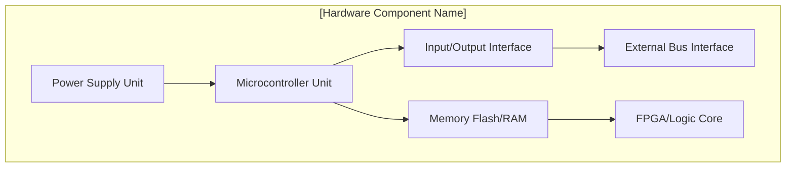

### **AQUA V. v12.3 Artifact Definition (Standardized)**

```yaml
artifact:
  nomenclature: "AQUART-DES-NC-HDD-GEN-DF-PA-HDDT-0001-SDIG-30400010000-NA-v12.3.0"
  configuration_item:
    artifact_id: "AQUART-DES-NC-HDD-GEN-DF-PA-HDDT-0001-SDIG-30400010000-NA-v12.3.0"
    owner_division: "QSTR"
    owner_team: "Enterprise Design Standards"
    created_by: "AI-DocGen-v9.0"
    created_date: "2025-08-03T00:00:00Z"
    classification: "AQUA V. STANDARD"
    lifecycle_state: "TEMPLATE"
  extended_description:
    title: "AQUA V. Enterprise Hardware Design Document - General Master Template"
    short_title: "Enterprise HDD - Master Template"
    description: "Master template for creating a Hardware Design Document (HDD). This document provides the definitive structure for detailing the technical design of a physical hardware component, including its architecture, physical characteristics, interfaces, and manufacturing requirements."
    keywords: ["hardware design document", "hdd", "design standard", "template", "electronics", "physical design"]
    language: "en-US"
    translations: []
```

---

### **Template Content (Standardized)**
`AQUART-DES-NC-HDD-GEN-DF-PA-HDDT-0001-SDIG-30400010000-NA-v12.3.0.md`

<!-- AQUA V. v12.3 Compliant -->
<!-- Artifact ID: AQUART-DES-NC-HDD-GEN-DF-PA-HDDT-0001-SDIG-30400010000-N/A-v12.3.0 -->

# 📘 Hardware Design Document: [Hardware Component Name]

| | |
|:---|:---|
| **Document Title** | Hardware Design Document: [Hardware Component Name] |
| **Artifact ID** | *This document's ID will be generated upon instantiation* |
| **Based on Template** | AQUART-DES-NC-HDD-GEN-DF-PA-HDDT-0001-SDIG-30400010000-N/A-v12.3.0 |
| **Phase** | DES - Design |
| **Owner Division** | [Program Owner Q-Division] |
| **Status** | DRAFT / IN REVIEW / APPROVED |
| **Version** | [Specify Document Version, e.g., v1.0.0] |

---

## 1. Purpose and Scope
This Hardware Design Document (HDD) provides the complete technical design for the **[Hardware Component Name]**. It is the authoritative source for its fabrication, assembly, and inspection, and it responds to the requirements specified in the Component Specification (CSP) `[Insert CSP Artifact ID]`.

---

## 2. System Context
*   **Component Name:** `[Specify Component Name]`
*   **Parent System UTCS:** `[e.g., 024-50-00 for Electrical Power Generator]`
*   **Design Phase:** DES - Design
*   **Criticality:** `[e.g., SE - Safety Essential]`
*   **Applicable Reality:** `[e.g., PHYSL for the final hardware]`

> **AI Note (from AGEN-QAI):** This template provides the standard structure for all Hardware Design Documents. All sections are mandatory. This virtual template (`SDIG`) is the source for all physical (`PHYSL`) hardware design descriptions.

---

## 3. Functional Overview
*   Describe the intended functionality of the hardware module.
*   Include key system-level interactions and dependencies.
*   Specify all modes of operation (e.g., Normal, Standby, Self-Test).

---

## 4. Hardware Block Diagram
*This diagram illustrates the major functional blocks within the hardware component.*



---

## 5. Interfaces
| Interface ID | Type | Protocol / Standard | Notes |
|:-------------|:-------|:----------------------|:------------------------------------|
| J1 | Power | 28V DC (DO-160G Sec. 16) | Main aircraft power supply. |
| J2 | Data | ARINC 429 / CAN Bus | Primary data bus interface. |
| J3 | Debug | JTAG / UART | For maintenance and diagnostics only. |

---

## 6. Mechanical & Environmental Constraints
*   **Operating Temperature:** -40°C to +85°C
*   **IP Rating:** IP67
*   **Target Weight:** < 500g
*   **Form Factor / Dimensions:** 100mm x 60mm x 25mm
*   **Reference CAD Model ID:** `[Insert compliant CAD model Artifact ID]`

---

## 7. Regulatory Standards
| Standard | Applicability | Status |
|:-----------|:------------------|:---------|
| DO-254 | Design Assurance | Applicable |
| MIL-STD-810H | Environmental | Reference Only |
| IPC-A-610 | Workmanship | Mandatory |

---

## 8. Bill of Materials (Top-Level)
| Part | Type | Quantity | Notes |
|:-----------------|:---------|:---------|:--------------------------|
| `[MCU Part Number]`| MCU | 1 | |
| `[Regulator PN]` | Regulator| 1 | |
| `[Connector PN]` | Connector| 2 | |
| `[Capacitor PN]` | Capacitor| 12 | Refer to full BOM artifact. |

*   **Full BOM Artifact ID:** `[Insert compliant BOM Artifact ID]`

---

## 9. Risk Considerations
*   Power loss handling and data retention strategy must be defined.
*   Memory overflow conditions under heavy load must be analyzed.
*   The debug interface SHALL be physically and logically disabled in the final deployment configuration.

---

## 10. Traceability Matrix
| Requirement ID (from CSP) | Section in this HDD | Verification Method |
|:----------------------------|:--------------------|:----------------------|
| R-HW-001 (Functional) | §3 | Test Report (TRP) |
| R-HW-002 (Interface) | §5 | Interface Test (ITP) |
| R-HW-003 (Environmental)| §6 | Qualification Test (QTR) |

---

## 11. Version History
| Version | Date | Author | Notes |
|:--------|:-----------|:-----------------|:--------------------------------------------|
| v1.0.0 | 2025-08-03 | AGEN-QAI | Initial template generation (SDIG instance). |

---
**End of Template**  
© 2025 AQUA V. Aerospace. All rights reserved.  
**Classification:** AQUA STANDARD – Controlled Template Document

```
